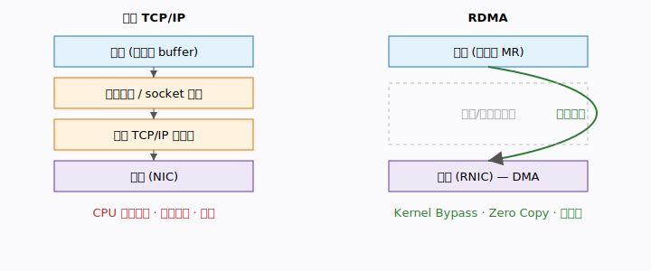
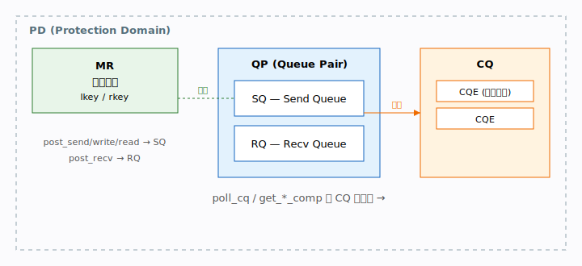
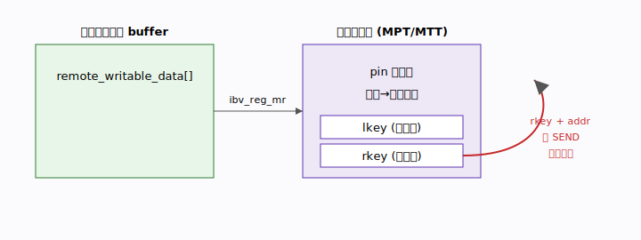
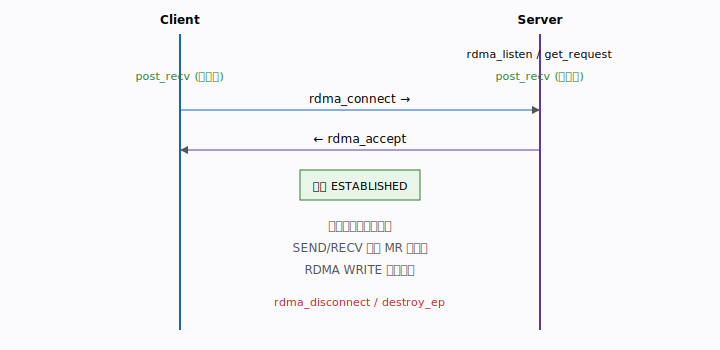
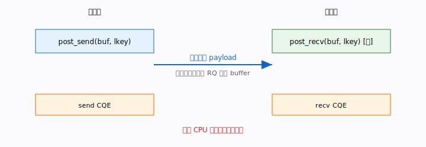
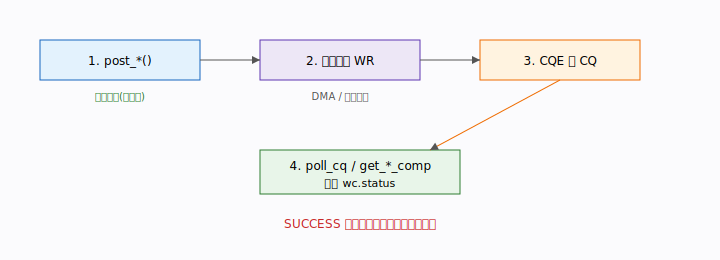
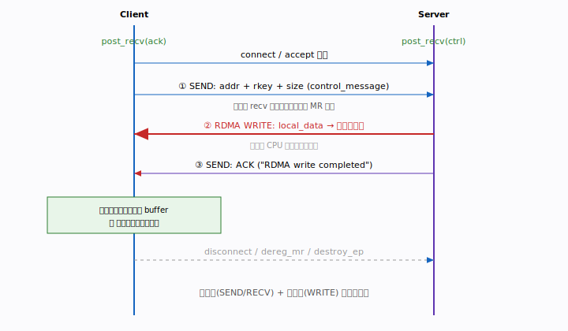
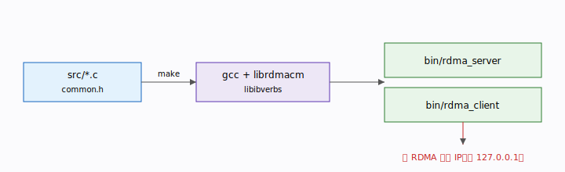

# CLAUDE.md — RDMA 原理与实战教程

> 本文件既是 Claude Code 的项目指引，也是一份完整的 **RDMA 教程**。
> 以本仓库的 `src/server.c`、`src/client.c`、`src/common.h` 为实例，逐层讲解
> RDMA 的**主要原理**、**编程使用**与**代码实现**。
>
> 约定：**每一节都附带一张 SVG 示意图**（内联 SVG，可在支持 SVG 的 Markdown
> 预览器 / 编辑器中直接渲染）。
>
> 🎯 **项目定位**：本仓库正由「初学者最小示例」升级为**「由浅入深、面向高级
> 工程师的 RDMA 系统教程」**。本文件第 1–8 节是入门主线；进阶篇（硬件模型、
> 性能工程、可扩展架构、可靠性、高级内存管理、系统集成、调试）的编写路线图与
> 施工清单见 **[TODO.md](./TODO.md)**，落地后会在此回填导航。

---

## 目录

1. [RDMA 是什么：内核旁路与零拷贝](#1-rdma-是什么内核旁路与零拷贝)
2. [核心对象：PD / MR / QP / CQ / WR](#2-核心对象pd--mr--qp--cq--wr)
3. [内存注册：lkey 与 rkey](#3-内存注册lkey-与-rkey)
4. [连接建立：rdma_cm 控制流](#4-连接建立rdma_cm-控制流)
5. [双边操作：SEND / RECV](#5-双边操作send--recv)
6. [单边操作：WRITE / READ](#6-单边操作write--read)
7. [完成机制：post 与 poll](#7-完成机制post-与-poll)
8. [本项目端到端时序](#8-本项目端到端时序)
9. [构建、运行与调试](#9-构建运行与调试)
10. [给 Claude 的工作约定](#10-给-claude-的工作约定)

> **配套示例导航**（持续扩充，路线图见 `TODO.md`）：
> - [`examples/01-write-demo`](examples/01-write-demo/) — 控制面 + RDMA WRITE（本文第 5/6/8 节）
> - [`examples/02-send-recv`](examples/02-send-recv/) — SEND/RECV 双边乒乓 + 延迟基准（第 5/7 节）
> - [`examples/03-read`](examples/03-read/) — RDMA READ 单边读（第 6 节）
> - [`examples/04-immediate`](examples/04-immediate/) — WRITE_WITH_IMM 写+通知合一（第 6/7 节）
> - [`examples/05-atomic`](examples/05-atomic/) — FETCH_ADD / CMP_SWAP 原子操作（第 6 节扩展）
>
> **进阶理论篇**（对应 `TODO.md` 各阶段，落地后在此回填导航）：
> - [`docs/stage1-hardware-model.md`](docs/stage1-hardware-model.md) — 阶段一：硬件模型（MMIO/DMA/WC/分层/RC-UC-UD/MPT-MTT/fence）
> - [`docs/stage3-performance.md`](docs/stage3-performance.md) — 阶段三：性能工程（选择性 signaling/poll vs event/inline/批处理/多 QP/基准）
> - [`docs/stage4-scalability.md`](docs/stage4-scalability.md) — 阶段四：可扩展架构（SRQ/共享 CQ/手工 QP 状态机/UD-DC）
> - [`docs/stage5-reliability.md`](docs/stage5-reliability.md) — 阶段五：可靠性与生产化（WC 错误/重传/DCQCN/资源生命周期）
> - [`docs/stage6-memory.md`](docs/stage6-memory.md) — 阶段六：高级内存管理（注册缓存/ODP/Memory Windows/HugePage）
> - [`docs/stage7-integration.md`](docs/stage7-integration.md) — 阶段七：与上层系统集成（极简 RPC/GPUDirect/生态总览/Soft-RoCE）
> - [`docs/stage8-debugging.md`](docs/stage8-debugging.md) — 阶段八：调试与可观测性（ibv_devinfo/计数器/抓包/故障树）

---

## 1. RDMA 是什么：内核旁路与零拷贝

**RDMA（Remote Direct Memory Access）** 让一台机器的网卡直接读写另一台机器的
内存，**绕过对端 CPU、绕过内核协议栈、避免数据多次拷贝**。

传统 TCP/IP 每次收发都要经过：用户态 → 内核 socket 缓冲 → 协议栈 → 网卡，并触发
系统调用与中断。RDMA 则在连接建立后，由 **网卡（RNIC）直接 DMA 访问已注册内存**，
数据路径完全不打扰 CPU 与内核。



**三种数据传输语义**（本教程逐一讲解）：

| 语义 | 谁参与 | 典型用途 |
|------|--------|----------|
| SEND / RECV（双边） | 收发双方 CPU 都参与 | 控制面：握手、交换元数据 |
| WRITE（单边） | 仅发起方 CPU | 数据面：把数据推入对端内存 |
| READ（单边） | 仅发起方 CPU | 数据面：从对端内存拉数据 |

---

## 2. 核心对象：PD / MR / QP / CQ / WR

RDMA 编程围绕几个核心对象。本仓库通过 `rdma_create_ep`（`server.c:119`、
`client.c:120`）一次性创建了 `rdma_cm_id`，它内部封装了 **PD + QP + CQ**。

- **PD（Protection Domain）**：保护域，MR 与 QP 的归属边界。
- **MR（Memory Region）**：注册过的内存，网卡才能访问，见 `register_memory()`。
- **QP（Queue Pair）**：发送队列 SQ + 接收队列 RQ。本项目用 `IBV_QPT_RC`
  （可靠连接，见 `setup_qp_attr()` `server.c:21`）。
- **CQ（Completion Queue）**：操作完成后投递 CQE（完成事件）。
- **WR / WQE（Work Request / Work Queue Element）**：一次操作请求，`post_*`
  把 WR 放进队列。



---

## 3. 内存注册：lkey 与 rkey

网卡只能访问**注册过的内存**。注册做两件事：把内存页 **pin 住**（防止换出），
并在网卡 MTT/MPT 表中建立映射，返回一个 `ibv_mr`，其中：

- `lkey`（local key）：**本端**在 SQ/RQ 的 WR 中引用该内存。
- `rkey`（remote key）：**对端**做 RDMA READ/WRITE 时用来寻址 + 鉴权。

本项目代码（`client.c:70`）：

```c
ctx->data_mr = ibv_reg_mr(ctx->id->pd, ctx->remote_writable_data,
                          sizeof(ctx->remote_writable_data),
                          IBV_ACCESS_LOCAL_WRITE |
                          IBV_ACCESS_REMOTE_WRITE |   // 允许对端写
                          IBV_ACCESS_REMOTE_READ);    // 允许对端读
```

权限标志决定对端能干什么：服务端只需 `IBV_ACCESS_LOCAL_WRITE`
（`server.c:72`，它只做本地源缓冲）；客户端开放 `REMOTE_WRITE` 才允许服务端
RDMA Write 进来。`rdma_reg_msgs` 是 `ibv_reg_mr` 的便捷封装，自动加
`LOCAL_WRITE`，用于 SEND/RECV 控制消息。



`addr + rkey + size` 正是本项目 `struct control_message`（`common.h:18`）要
传递的内容。

---

## 4. 连接建立：rdma_cm 控制流

本项目用 **librdmacm（rdma_cm）** 简化连接管理，它把"建立 TCP 风格连接 + 创建
QP"封装成类 socket 的 API。

- 服务端：`rdma_getaddrinfo` → `rdma_create_ep` → `rdma_listen` →
  `rdma_get_request` → `rdma_accept`（`server.c:115-132`）。
- 客户端：`rdma_getaddrinfo` → `rdma_create_ep` → `rdma_connect`
  （`client.c:116-128`）。

**关键时序细节**：接收方必须在连接真正可用前 `rdma_post_recv` 预投递接收缓冲，
否则对端 SEND 到达时无处安放。本项目正是这样做的：服务端在 `rdma_accept` 之前
post_recv（`server.c:129`），客户端在 `rdma_connect` 之前 post_recv
（`client.c:125`）。



---

## 5. 双边操作：SEND / RECV

**双边（two-sided）**：发送方 `post_send`，接收方必须已 `post_recv`，**两端 CPU
都参与**，两端各产生一个 CQE。适合传输小而关键的控制信息。

本项目用 SEND/RECV 交换 MR 元数据与 ACK：

```c
// 客户端把自己的 addr/rkey/size 发给服务端 (client.c:131-143)
ctx.send_ctrl.addr = (uint64_t)(uintptr_t)ctx.remote_writable_data;
ctx.send_ctrl.rkey = ctx.data_mr->rkey;
ctx.send_ctrl.size = sizeof(ctx.remote_writable_data);
rdma_post_send(id, NULL, &ctx.send_ctrl, sizeof(ctx.send_ctrl),
               ctx.send_ctrl_mr, IBV_SEND_SIGNALED);

// 服务端在 RQ 取出该消息 (server.c:135)
wait_recv_comp(conn_id, "...");   // 得到 recv_ctrl.addr / rkey
```



---

## 6. 单边操作：WRITE / READ

**单边（one-sided）**：发起方提供 **对端的 addr + rkey**，网卡直接 DMA 访问对端
内存，**对端 CPU 完全不参与**，对端不产生 CQE。适合高吞吐数据面。

本项目服务端用 RDMA Write 把数据直接写进客户端内存（`server.c:139`）：

```c
rdma_post_write(conn_id, NULL,
                ctx.local_data, strlen(ctx.local_data)+1,
                ctx.data_mr, IBV_SEND_SIGNALED,
                ctx.recv_ctrl.addr,   // 对端地址（客户端通过 SEND 告知）
                ctx.recv_ctrl.rkey);  // 对端 rkey
```

**READ** 方向相反（本项目未用，原理对称）：`rdma_post_read(id, ..., local_buf,
local_mr, flags, remote_addr, remote_rkey)`，从对端内存把数据拉到本地。


---

## 7. 完成机制：post 与 poll

RDMA 是**异步**的，分两步：

1. **post**（投递）：`rdma_post_send / post_recv / post_write / post_read` 把 WR
   放入队列，**立即返回**，硬件后台执行。
2. **poll**（轮询完成）：从 CQ 取出 CQE 确认操作真正完成。本项目用便捷封装
   `rdma_get_send_comp` / `rdma_get_recv_comp`（底层即 `ibv_poll_cq`），见
   `wait_send_comp()` / `wait_recv_comp()`（`server.c:24-48`）。

`IBV_SEND_SIGNALED`（以及 `sq_sig_all=1`，`server.c:20`）保证每个 send 类操作都
产生 CQE，才能被 poll 到。务必检查 `wc.status == IBV_WC_SUCCESS`。



---

## 8. 本项目端到端时序

把上述拼起来，就是 `server.c` 与 `client.c` 的完整协作：先用 **SEND/RECV** 交换
MR 元数据（控制面），再用 **RDMA WRITE** 推送数据（数据面），最后 SEND 一个 ACK。
这正是真实 RDMA 系统的经典范式。



---

## 9. 构建、运行与调试

```bash
make                       # 生成 bin/rdma_server 与 bin/rdma_client
./bin/rdma_server <RDMA网卡IP> 7471   # 终端1
./bin/rdma_client <RDMA网卡IP> 7471   # 终端2
```

构建/运行图：



**常见问题**：
- `rdma_create_ep: No such device`：用了 `127.0.0.1`；请改用 RDMA 网卡 IP。
- 无物理 RDMA 网卡：可用 Soft-RoCE（`rdma_rxe` 内核模块）模拟。
- 依赖（Anolis/RHEL/CentOS）：`dnf install -y gcc make rdma-core-devel
  libibverbs-devel librdmacm-devel`。

---

## 10. 给 Claude 的工作约定

- **代码风格**：C11，4 空格缩进，沿用现有 `die_rdma` / `check_zero` 错误处理与
  `wait_send_comp` / `wait_recv_comp` 模式；新增 verbs 调用务必检查返回值与
  `wc.status`。
- **目录**：源码在 `src/`，产物在 `bin/`（已被 `.gitignore` 忽略）。
- **改动后**：`make` 必须能通过；涉及收发逻辑时同步更新 server 与 client 两端。
- **教学定位**：本仓库面向初学者，优先清晰可读，而非生产级健壮性（重试、心跳、
  连接重建、CQ 事件模式、内存池等属于扩展方向）。
- **文档**：行为变化时同步更新本文件与 `README.md`；新增章节请保持"**每节配一张
  SVG 图**"的约定。
- **配图（强制约束）**：本文件及教程的**每一节、每一个阶段（含 `TODO.md` 阶段一~
  阶段八的每个章节）都必须配至少一张 SVG 示意图**，用于刻画原理、数据路径、状态机
  或时序。**SVG 一律单独保存为文件**（统一放在 `docs/img/` 下，按 `NN-topic.svg`
  命名），正文中**不内置 `<svg>`**，改用 Markdown 图片链接导入：
  ``。**新增或重写任何阶段/小节时，缺图视为未完成**，
  不得只有文字。图需与正文术语一致，并随内容变化同步更新对应 `.svg` 文件。
- **分支**：在指定的开发分支上提交，非必要不创建 PR。
