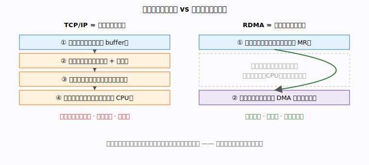
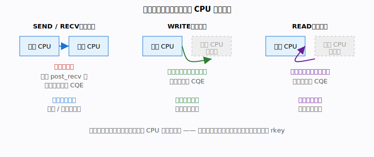

# 第 1 章 · 为什么需要 RDMA

> 这是全书的第一章。我们不急着写代码，先回答一个最朴素的问题：
> **为什么会有 RDMA 这种东西？传统的网络通信到底差在哪？**
> 读完本章，你会对「内核旁路」「零拷贝」「单边 / 双边」这几个词有直觉，
> 后面的章节都建立在这层直觉之上。

## 本章你将遇到的术语（预览）

下面这些词本章会出现，但你**现在不用记住**，只需要先有个一句话的印象：

- **内核旁路（kernel bypass）**：让网卡绕开操作系统内核，直接和你的程序内存打交道。
- **零拷贝（zero-copy）**：数据不在内核缓冲区和用户缓冲区之间来回搬，省掉多次内存拷贝。
- **RNIC（RDMA 网卡）**：一块「会自己搬内存」的智能网卡，是 RDMA 的硬件主角。
- **SEND / RECV（双边操作）**：收发双方都要动手的通信，像打电话，两边都得拿起话筒。
- **WRITE / READ（单边操作）**：只有发起方动手，对方 CPU 完全不知情，像别人直接往你抽屉里放东西。
- **MR（内存区域）**：一块提前向网卡「报备」过、允许它直接读写的内存（细节在第 4 章）。

## 场景 / 问题引入

设想你在写一个分布式系统：两台机器要互相传一大块数据，越快越好，而且 CPU 还得
腾出来干别的正事。你很自然地用上了 TCP socket，`write()` 一发、`read()` 一收，
代码很顺。但一压测就发现两个问题：

1. **CPU 被网络吃掉了**。明明只是「搬数据」，CPU 占用却高得吓人。
2. **延迟下不去**。哪怕在同一个机房，一来一回也要几十微秒起步。

你可能会想：「数据不就是从我这块内存，搬到对面那块内存吗？为什么要这么贵？」
这正是 RDMA 想解决的问题。

## 直觉与类比

先看一个生活类比。传统 TCP/IP 寄一次数据，像**走传统邮局**：

- 你把信交到柜台（用户态 → 内核，一次拷贝）；
- 邮局内部分拣、装车、贴单（协议栈处理、系统调用、中断）；
- 对面邮局收件、再分拣、最后送到收件人手上（对端内核 → 对端用户态，又一次拷贝）。

每一步都要有人经手，"经手"就是 CPU 的开销。

而 RDMA 像**给两家之间装了一条专用气动传输管道**：你把东西放进管口，
它「嗖」地直接出现在对方屋里的指定抽屉里，**中途没有任何人经手，对方甚至可能
都没注意到东西已经到了**。

这条「专用管道」就是 RNIC（RDMA 网卡）在两块**已注册内存**之间直接做的 DMA 搬运。

## 概念一：传统 TCP/IP 的代价

我们把「走邮局」这件事拆开看，传统网络收发一次数据，至少要经历：

1. **数据拷贝**：用户缓冲区 → 内核 socket 缓冲区（发送端），对端再反过来一次。
   大数据量下，光是内存拷贝就很费 CPU 和内存带宽。
2. **系统调用**：每次 `read()` / `write()` 都要陷入内核，有上下文切换成本。
3. **协议栈处理**：TCP/IP 分段、校验、重组，全靠 CPU 一层层算。
4. **中断**：数据到达时网卡发中断，CPU 被打断去处理。
5. **对端 CPU 也得全程参与**：对方得调用 `read()` 把数据从内核搬到用户态。

注意最后一点：**哪怕你只是想把数据放到对方内存里，对方的 CPU 也躲不掉**。
在高并发服务器上，这是一笔巨大的隐形开销。

## 概念二：内核旁路与零拷贝

RDMA 的核心思路就两条，正好对应上面的痛点：

- **内核旁路**：连接建好之后，数据收发**不再经过内核协议栈**。应用程序直接把
  「我要发什么、发到哪」这样的请求交给网卡，网卡自己干活。系统调用、协议栈、
  中断这些开销在数据路径上基本消失了。
- **零拷贝**：网卡通过 **DMA** 直接读写应用程序**已注册的内存**，数据不在
  内核缓冲区和用户缓冲区之间来回搬。源在哪、目的地在哪，网卡一步到位。

下图把传统路径和 RDMA 路径并排放在一起，你能直观看到 RDMA "抄了近路"：

这里埋了一个伏笔：网卡凭什么能「直接」读写你的内存？它怎么知道哪块内存是它能碰的？
答案就是上面预览里提到的 **MR（内存区域）**——你得先把内存向网卡「报备」。
这件事我们留到第 4 章专门讲。

## 概念三：三种传输语义全景

RDMA 提供三种数据传输方式，理解它们「谁参与」是关键。我们先做个**全景概览**，
具体怎么用、怎么写代码，留到第 5～6 章细讲。

| 语义 | 谁的 CPU 参与 | 像什么 | 典型用途 |
|------|--------------|--------|----------|
| **SEND / RECV**（双边） | 收发双方都参与 | 打电话，两边都要拿话筒 | 控制面：握手、交换元数据 |
| **WRITE**（单边） | 只有发起方 | 直接把东西放进对方抽屉 | 数据面：把数据推入对端内存 |
| **READ**（单边） | 只有发起方 | 直接从对方抽屉拿东西 | 数据面：从对端内存拉数据 |

- **双边（two-sided）**：发送方要 `post_send`，接收方必须**事先**准备好接收缓冲
  （`post_recv`）。两边 CPU 都得动手，两边各产生一个「完成事件」。它适合传小而
  关键的控制信息——量不大，但需要对方"知道收到了"。
- **单边（one-sided）**：发起方提供**对方内存的地址和访问钥匙**，网卡直接 DMA
  读或写对方内存，**对方 CPU 全程不知情**，对方不产生完成事件。它适合高吞吐的
  数据面——这才是 RDMA 最"魔法"的部分。

真实系统里最常见的范式是**两者结合**：先用 SEND/RECV 握手、交换"我的内存在哪、
钥匙是什么"，再用 WRITE/READ 高速搬数据。我们这本书的第一个示例
（示例 01）就是这个经典组合。

> 🛠 动手跑：[examples/01-write-demo/](../../examples/01-write-demo/)
> （先别急着读代码，第 2 章我们会带你把它跑起来。）

## 常见误区

- **「RDMA 就是更快的 TCP，换个 API 就行」**。不是。RDMA 是另一套编程模型：
  内存要预先注册、操作是异步的（发出去不等于做完了）、还要自己管理完成事件。
  心智模型变了，不只是换 API。
- **「单边操作对方完全无感，那不就不安全了？」**。对方并非毫无防备：它必须
  **主动把内存注册成可远程访问**，并把"钥匙"（rkey）交出去，发起方才能访问。
  没拿到钥匙、没被授权的内存，网卡碰都碰不了。细节见第 4 章。
- **「没有 RDMA 网卡就学不了」**。完全可以学。用 Soft-RoCE（纯软件模拟）就能在
  普通笔记本上跑通本书所有示例，下一章就教你 30 秒搭好。

## 小结

- 传统 TCP/IP 慢在：多次拷贝、系统调用、协议栈、中断，而且**对端 CPU 也得参与**。
- RDMA 用**内核旁路 + 零拷贝**抄近路：网卡直接 DMA 读写**已注册内存**。
- 三种语义中，**双边（SEND/RECV）**两端 CPU 都参与，适合控制面；
  **单边（WRITE/READ）**只有发起方参与，适合高吞吐数据面。
- 经典范式：先双边握手交换内存信息，再单边高速搬数据。

要让网卡直接搬内存，前提是先把内存「登记」给它。但在登记之前，我们得先有一个
能跑 RDMA 的环境，并亲眼看一次它工作的样子。**下一章，我们用 30 分钟把第一个
示例跑起来。**

## 术语速查

| 术语 | 含义 |
|------|------|
| 内核旁路 | 数据收发绕过操作系统内核协议栈，网卡直接服务应用 |
| 零拷贝 | 网卡 DMA 直接读写已注册内存，省去内核/用户缓冲区间的拷贝 |
| RNIC | 支持 RDMA 的智能网卡，负责实际的内存搬运 |
| DMA | 直接内存访问，硬件不经 CPU 直接读写内存 |
| 双边操作（SEND/RECV） | 收发双方 CPU 都参与的通信，适合控制面 |
| 单边操作（WRITE/READ） | 仅发起方参与、对端 CPU 无感，适合数据面 |
| MR（内存区域） | 向网卡报备过、允许其直接访问的内存（详见第 4 章） |
