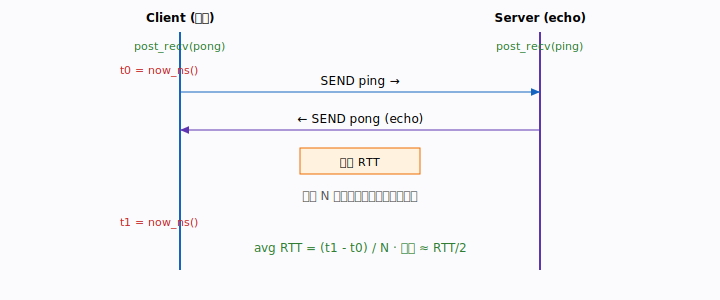

# 第 6 章 · 双边操作 SEND/RECV

第 5 章里，我们终于把连接建好了：两端的 QP 都进入了可用状态，控制通道也通了。
连接就像两根接好的水管——可现在水管里还一滴水都没流过。这一章，我们就让数据
第一次真正在两台机器之间流动起来，用的是最容易上手的方式：**双边操作
SEND/RECV**。

## 本章你将遇到的术语（预览）

- **双边操作（two-sided）**：一次传输，收发两端的 CPU 都要出力。
- **post_send / post_recv**：分别把「我要发」和「我准备收」这两个意图放进队列。
- **预投递（pre-post）**：在对方发来之前，接收方必须先把接收缓冲挂好。
- **RNR（Receiver Not Ready）**：对方发来了，你却没准备好接收，于是报错重试。
- **credit / 流控**：接收方还能收几条，发送方心里得有数。

## 场景 / 问题引入

连接建好之后，最先要解决的不是「怎么把一个 G 的数据高速怼过去」，而是一个更
朴素的问题：**两端怎么互相交换一点点关键信息？** 比如：

- 客户端想让服务端往自己的内存里写数据，可服务端根本不知道「往哪写」——它需要
  客户端内存的地址、rkey 和大小。
- 数据传完了，发起方想知道「对面收好了吗」，需要一个 ACK。

这些信息又小又关键，而且**收发双方都得知道这件事发生了**。这正是 SEND/RECV
擅长的活儿。

## 直觉与类比

把 SEND/RECV 想象成**寄快递**：

- 发件人（发送方）把包裹投进快递柜（`post_send`）。
- 但收件人必须**事先在家放好一个收件箱**（`post_recv`），快递员才有地方放。
- 如果收件人没准备收件箱，快递员只能拎着包裹在门口干等、反复来敲门——这就是
  **RNR**。
- 包裹送达后，发收两边各自得到一张「签收回执」（各产生一个 CQE）。

对比下一章的单边操作（直接拿钥匙开对方家门把东西放进去），双边的特点就是：
**对方必须在场配合**。


## 概念一：为什么叫「双边」

「双边」的核心含义是：**发送方调用 `post_send`，接收方必须已经调用过
`post_recv`，两端 CPU 都参与了这次传输，并且两端各产生一个 CQE。**

这和我们下一章要讲的单边操作形成鲜明对照。单边操作里，发起方提供对端地址，
网卡直接 DMA，对端 CPU 全程不知情、不产生 CQE。而双边操作里，接收方必须主动
「张开手」接住——它的 RQ（接收队列）里得有一个等着的 WR。

这带来一个重要后果：**接收方拥有控制权**。它决定了「我准备接收几条、每条多大」。
正因如此，双边特别适合控制面：握手、交换元数据、发 ACK——这些都需要对端有意识
地参与。

## 概念二：接收必须「预投递」

新手最容易栽的坑：以为「发送方一发，数据就自动到位」。不是的。

RDMA 网卡收到一条 SEND 报文时，会去接收方的 RQ 里**取一个已经挂好的接收 WR**，
把数据放进那个 WR 指定的缓冲区。如果 RQ 是空的——没有任何预投递的接收 WR——网卡
无处安放数据，于是触发 **RNR**：对端被告知「接收方还没准备好」，按重试策略稍后
再试。

所以铁律是：**接收方要在对端可能 SEND 过来之前，就先 `post_recv`。**

这也解释了第 5 章那个看似奇怪的顺序：服务端在 `rdma_accept` 之前就 post_recv，
客户端在 `rdma_connect` 之前就 post_recv。因为一旦连接握手完成，对端的 SEND
随时可能到达，接收缓冲必须**早已就位**。

## 概念三：交换 MR 元数据——双边的经典用法

回忆第 3 章的 `struct control_message`：它装的正是 `addr + rkey + size`。
这就是双边操作最典型的载荷——客户端把「我这块可写内存在哪、钥匙是什么」用 SEND
告诉服务端，服务端用 RECV 收下：

```c
// 客户端把自己的 addr/rkey/size 发给服务端
ctx.send_ctrl.addr = (uint64_t)(uintptr_t)ctx.remote_writable_data;
ctx.send_ctrl.rkey = ctx.data_mr->rkey;
ctx.send_ctrl.size = sizeof(ctx.remote_writable_data);
rdma_post_send(id, NULL, &ctx.send_ctrl, sizeof(ctx.send_ctrl),
               ctx.send_ctrl_mr, IBV_SEND_SIGNALED);

// 服务端在 RQ 取出该消息
wait_recv_comp(conn_id, "...");   // 得到 recv_ctrl.addr / rkey
```

逐行看「为什么」：

- `addr`/`rkey`/`size` 三件套，是后面单边 WRITE/READ 的「门牌号 + 钥匙 + 房间
  大小」，缺一不可。
- `IBV_SEND_SIGNALED` 让这次 send 产生一个 CQE，发送方才能 `wait_send_comp`
  确认「确实发出去了」（第 8 章详谈）。
- 服务端这边，数据已经被网卡放进了它预投递的接收缓冲，`wait_recv_comp` 一返回，
  `recv_ctrl` 里就是客户端的元数据了。

## 概念四：用乒乓理解 credit 与流控

示例 02 是一个纯双边的乒乓程序：客户端发 `ping`，服务端 echo 回 `pong`，循环
N 次，测平均往返延迟（RTT）。它最适合用来体会**预投递的节奏**。

```c
/* 预投递接收第一个 pong，必须在 connect 前 */
check_zero(rdma_post_recv(id, NULL, recv_buf, MSG_SIZE, recv_mr), "post_recv");
check_zero(rdma_connect(id, NULL), "rdma_connect");

for (int i = 0; i < iters; i++) {
    rdma_post_send(id, NULL, send_buf, MSG_SIZE, send_mr, IBV_SEND_SIGNALED);
    wait_send_comp(id, "send ping");
    wait_recv_comp(id, "recv pong");
    if (i + 1 < iters) {
        rdma_post_recv(id, NULL, recv_buf, MSG_SIZE, recv_mr);  // 为下一发预投递
    }
}
```

注意循环里的关键动作：**每收到一个 pong，就立刻为「下一发」再 post 一个接收
WR**。这就是在持续补充「接收 credit」。

什么是 credit？可以理解成接收方手里的「接收名额」。RQ 里每挂一个接收 WR，就给
对端一个「你可以再发一条」的名额。乒乓程序里名额数永远维持在 1，所以收发严格
交替、不会堆积。真实系统中，接收方会一次预投递很多个 WR（批量补充 credit），
让发送方可以连发多条不必等待——这就是双边流控的雏形。

> 🛠 动手跑：[examples/02-send-recv/](../../examples/02-send-recv/)



## 常见误区

- **「发送方一发数据就到了，接收方不用管」**：错。接收方不预投递就 RNR。RDMA 把
  「准备接收」这件事显式交给了你。
- **「post_recv 的 buffer 可以小于对端发来的数据」**：不行。接收缓冲必须 ≥ 对端
  SEND 的长度，否则报错（`IBV_WC_LOC_LEN_ERR`）。
- **「收发各只产生一个 CQE，所以 send 完成就代表对端收到了」**：要分清——send
  的 CQE 只代表**本端网卡已把数据交付出去**（RC 下意味着对端网卡已确认），但
  「对端 CPU 已读取并处理」需要应用层自己用 ACK 来表达。
- **「乒乓很慢说明 RDMA 不快」**：乒乓是最朴素、未优化的形态（每发都 signaled、
  阻塞等完成），是性能优化的**基线**，不是终点。

## 小结

- 双边 SEND/RECV：收发两端 CPU 都参与，各产生一个 CQE。
- 接收方必须**预投递** `post_recv`，否则触发 RNR。
- 双边最适合**小而关键的控制信息**：交换 MR 元数据、发 ACK。
- 持续补充接收 WR 就是在补充 **credit**，这是双边流控的基础。

下一章，我们换一种完全不同的玩法：**单边操作**——发起方拿着对端的 addr+rkey，
让网卡直接 DMA 进对方内存，对端 CPU 全程不参与。这正是 RDMA 高吞吐数据面的主角。

## 术语速查

| 术语 | 含义 |
|------|------|
| 双边操作（two-sided） | SEND/RECV，收发两端 CPU 都参与，各产生一个 CQE |
| post_send | 把「要发送的数据」作为 WR 放入发送队列 SQ |
| post_recv | 把「接收缓冲」作为 WR 预先放入接收队列 RQ |
| 预投递（pre-post） | 在对端 SEND 到达之前先 post_recv |
| RNR（Receiver Not Ready） | 数据到达时 RQ 为空，接收方未就绪，触发重试 |
| credit | 接收方剩余的接收名额，每个未消费的接收 WR 即一个名额 |
| ACK | 应用层用一条 SEND 表达「我已处理完毕」 |
