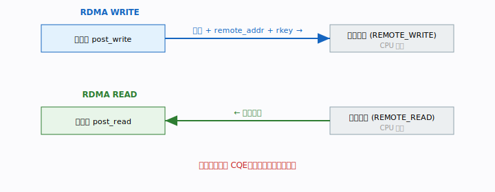
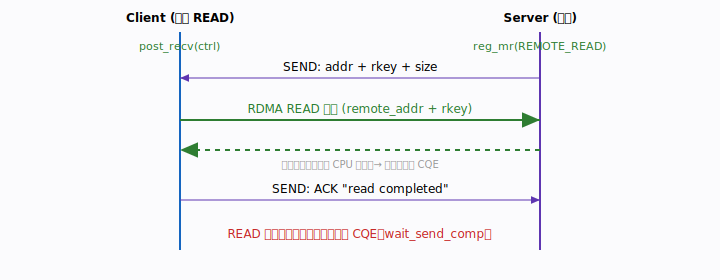

# 第 7 章 · 单边操作 WRITE/READ

上一章的 SEND/RECV 很可靠，但有个「累」的地方：每次传输，对端 CPU 都得在场
配合——要预投递接收、要从 CQ 取完成、要参与每一笔。控制面消息小、次数少，这点
开销无所谓。可一旦进入**高吞吐数据面**，每秒几百万次传输，还让对端 CPU 笔笔
参与，它就别干别的了。

这一章的主角——**单边操作 WRITE/READ**——正是为此而生：发起方拿着对端的地址和
钥匙，让网卡直接 DMA 读写对方内存，**对端 CPU 完全不参与**。

## 本章你将遇到的术语（预览）

- **单边操作（one-sided）**：只有发起方 CPU 参与，对端 CPU 全程无感。
- **WRITE**：把本地数据**推**进对端内存。
- **READ**：把对端内存的数据**拉**回本地。
- **remote addr + rkey**：发起单边操作必须先拿到的「对端门牌号 + 钥匙」。
- **对端不产生 CQE**：被访问的一方网卡默默搬数据，CQ 里什么都没有。

## 场景 / 问题引入

设想一个分布式 KV 存储：客户端要把一个 value 存到服务端某块内存里。如果用
SEND/RECV，服务端 CPU 得：预投递接收、被中断/轮询唤醒、把数据从接收缓冲拷贝到
目标位置……每一笔都打扰它。

我们真正想要的是：**客户端直接把 value 写进服务端早已划好的那块内存，服务端
CPU 该干嘛干嘛，完全不被打扰。** 这就是 WRITE。反过来，如果客户端想读取服务端
内存里某个值，也不想惊动服务端 CPU——那就是 READ。

## 直觉与类比

还记得第 6 章「寄快递」的类比吗？单边操作是另一个画风：

- **WRITE** = 你有对方家的钥匙，自己开门进去，把东西放在约定好的桌子上就走。
  主人可能在睡觉，全程不知道你来过。
- **READ** = 同样拿钥匙进门，但这次是从对方桌上**拿走**一份资料带回家。

「钥匙」就是 `rkey`，「桌子的位置」就是 `remote addr`。关键点：**对方必须事先
把钥匙和地址给你**——而给钥匙这个动作，恰恰是上一章的双边 SEND 干的活儿。这就是
为什么真实系统总是「先双边交换元数据，再单边搬数据」。



## 概念一：什么是「单边」

「单边」的精确含义：**发起方提供对端的 addr + rkey，网卡直接 DMA 访问对端内存，
对端 CPU 完全不参与，对端不产生 CQE。**

把它和第 6 章对照着记最清楚：

| | SEND/RECV（双边） | WRITE/READ（单边） |
|---|---|---|
| 对端 CPU | 必须参与（预投递、取完成） | 完全不参与 |
| 对端 CQE | 产生一个 recv CQE | **不产生** |
| 发起前需要 | 对端已 post_recv | 对端的 addr + rkey |
| 典型用途 | 控制面、小消息 | 数据面、高吞吐 |

「对端不产生 CQE」是单边最反直觉、也最强大的性质：被访问方的网卡默默完成 DMA，
它的应用程序甚至感知不到这次访问发生过。这就是单边能做到极致吞吐和极低对端
开销的根源。

## 概念二：WRITE——把数据推进对端内存

本仓库的入门示例里，服务端用 RDMA WRITE 把数据直接写进客户端内存：

```c
rdma_post_write(conn_id, NULL,
                ctx.local_data, strlen(ctx.local_data)+1,
                ctx.data_mr, IBV_SEND_SIGNALED,
                ctx.recv_ctrl.addr,   // 对端地址（客户端通过 SEND 告知）
                ctx.recv_ctrl.rkey);  // 对端 rkey
```

逐项看「为什么」每个参数都不可少：

- `ctx.local_data` + `ctx.data_mr`：本地源数据及其 MR（网卡要 DMA 读它，需要
  lkey，封在 mr 里）。
- `ctx.recv_ctrl.addr` / `ctx.recv_ctrl.rkey`：**对端**的目标地址和钥匙——这正是
  客户端先前通过双边 SEND 告诉服务端的（第 6 章的元数据交换）。没有它俩，网卡
  根本不知道往哪写、也没权限写。
- `IBV_SEND_SIGNALED`：让这次 write 在**发起方**产生 CQE，发起方才能确认完成。
  注意——CQE 只在发起方这边产生，客户端（被写方）那边**什么 CQE 都没有**。

这就引出 WRITE 的一个经典「尾巴」：客户端怎么知道数据写好了？因为它收不到 CQE。
办法之一是服务端写完后再补一发 SEND 当 ACK 通知客户端——这恰好是第 9 章
WRITE_WITH_IMM 要优化掉的那个往返。

> 🛠 动手跑（WRITE）：[examples/01-write-demo/](../../examples/01-write-demo/)

## 概念三：READ——从对端内存拉数据

READ 和 WRITE 完全对称，只是数据流向相反：

```c
rdma_post_read(id, NULL, local_buf, len, local_mr,
               IBV_SEND_SIGNALED,
               remote_addr, remote_rkey);   // 对端地址 + rkey
```

示例 03 由**客户端发起 READ**，把服务端内存里的数据拉回本地：

- 服务端把内存注册为 `IBV_ACCESS_REMOTE_READ`，并通过 SEND 告知 addr/rkey/size。
  （权限标志决定对方能干什么——只给 READ 权限，对方就只能读不能写。）
- 客户端本地目标 buffer 需 `IBV_ACCESS_LOCAL_WRITE`，因为网卡要把读回来的数据
  **写入**本地这块内存。
- **READ 完成在发起方的发送队列产生 CQE**，用 `wait_send_comp` 获取；服务端对
  这次数据搬运**毫无感知**。

WRITE 与 READ 的对称性，一张表说清：

| | 数据流向 | 谁发起 | 对端是否产生 CQE |
|---|---|---|---|
| WRITE | 本地 → 对端 | 写入方 | 否 |
| READ | 对端 → 本地 | 读取方 | 否 |

> 🛠 动手跑（READ）：[examples/03-read/](../../examples/03-read/)



## 概念四：READ 通常比 WRITE 慢一点

虽然两者对称，延迟却不完全一样，这点对性能工程很重要：

- **WRITE** 是「推」：发起方把数据连同请求一起发出，对端网卡收下、DMA 落地即可。
  发起方的 CQE 在「对端确认收到」后产生。
- **READ** 是「拉」：发起方先发一个读请求过去，对端网卡再把数据 DMA 读出、发回，
  数据**走完一个完整往返**才算完成。

直觉上，READ 多了「请求过去 + 数据回来」的来回，所以**READ 的延迟通常高于
WRITE**，单边写在很多高性能设计里因此更受偏爱。当你要拉对端数据又在乎延迟时，
有时会反过来设计成「让对端主动 WRITE 给你」。

## 常见误区

- **「单边操作不需要对端做任何事」**：搬数据时确实不需要。但对端必须**事先**做
  两件事：注册内存并开放对应权限（REMOTE_WRITE / REMOTE_READ），以及把
  addr+rkey 告诉你。这一步通常用双边 SEND 完成。
- **「WRITE 完成的 CQE 说明对端应用已经读到数据了」**：不。CQE 只说明数据已落进
  对端内存，对端应用并不知道——它没有 CQE。要通知它，得用 ACK 或
  WRITE_WITH_IMM。
- **「rkey 是固定不变的，可以写死」**：rkey 随每次 `ibv_reg_mr` 而变，必须运行时
  动态交换，不能硬编码。
- **「权限随便开，方便」**：只开必要权限。该只读就别给 REMOTE_WRITE，这是安全
  边界。

## 小结

- 单边 WRITE/READ：发起方提供对端 addr+rkey，网卡直接 DMA，**对端 CPU 不参与、
  不产生 CQE**。
- WRITE 把数据推入对端内存；READ 把对端数据拉回本地，两者方向相反、形式对称。
- 单边的前提是先用双边交换 addr+rkey 并开放好内存权限。
- READ 因多一次往返，延迟通常高于 WRITE。

到这里你已经掌握了 RDMA 的三大数据语义（SEND/RECV、WRITE、READ）。但有一个问题
一直被我们绕过去了：这些操作都是**异步**的——`post` 之后就立即返回了，那到底
「什么时候算完成」？下一章我们就专门拆解 **post 与 poll 的完成机制**。

## 术语速查

| 术语 | 含义 |
|------|------|
| 单边操作（one-sided） | 仅发起方 CPU 参与，对端 CPU 无感、不产生 CQE |
| WRITE | 把本地数据 DMA 推入对端内存 |
| READ | 从对端内存 DMA 拉数据回本地 |
| remote addr | 对端目标内存的地址，由对端通过双边告知 |
| rkey | 对端内存的远程访问钥匙，发起单边操作必需 |
| IBV_ACCESS_REMOTE_WRITE/READ | 内存注册时开放的远程写/读权限 |
