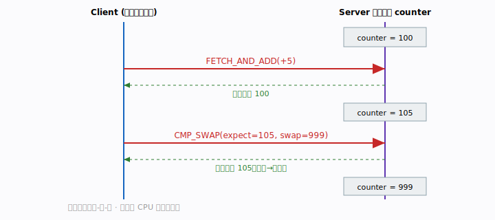

# 第 9 章 · 过渡：立即数与原子操作

恭喜你走到了入门篇的最后一章。前八章我们搭好了 RDMA 的「主干道」：建链、注册
内存、三大数据语义、完成机制。这一章是一座**桥**——我们看两个更精巧的操作，
它们既是前面知识的自然延伸，又已经带上了「为性能与并发而设计」的味道，正好把
你引向第二部分的硬件模型与性能工程。

两个主角：

- **WRITE_WITH_IMM**：单边写，顺手通知对端，省掉一次 ACK 往返。
- **原子操作（FETCH_ADD / CMP_SWAP）**：让网卡对对端内存做不可分割的「读-改-
  写」，分布式锁与无锁计数器的地基。

## 本章你将遇到的术语（预览）

- **立即数（immediate data）**：随操作捎带的 32 位小数据，能触发对端 recv CQE。
- **WRITE_WITH_IMM**：带立即数的 RDMA 写，写数据 + 通知合二为一。
- **原子操作（atomic）**：网卡对对端 8 字节做的不可分割读-改-写。
- **FETCH_ADD**：原子地「加一个数并返回旧值」。
- **CMP_SWAP**：原子地「若等于期望值则替换」，比较并交换。
- **8 字节对齐**：原子操作目标地址的硬性要求。

---

## 9.1 WRITE_WITH_IMM：写 + 通知合一

### 问题：单边写之后那个多余的往返

回忆第 7 章 WRITE 的尾巴：服务端用 RDMA WRITE 把数据写进客户端内存——可客户端
（被写方）**不产生 CQE**，它压根不知道数据到了。入门示例的办法是：服务端写完
**再补一发 SEND 当 ACK**，客户端 RECV 到 ACK 才知道「数据就绪」。

这意味着：一次逻辑上的「写并通知」，实际跑了「WRITE + SEND」两次操作、两个往返
开销。能不能合成一次？能——这就是 **WRITE_WITH_IMM**。

### 直觉与类比

普通 WRITE 像「悄悄把东西放进对方家就走」，对方不知道。WRITE_WITH_IMM 则是
「放完东西**顺手按一下门铃**」——东西照常 DMA 进对方内存（对端 CPU 不搬数据），
但额外触发对端一个 recv CQE，门铃声里还夹带一张 32 位的小纸条（立即数）。


### 它怎么工作

- 写入的数据照常 DMA 进客户端目标 buffer（**单边**，对端 CPU 不参与搬运）。
- **但额外消费对端一个 recv WR，产生 recv CQE**，
  `wc.opcode == IBV_WC_RECV_RDMA_WITH_IMM`，`wc.imm_data` 携带 32 位立即数。

于是客户端**无需额外 ACK 报文**就被通知到，少一个往返。注意这里 recv WR 被消费
了——所以即便它不承载数据，接收方**仍必须预投递一个 recv WR**（哪怕 0/1 字节
占位），否则又是 RNR（呼应第 6 章）。

### 代码与陷阱

```c
/* librdmacm 的 rdma_post_write 不支持立即数，必须手工构造 ibv_send_wr */
struct ibv_send_wr wr = {0}, *bad;
struct ibv_sge sge = { .addr=(uintptr_t)buf, .length=len, .lkey=mr->lkey };
wr.opcode      = IBV_WR_RDMA_WRITE_WITH_IMM;   // ★ 关键 opcode
wr.send_flags  = IBV_SEND_SIGNALED;
wr.imm_data    = htonl(0xCAFEF00D);            // 立即数走网络字节序
wr.sg_list     = &sge;
wr.num_sge     = 1;
wr.wr.rdma.remote_addr = remote_addr;          // 对端 addr（SEND 告知）
wr.wr.rdma.rkey        = remote_rkey;          // 对端 rkey
ibv_post_send(id->qp, &wr, &bad);
```

逐点讲「为什么」：

- **必须用 `ibv_post_send` 手工构造**：librdmacm 的便捷封装 `rdma_post_write`
  不支持立即数，到了这里就得「下沉」到原生 verbs。
- `imm_data` 走线为**网络字节序**：发端 `htonl`，收端 `ntohl`，跨机器别忘了。
- 接收方读立即数需要拿到 `ibv_wc`，所以客户端直接用 `rdma_get_recv_comp(&wc)`
  而非丢弃 wc 的封装，再 `ntohl(wc.imm_data)` 取出那张小纸条。

> 🛠 动手跑：[examples/04-immediate/](../../examples/04-immediate/)

立即数典型用途：用那 32 位携带「消息编号 / 槽位 ID / 状态码」，让对端一收到门铃
就知道「哪块数据好了」，省去单独的元数据交换。

---

## 9.2 原子操作：分布式锁与计数器的地基

### 问题：多个客户端同时改同一个远端变量

设想多台机器要共享一个远端计数器，各自做「读出来 +1 再写回去」。如果用「READ
然后 WRITE」两步，两个客户端就可能同时读到 100、各自加成 101，结果丢了一次
计数——这就是经典的竞态。

我们需要的是**不可分割**的「读-改-写」：从读到改到写，中间谁都插不进来。RDMA
**原子操作**就提供这个，而且全程**对端 CPU 不参与**。

### 直觉与类比

原子操作像银行柜台的「凭条」：你说「给账户加 5，并把加之前的余额告诉我」，柜员
一气呵成完成，期间不接待别人。无论多少人同时来，每笔都干净利落、不会互相踩。



### 两种原子操作

RDMA 让网卡直接对**对端内存中的一个 64 位字**做不可分割的读-改-写。示例 05 的
客户端依次演示两种：

1. **FETCH_AND_ADD(+5)**：`*remote += 5`，返回**旧值**（100 → 105，返回 100）。
   无锁计数器、序列号分配的基础。
2. **COMPARE_AND_SWAP(expect=105, swap=999)**：若 `*remote == 105` 则置为 999，
   返回旧值。分布式锁、CAS 自旋的基础——「只有在我以为的状态没被别人改过时，
   我才动手」。

两者都把**操作前的旧值**写回客户端本地 8 字节 buffer，并在**发送队列产生 CQE**
（和单边一样，对端无感）。

### 代码与陷阱

原子操作也只能用 `ibv_post_send` 手工构造，参数在 `wr.wr.atomic`：

```c
struct ibv_send_wr wr = {0}, *bad;
struct ibv_sge sge = { .addr=(uintptr_t)local8, .length=8, .lkey=mr->lkey };
wr.opcode      = IBV_WR_ATOMIC_FETCH_AND_ADD;   // 或 IBV_WR_ATOMIC_CMP_AND_SWP
wr.send_flags  = IBV_SEND_SIGNALED;
wr.sg_list     = &sge;                           // 旧值写回这里（8 字节）
wr.num_sge     = 1;
wr.wr.atomic.remote_addr = remote_addr;          // ★ 必须 8 字节对齐
wr.wr.atomic.rkey        = remote_rkey;
wr.wr.atomic.compare_add = 5;                    // FETCH_ADD 的加数 / CMP_SWAP 的比较值
wr.wr.atomic.swap        = 999;                  // 仅 CMP_SWAP 使用
ibv_post_send(id->qp, &wr, &bad);
```

务必记住的几条陷阱：

- **目标地址必须 8 字节对齐**（示例用 `__attribute__((aligned(8)))`）。原子操作
  作用于一个 64 位字，未对齐直接出错。
- **目标 MR 必须开放 `IBV_ACCESS_REMOTE_ATOMIC`**——和 REMOTE_WRITE/READ 一样，
  这是独立的权限位。
- `compare_add` 一字段两用：FETCH_ADD 时是加数，CMP_SWAP 时是比较值；`swap`
  仅 CMP_SWAP 用。
- 原子性保证的**粒度/范围**取决于设备能力（`atomic_cap`，IB 级 vs 全局）。跨
  主机的 RDMA 原子操作与本地 CPU 的原子指令**混用同一变量时**要格外小心——两者
  不一定互相保证原子。

> 🛠 动手跑：[examples/05-atomic/](../../examples/05-atomic/)

---

## 常见误区

- **「WRITE_WITH_IMM 的接收方不用 post_recv，反正不传数据」**：错。立即数会消费
  一个 recv WR，没预投递照样 RNR。
- **「立即数可以传任意大小的元数据」**：不行，只有 32 位。它是「通知 + 小标签」，
  不是数据通道。
- **「原子操作能对任意长度内存生效」**：不行，固定就是一个 64 位字、且地址必须
  8 字节对齐。
- **「远端 RDMA 原子和本地 `__atomic` 对同一变量混用没问题」**：危险。原子域取决
  于设备，混用前务必确认 `atomic_cap`。
- **「这些高级操作还能用 librdmacm 的 rdma_post_* 封装」**：不能。立即数与原子
  都必须下沉到 `ibv_post_send` 手工构造 WR。

## 小结

- **WRITE_WITH_IMM**：单边写 + 32 位立即数，触发对端 recv CQE，把「写数据」和
  「通知对端」合成一次操作，省掉一次 ACK 往返；接收方仍须预投递 recv WR。
- **原子操作 FETCH_ADD / CMP_SWAP**：网卡对对端一个 8 字节字做不可分割的读-改-
  写，对端 CPU 不参与，是分布式锁、无锁计数器、序列号分配的地基；地址须 8 字节
  对齐，MR 须开放 REMOTE_ATOMIC。
- 这两类操作都已超出 librdmacm 便捷封装，需要手工构造 `ibv_send_wr`——这也预示
  着：再往深走，你会越来越多地直接面对原生 verbs 与硬件细节。

### 通往第二部分

到这里，入门篇画上句号。你已经能读懂、写出一个完整的 RDMA 程序，并理解它每一步
「为什么这么做」。但还有许多问题我们只是点到为止：网卡内部到底怎么把 WR 变成
线上的报文？为什么 READ 比 WRITE 慢、怎么把吞吐压榨到极限？选择性 signaling、
inline、批处理这些优化背后的硬件模型是什么？

**第二部分**将带你下沉到**硬件模型与性能工程**：MMIO/DMA 如何驱动队列、RC/UC/UD
的取舍、MPT/MTT 地址翻译、以及把延迟与吞吐推向极致的系统化方法。我们从「会用」
走向「用好、用对、用到极致」。

## 术语速查

| 术语 | 含义 |
|------|------|
| 立即数（immediate data） | 随操作捎带的 32 位数据，能触发对端 recv CQE |
| WRITE_WITH_IMM | 带立即数的 RDMA 写，写数据 + 通知合一 |
| IBV_WC_RECV_RDMA_WITH_IMM | 对端收到带立即数写时的完成 opcode |
| 原子操作（atomic） | 网卡对对端 8 字节做的不可分割读-改-写 |
| FETCH_ADD | 原子地加一个数并返回旧值 |
| CMP_SWAP | 原子地「若等于期望值则替换」，返回旧值 |
| IBV_ACCESS_REMOTE_ATOMIC | 允许对端做原子操作的 MR 权限位 |
| atomic_cap | 设备的原子能力/保证范围（IB 级 vs 全局） |
