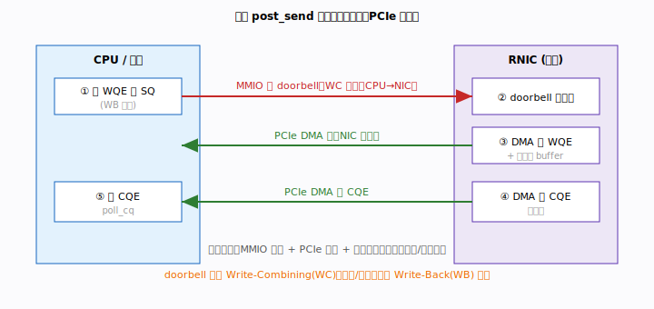
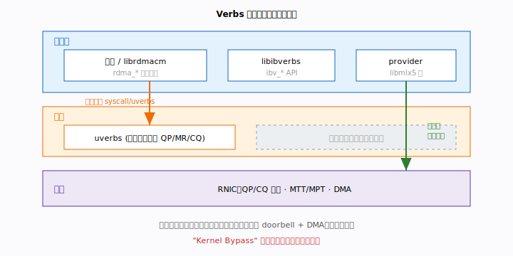
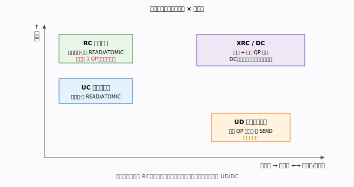
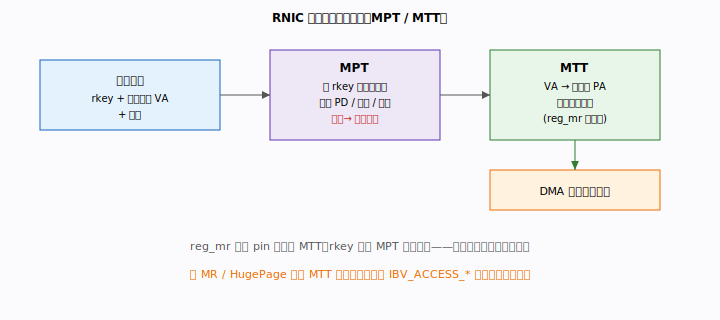
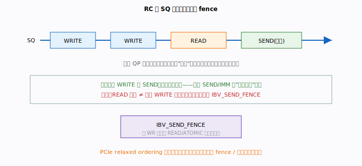

# 第 10 章 · 硬件模型：数据路径的真实代价

> 第一部分（入门篇）已经把你带到了「会用」的程度：你能创建 QP/MR/CQ，能
> post/poll，能跑通 SEND/RECV 与 WRITE。但「会用」之后，迟早会撞到两类问题：
> 为什么我的延迟下不去？为什么换个机器、换个 NUMA 节点，性能就抖了？
> 答案不在 API 文档里，而在 API 底下的**硬件**里。本章不再教你「怎么写」，
> 而是回答「**为什么是这样、代价究竟花在哪**」——为后面的性能工程（第 11 章）
> 打地基。

---

## 本章你将遇到的术语（预览）

下面每个术语先给一句话直觉（预热用），完整定义在正文展开；章末另有一份复习速查表。

| 术语 | 一句话直觉 |
|------|-----------|
| **MMIO** | CPU 用一条普通的「写内存」指令，写的其实是网卡上的寄存器。 |
| **Doorbell（门铃）** | 就是那条写到网卡寄存器的指令——「叮，有新活了」，约 100 ns。 |
| **DMA** | 网卡自己去读写主机内存，不打扰 CPU——这是「零拷贝」的本体。 |
| **IOMMU** | 给设备 DMA 做地址翻译的「关卡」，开了它注册内存会更慢。 |
| **MPT** | 网卡里的一张表，存每块注册内存的「身份证」（key、权限、地址、长度）。 |
| **MTT** | 另一张表，把虚拟/DMA 地址翻成物理页地址——网卡专用页表。 |
| **MR** | 注册过的内存：页被 pin 住 + 在 MTT/MPT 里登记。 |
| **lkey / rkey** | 引用一块 MR 的钥匙，本端用 lkey，对端用 rkey。 |
| **RC / UC / UD** | 可靠连接 / 不可靠连接 / 不可靠数据报，三种 QP 性格。 |
| **XRC / DC** | 两种缓解「QP 数量爆炸」的扩展传输类型。 |
| **Fence（栅栏）** | 一道「先等前面的 READ/ATOMIC 干完再走」的命令。 |

---

## 引子：内核旁路不是免费的

入门篇反复强调 RDMA 的卖点是「内核旁路、零拷贝」，很容易让人产生一种错觉：
既然绕过了内核，延迟岂不是约等于零？

并不是。内核旁路做的事，是把**系统调用的开销**换成了 **MMIO + PCIe 事务**的
开销。前者是微秒级，后者是百纳秒级——确实快了一个数量级，但绝不是零。
要知道延迟的下限在哪、该往哪优化，你得把一次 `post_send` 在硬件上**真正
发生的事**拆开看一遍。这就是第 1 节要做的。

---

## 1. 一次 post_send 的真实代价：MMIO · DMA · WC vs WB

**问题**：你调用 `rdma_post_send` 后函数立刻返回了，但数据显然还没发出去。
那么从「函数返回」到「对端收到」，中间这台机器到底忙了些什么？

**类比**：把 post_send 想象成「给楼下快递柜寄件」。你（CPU）把包裹和单子放进
柜子（写 WQE 到内存），然后**按一下柜子上的呼叫按钮**（doorbell）通知快递员
（网卡）。快递员过来取件（DMA 读 WQE），送达后在你的签收本上盖个章
（DMA 写 CQE），你回头翻签收本（poll CQ）才知道寄到了。按钮一按你就能走人
——这就是「post 立即返回」，但寄送的物理过程一样都没省。

### 硬件事务序列

一次 post_send 在硬件上严格按这五步发生：

```
① CPU 填写 WQE（Work Queue Element）到 SQ 所在内存（Write-Back 普通内存）
② CPU 写 doorbell 寄存器（MMIO，Write-Combining 内存）→ 网卡得到通知
③ 网卡通过 PCIe DMA 读 WQE（可能顺带读 inline 以外的数据 buffer）
④ 网卡完成传输后，PCIe DMA 写 CQE 到 CQ 内存
⑤ CPU poll_cq，读取 CQE 确认完成
```

这里出现了两个需要先解释的词：**MMIO**（Memory-Mapped I/O）是指 CPU 用普通的
内存写指令去写一个其实落在网卡上的地址；**DMA**（Direct Memory Access）是指
网卡反过来自己读写主机内存，全程不惊动 CPU——这正是「零拷贝」的物理本体。



### 为什么 doorbell 区和 SQ 区是两种内存：WC vs WB

第 ① 步写 WQE 和第 ② 步写 doorbell，落在**两种性质完全不同的内存**上。这不是
随意安排，理解它才能理解延迟从哪来。

| 内存类型 | 用途 | 特点 |
|----------|------|------|
| WB（Write-Back，普通） | SQ / CQ / 数据 buffer | CPU cache 一致，可被 DMA 读到最新值 |
| WC（Write-Combining，MMIO doorbell 区） | 写 doorbell 通知网卡 | CPU 写合并后再刷到 PCIe 总线；**不可读** |

通俗说：**WB** 是你日常用的内存，读写都走 cache，网卡 DMA 读它能拿到最新值，
所以 WQE、CQE、数据 buffer 都放这里。**WC** 是专门留给 doorbell 的「只写
通道」——CPU 会把多次写合并（combine）后一次性刷到 PCIe 总线，效率高，
但代价是它**不可读**，且需要一次「刷出」动作。

doorbell 区映射到 `/proc/<pid>/maps` 里 `[uverbs]` 开头的 mmap 区域。每次
`rdma_post_send` 最终触发一次对该区域的 MMIO 写，加上来回 PCIe 事务，构成
RDMA 延迟的**硬件下限**，通常在百纳秒量级（取决于 PCIe 代数、NUMA 距离）。

### 延迟到底由哪些部分组成

把上面五步加上线缆传播，一次操作的总延迟可以拆成：

```
总延迟 ≈ WQE 写缓存（WB）+ doorbell 刷出（WC）
       + PCIe 读 WQE 往返
       + 数据 DMA（WRITE/READ）
       + PCIe 写 CQE 往返
       + 线缆/交换机传播
```

注意这里面没有一项是「系统调用」——那正是内核旁路省下的。但每一项 PCIe
往返都实打实地花时间。其中一个常被忽略的杀手是 **NUMA 距离**：当 CPU 与网卡
不在同一个 NUMA 节点时，那次跨节点的 doorbell 写会让延迟劣化 **30–50 ns**。
这就是「CPU-NIC 亲和性」要求的硬件根因——第 11 章会把它变成可操作的优化手段。

---

## 2. Verbs 软硬件分层：控制面慢、数据面快

**问题**：同样是调 verbs API，为什么有人说「RDMA 收发不走内核」，可创建 QP
时明明又触发了系统调用？这两种说法都对吗？

**类比**：把 RDMA 软件栈想成一家餐厅。**控制面**像是「办会员卡、订包间」——
要走前台、填表、走流程（系统调用进内核），慢，但你一晚上只办一次。
**数据面**像是「服务员直接上菜」——你和后厨之间有条专用通道，不用每道菜都
回前台登记。混淆这两条路，是 RDMA 性能误解的头号来源。

RDMA 软件栈分三层，关键在于**控制面与数据面走不同的路径**。



### 控制面（慢路径）

```
应用 → librdmacm / libibverbs → ioctl(uverbs) → 内核 ib_core → 驱动 → 硬件
```

创建 / 销毁 QP、MR、CQ、PD 都走这条路。每次都有系统调用，但它们只在**连接
建立时**发生，频率极低，**不在关键路径上**——所以慢一点无所谓。

### 数据面（快路径）

```
应用 → libibverbs → provider（libmlx5 等）→ WQE 写用户态 mmap → MMIO doorbell
                                                                      ↓
                                                              RNIC 硬件直接处理
```

`ibv_post_send` / `ibv_poll_cq` 完全在用户态执行，**0 系统调用、0 内核态切换**。
这里出现的 **provider**（如 `libmlx5`）是厂商提供的用户态驱动库，它直接调用
网卡的用户态接口写 WQE 并敲 doorbell。这才是「内核旁路」名副其实的地方。

### 想确认自己在用哪条路？看这几个文件

```
/dev/infiniband/uverbs0        # 控制面字符设备（ioctl）
/sys/class/infiniband/mlx5_0/ # 设备能力、计数器
ldd bin/server | grep mlx5    # 确认 provider 是否链接
```

记住这条性能直觉：**syscall 是微秒级，WQE 写是纳秒级**。把任何本该在数据面
做的事误放到控制面（比如频繁 reg/dereg 内存），就是把纳秒的活硬塞进微秒的
路径——第 11 章和第 6 节都会再提到这条线。

---

## 3. 传输类型对比：RC / UC / UD / XRC / DC

**问题**：入门篇所有示例都用 RC（可靠连接），用着也挺好，为什么还要了解
别的类型？

**类比**：选传输类型就像选「快递服务」。**RC** 是顺丰标快——保证送达、保证
顺序、丢了自动重发，但每个收件人都要单独建一条专线。**UD** 是同城闪送广播
——一辆车能给很多人送，便宜灵活，但不保证每件都到。当你的收件人从 10 个
涨到 10000 个，「每人一条专线」的 RC 就会让你的 QP 数量爆炸（N² 问题），
这时就得换思路。

不同 QP 类型在**可靠性、连接性、支持的操作、扩展代价**上差异显著，选型直接
影响架构。



### 四种主要类型

| 类型 | 可靠性 | 连接 | 支持操作 | 扩展性 |
|------|--------|------|----------|--------|
| **RC**（Reliable Connected） | 有序可靠，硬件重传 | 一对一 | SEND/RECV/WRITE/READ/ATOMIC | 差：N² QP |
| **UC**（Unreliable Connected） | 无重传，包可丢 | 一对一 | SEND/RECV/WRITE | 较差 |
| **UD**（Unreliable Datagram） | 无重传，包可丢 | 一对多 | 仅 SEND/RECV | 最佳：1 QP |
| **XRC**（eXtended RC） | 同 RC | 共享 RQ | SEND/RECV/WRITE/READ | 缓解 N² |

读表小贴士：可靠性越强、操作越全，往往连接越「私有」、扩展越差。RC 是
功能最全但最不可扩展的一端，UD 是反过来的一端。**XRC**（扩展 RC）通过让多个
QP 共享接收队列，在保住 RC 可靠性的同时缓解 N² 爆炸。

### DC（Dynamic Connected，Mellanox 扩展）

DC 是 Mellanox/NVIDIA 网卡特有的类型，可以理解成「按需拨号的可靠连接」：
它兼顾 RC 的可靠性与 UD 的扩展性，连接在网卡内**动态建立与复用**，应用层
不需要维护全量 QP。特别适合万节点以上的 All-to-All 通信（如 NCCL、存储网络）。

### 何时选什么

- **教学 / 通用**：RC，语义最全、最易理解（本仓库所有示例）。
- **低延迟广播 / 路由发现**：UD。
- **大规模存储 / AI 集群**：DC 或 RoCE v2 + ECMP。
- **QP 数量超出硬件限制**：XRC 或 SRQ（见阶段四 / 第 12 章）。

---

## 4. 内存与地址翻译：MR / MPT / MTT / IBV_ACCESS_*

**问题**：第 3 章讲过注册内存会拿到 lkey/rkey，对端凭 rkey 就能直接写你的
内存。但凭一个 32 位的数字就能随意访问别人内存，这安全吗？网卡又是怎么把
一个虚拟地址翻成它能 DMA 的物理地址的？

**类比**：把一块注册内存想成「银行保险柜」。**rkey 是钥匙**，但光有钥匙没用
——银行（网卡）还要查一本**登记簿**（MPT）：这把钥匙对应哪个柜子、持钥匙人
有没有权限、要取的范围在不在柜子里。核验通过后，再用一张**楼层平面图**
（MTT）找到柜子的真实物理位置。钥匙 + 登记簿 + 平面图，缺一不可。

RDMA 的安全与性能都建立在**内存注册**机制上。注册不只是「告诉网卡有这块
内存」，而是构建了一条从 rkey 到物理地址的**鉴权翻译链**。



### MPT（Memory Protection Table）：那本登记簿

每个 MR 在 RNIC 内对应一条 MPT 表项，索引键就是 `lkey` 或 `rkey`。
远端 WRITE/READ 请求到达时，网卡先查 MPT，做三道校验：

1. **PD 校验**：请求来自的 QP 与 MR 是否属于同一 PD。
2. **权限校验**：操作类型是否在 `IBV_ACCESS_*` 权限集内。
3. **范围校验**：`addr + length` 是否落在注册范围内。

任何一项失败，都会产生完成错误（`IBV_WC_REM_ACCESS_ERR` 等），**根本不会
触碰内存**。所以「凭 rkey 就能乱写」的担心，被这三道锁挡住了。

### MTT（Memory Translation Table）：那张平面图

MPT 通过 `MTT_base` 指向一组物理页映射（等价于内核的页表）。校验通过后，
网卡用 MTT 把虚拟/DMA 地址翻译成物理页地址，才能 DMA。

这也解释了 `ibv_reg_mr` 为什么慢（μs–ms 级）——它的开销主要在两件重活：

- `get_user_pages()`：pin 住所有物理页（防止被 swap 换出）。
- 在 RNIC 的 MTT 中建立 VA → PA 映射。

正因为注册这么贵，生产环境绝不会每次收发都 reg/dereg，而是用**注册缓存**
（registration cache）复用 MR（见阶段六 / 第 6 节）。顺带一提，若开启了
**IOMMU**（设备 DMA 的地址翻译关卡），注册代价还会进一步增加。

### IBV_ACCESS_* 权限矩阵

权限位决定了「这把钥匙能开多大的门」：

```c
IBV_ACCESS_LOCAL_WRITE    // 本端 RQ（post_recv）或 READ 目标必须有此权限
IBV_ACCESS_REMOTE_WRITE   // 允许对端 RDMA WRITE
IBV_ACCESS_REMOTE_READ    // 允许对端 RDMA READ
IBV_ACCESS_REMOTE_ATOMIC  // 允许对端原子操作（FETCH_ADD / CMP_SWAP）
IBV_ACCESS_ON_DEMAND      // ODP：延迟 pin（见阶段六）
```

一句话规则：**对端能做什么，完全由 MR 注册时的权限决定——rkey 是钥匙，
MPT 是锁**。请遵守最小权限原则：只开放必要的位，这样即便 rkey 泄露，
爆炸半径也最小。

---

## 5. 完成语义与排序保证：FENCE 与 PCIe ordering

**问题**：RC 不是保证「有序可靠」吗？那我先 WRITE 再 SEND，对端一定先看到
WRITE 的数据、再收到 SEND 通知，对吧？以及——`wc.status == SUCCESS` 是不是
就代表对端那边数据已经完全可用了？

**类比**：RC 的「有序」保证的是**信件投递的先后顺序**，但「信送到收件人楼下」
和「收件人本人读到信」之间还有一截。RDMA 程序里很多数据竞争，就藏在这截
微妙的缝隙里。

RC QP 保证报文有序到达，但「有序到达」与「对端内存可见」「对端 CPU 可读」
之间仍有微妙差别，是 RDMA 程序出现数据竞争的常见根源。



### RC 内的顺序保证

```
同一 QP：WR 按投递顺序在 SQ 中排队，网卡按序执行。
```

具体来说（IB Spec Vol.1 §10.7.3）：

- **SEND 可用作数据栅栏**：RC 下，同一 QP 先 WRITE 后 SEND，对端**保证**先
  收到 WRITE 的数据，再收到 SEND——这正是示例 01/04 用 SEND/ACK 当通知的
  理论依据。
- **同一 QP、同一地址：WRITE→READ 有序**：RC 保证同一 QP 上后投递的 READ 能
  观测到先投递的 WRITE 已生效（操作按 SQ 顺序在对端执行）。换句话说，
  「同 QP 先 WRITE 后 READ 会读到旧值」是**误解**。真正需要 FENCE 的场景，是
  当**本地** READ/ATOMIC 的返回结果要喂给**后续**操作时（见下文
  FETCH_ADD→FENCE→WRITE），以及 PCIe relaxed ordering 下本地完成顺序的边界
  情形。
- **跨 QP 无顺序保证**：多个 QP 之间没有全局顺序，需应用层同步。

### IBV_SEND_FENCE：让后面的操作等一等

```c
wr.send_flags = IBV_SEND_SIGNALED | IBV_SEND_FENCE;
```

带 FENCE 标志的 WR 会等待**本 QP 内所有先前的 READ / ATOMIC 完成**后，
才开始执行自身。典型用法：FETCH_ADD → FENCE → WRITE——先原子取回一个旧值，
确保它真的回来了（FENCE），再把基于旧值算出的结果写出去。

### PCIe Relaxed Ordering 的影响

PCIe 默认启用 Relaxed Ordering（RO），允许 PCIe 事务重排，以提高总线利用率。
这是一把双刃剑：

- NIC 的 DMA 写（CQE / RDMA WRITE 数据）可能在对端以乱序落地。
- Mellanox 网卡在 RC 下默认**关闭 RO**，保证 WRITE 语义；但 UD 场景下可能存在。
- 自研或异构场景需检查 `ethtool -I <dev>` 和 PCIe 配置，或显式用 FENCE。

### 生产排查要点

记住下面两条「等号不成立」，能避开一大半诡异 bug：

```
wc.status == IBV_WC_SUCCESS   ≠ 对端数据已完全可见（不同 CPU core 的 cache）
                               → 需要 fence 或应用层同步原语
wc.status != IBV_WC_SUCCESS   → QP 进入 ERROR 态，后续 WR 全部以 flush error 完成
                               → 必须重建 QP（阶段五 / 后续章节详述）
```

---

## 小结：五段式（原理 → API → 代码 → 性能 → 陷阱）

下表把全章浓缩成可复习的五段式，便于回看：

| 节 | 原理 | 核心 API | 代码位置 | 性能影响 | 常见陷阱 |
|----|------|---------|---------|---------|---------|
| 10.1 | MMIO + DMA 是真实路径 | `ibv_post_send` doorbell | `common/rdma_common.h` `wait_send_comp` | NUMA 亲和 ±50 ns | 误认为"零延迟" |
| 10.2 | 数据面 0 syscall | provider mmap | 透明，应用不感知 | syscall = 微秒级；WQE 写 = 纳秒级 | 混淆控制面/数据面开销 |
| 10.3 | RC/UD/DC 取舍 | `qp_type` in `ibv_qp_init_attr` | `fill_qp_attr()` `common/rdma_common.h:43` | UD 1 QP vs RC N² QP | 大规模下坚持用 RC 导致 QP 爆炸 |
| 10.4 | MPT/MTT 鉴权链 | `ibv_reg_mr` `IBV_ACCESS_*` | `examples/*/server.c` `client.c` | reg 慢（ms）；MTT 命中影响 DMA | 权限过宽暴露 rkey |
| 10.5 | RC 有序但需 fence | `IBV_SEND_FENCE` `wc.status` | `wait_send_comp` / `wait_recv_comp` | fence 串行化 SQ | 误认为 WRITE 后 READ 仍看新值 |

---

## 术语速查

> 完整术语表见 [附录 A · 术语表与参考文献](appendix-a-glossary.md)。

| 术语 | 含义 |
|------|------|
| **MMIO** | 内存映射 I/O，CPU 通过普通 store 指令写设备寄存器（如 doorbell）|
| **Doorbell（门铃）** | MMIO 写网卡寄存器通知有新 WQE，WC 内存写约 100ns |
| **DMA** | 网卡直接读写主机内存，不经过 CPU，零拷贝核心 |
| **IOMMU** | 设备 DMA 地址→物理地址翻译单元，开启会增加 reg_mr 代价 |
| **MPT** | 内存保护表，存 MR 元数据（lkey/rkey、权限、地址、长度）|
| **MTT** | 内存翻译表，虚拟/DMA 地址→物理页地址的页表 |
| **MR** | 已注册内存区域，pin 页 + 建立 MTT/MPT 映射 |
| **lkey / rkey** | 本端 / 对端引用 MR 的密钥 |
| **RC / UC / UD** | 可靠连接 / 不可靠连接 / 不可靠数据报传输类型 |
| **XRC / DC** | 扩展可靠连接 / 动态连接，缓解 N² QP 爆炸 |
| **Fence** | `IBV_SEND_FENCE`，保障当前 WR 在之前 READ 完成后才执行 |
