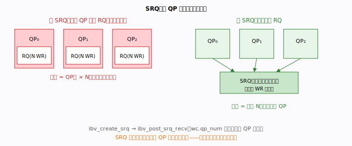
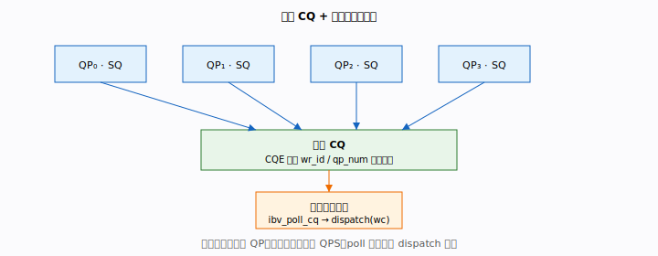
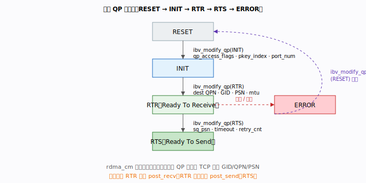
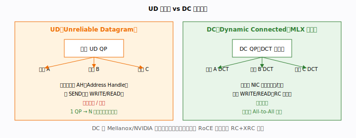

# 第 12 章 · 可扩展架构

> 前面的章节里，我们的程序始终只有"两个进程、一条连接"。那是理解 RDMA 语义的
> 最佳起点，却离真实服务端很远。一台 RDMA 服务器往往要同时面对成千上万个客户端。
> 本章要回答的核心问题是：**当连接数从 1 涨到 10000，原来那套写法会在哪里崩溃，
> 又该如何重构？**

---

## 本章你将遇到的术语（预览）

下面这些名词会在本章反复出现，这里先各给一句"直觉版"解释，正文里再展开。

| 术语 | 一句话直觉 |
|------|-----------|
| **SRQ** | 让很多 QP 共用一个接收队列，接收缓冲内存不再随连接数膨胀 |
| **CQ / CQE** | 完成队列 / 完成事件；共享一个 CQ 时靠 `wr_id`、`qp_num` 认领归属 |
| **QP / QPN** | 队列对 / 它那个 24 位的唯一编号，建连时双方互相告知 |
| **PSN** | 包序列号，建连时双方各报一个随机起始值 |
| **GID** | 128 位全局地址，RoCE 下由 MAC/IP 派生，类似"网络层地址" |
| **AH** | 地址句柄，UD 发送时用来说明"这一发要寄给谁" |
| **RC / UC / UD** | 三种传输类型，扩展性 UD > DC > RC |
| **DC / DCT / DCI** | 动态连接 / 目标端 / 发起端，用来缓解 N² 个 QP 的爆炸 |
| **XRC** | 扩展可靠连接，纯标准 RoCE 下用来替代私有的 DC |

> 完整术语表见 [`docs/glossary.md`](../glossary.md)。

---

## 引子：两进程 demo 撑不起一万个连接

回想我们之前的程序结构：一个 QP、一个 CQ、几块 MR，靠 `rdma_cm` 帮我们把连接
和 QP 一手包办。这套结构在连接数是 1 的时候清爽无比，但只要把它原样复制 N 份，
四个瓶颈会接连冒出来：

1. 每个 QP 都要单独喂饱自己的接收队列 → **接收缓冲内存随连接数线性膨胀**；
2. 每个 QP 配一个 CQ、配一个轮询线程 → **CPU 线程数随连接数线性膨胀**；
3. `rdma_cm` 一次建一条连接，万级建连时不够灵活 → **需要更可控的批量建连**；
4. RC 是点对点的，N 个节点两两互联就要 N² 个 QP → **QP 数量爆炸**。

本章四节正是逐一拆解这四个瓶颈：SRQ 解决内存、共享 CQ 解决线程、手工 QP 状态机
解决建连、UD/DC 解决 QP 爆炸。

---

## 12.1 SRQ（Shared Receive Queue）：让接收缓冲不再按连接数膨胀

> 🛠 可运行示例：[examples/07-srq/](../../examples/07-srq/)
> ——两个客户端连接共享一个 SRQ，用 `wc.qp_num` 区分来源。

### 问题：每个 QP 各养一支接收队列，太奢侈了

先看一个直觉。RC 连接里，发送方要 SEND 一条消息，**接收方必须事先在自己的接收
队列（RQ）里放好一个空缓冲**等着接，否则对端会撞上 RNR（Receiver Not Ready，
"收方没准备好"）错误。这就像快递必须有人在家签收：你得提前安排人手。

一个 QP 安排几个"签收名额"还好，可如果有 1000 个 QP，每个都要预投递 N 个 WR
（Work Request，一次接收请求），内存就是 `1000 × N` 份。更尴尬的是，这些缓冲
绝大多数时刻都在"空等"——名额开了一大堆，真正来快递的没几个。

### 机理：把所有接收队列合并成一个共享池

**SRQ（Shared Receive Queue，共享接收队列）** 的思路非常朴素：与其每家都雇一个
签收员，不如整栋楼共用一个收发室。多个 QP 不再各自维护 RQ，而是共享同一个接收
WR 池：

- 内存从 `QP数 × N` 降为固定的 `N`，**无论有多少个 QP**；
- 任意 QP 收到消息时，NIC 从 SRQ 里取一个 WR 来用，完成后在 CQ 产生一个 CQE，
  其中 `wc.qp_num` 标明"这条是哪个 QP 收到的"；
- 预投递改由应用统一管理：调用 `ibv_post_srq_recv`，而不是各 QP 自己的
  `ibv_post_recv`。



### API 与代码

```c
// 创建 SRQ
struct ibv_srq_init_attr srq_attr = {
    .attr = { .max_wr = 1024, .max_sge = 1 }
};
struct ibv_srq *srq = ibv_create_srq(pd, &srq_attr);

// 预投递到 SRQ（而非某个 QP）
struct ibv_sge sge = { .addr = (uint64_t)buf, .length = buf_len, .lkey = mr->lkey };
struct ibv_recv_wr wr = { .wr_id = (uint64_t)buf, .sg_list = &sge, .num_sge = 1 };
struct ibv_recv_wr *bad;
ibv_post_srq_recv(srq, &wr, &bad);

// 创建 QP 时绑定 SRQ
struct ibv_qp_init_attr qp_attr = { .srq = srq, ... };
struct ibv_qp *qp = ibv_create_qp(pd, &qp_attr);
```

配套示例 [`examples/07-srq/`](../../examples/07-srq/) 把这套流程做成了可运行版本：
服务端建一个 SRQ，两个客户端连接共享它，服务端用 `wc.qp_num` 区分 A、B 两条
消息。注意示例 README 里强调的几个落地细节：用 SRQ 时**必须手工
`rdma_create_qp`** 并把 `qp_init_attr.srq` 指向 SRQ，不能再用 `rdma_create_ep`
的自动 QP；所有 QP、SRQ、MR 必须在**同一个 PD** 下；绑定 SRQ 的 QP，其
`cap.max_recv_wr` 由 SRQ 决定，建 QP 时无需设置。

### 陷阱

SRQ 是共享的，所以一旦它**被取空**，所有关联 QP 都会同时"收不到消息"（静默撞
RNR），影响面比单 QP 大得多。因此必须持续补投递、维持足够的水位深度。配套工具：
`ibv_get_srq_num` 取得 SRQ 编号便于对端识别；`ibv_modify_srq` 可动态调整
`srq_limit`，在余量低于阈值时触发"低水位事件"提醒你补货。

---

## 12.2 共享 CQ + 单线程事件循环：让轮询线程不再按连接数膨胀

### 问题：每个 QP 配一个 CQ、一个线程，CPU 扛不住

解决了内存，再看 CPU。传统写法每个 QP 配一个 CQ，于是你得为每个 CQ 安排轮询。
连接一多，要么开等比例的线程去轮询（线程数随连接数线性增长），要么一个线程轮询
一大堆 CQ（轮询开销同样线性增长）。无论哪种，CPU 都会被连接数拖垮。

### 机理：所有 QP 的完成事件汇入同一条流水线

**共享 CQ** 把所有 QP 的完成事件汇入同一个完成队列，由一个线程统一收割、分发：

- 创建 CQ 时，`cq_size` 要按最坏情况（所有 QP 同时完成）来估，免得溢出；
- 每个 CQE 都自带 `wr_id`（应用自定义，可塞上下文指针）和 `qp_num`，足以让你
  反查"这是谁的哪一次操作"；
- 这套结构适合"**高连接数、中低 QPS**"的场景；如果 QPS 极高，单线程会成为瓶颈，
  那时应改为按 CPU 核分片（见第三阶段性能工程 3.5）。



### 代码

```c
// 一个 CQ 服务 N 个 QP
struct ibv_cq *cq = ibv_create_cq(ctx, CQ_DEPTH, NULL, NULL, 0);

// 所有 QP 创建时指定同一个 send_cq / recv_cq
struct ibv_qp_init_attr attr = {
    .send_cq = cq,
    .recv_cq = cq,
    ...
};

// 事件循环
void event_loop(struct ibv_cq *cq) {
    struct ibv_wc wc[32];
    while (running) {
        int n = ibv_poll_cq(cq, 32, wc);
        for (int i = 0; i < n; i++) {
            if (wc[i].status != IBV_WC_SUCCESS) handle_error(&wc[i]);
            else dispatch(&wc[i]);   // 按 wr_id / qp_num 分发
        }
    }
}
```

### 进阶：和事件通知结合，省掉空转 CPU

纯忙轮询在连接很多但大多数空闲时很浪费 CPU。这时把 `ibv_req_notify_cq` +
`ibv_get_cq_event` 用上，让线程在没有完成事件时睡眠、有事件再被唤醒，可大幅降低
空闲 CPU 占用（参见第三阶段 3.2 的混合策略）。

---

## 12.3 连接管理规模化：手工 QP 状态机

### 问题：`rdma_cm` 很省心，但不够"可控"

`rdma_cm` 像 socket API 一样，把 QP 的状态迁移全替你做了，写起来很爽。但当你
需要精细控制建连细节，或者要在极短时间内批量建立海量连接时，这层封装反而碍事。
这时常见的做法是：**用一条普通的带外 TCP 连接交换元数据，再自己手工调用
`ibv_modify_qp` 把 QP 一步步推到可用状态**。

### 机理：QP 是个状态机，必须按顺序爬台阶

一个新建的 QP 出厂状态是 **RESET**，它不能直接干活，必须严格按顺序迁移：

```
RESET → INIT → RTR（Ready To Receive）→ RTS（Ready To Send）
```

可以把它想成一台机器的开机自检流程：通电（INIT）→ 准备好收（RTR）→ 准备好发
（RTS），每一步都要填好对应的"配置表单"，缺一项都过不去。每步调用一次
`ibv_modify_qp`，并通过掩码告诉它"这次我要改哪些字段"。



```c
// 1. RESET → INIT
struct ibv_qp_attr attr = {
    .qp_state        = IBV_QPS_INIT,
    .pkey_index      = 0,
    .port_num        = port,
    .qp_access_flags = IBV_ACCESS_REMOTE_WRITE | IBV_ACCESS_REMOTE_READ,
};
ibv_modify_qp(qp, &attr,
    IBV_QP_STATE | IBV_QP_PKEY_INDEX | IBV_QP_PORT | IBV_QP_ACCESS_FLAGS);

// 2. INIT → RTR（需对端 QPN / GID / PSN，通过带外 TCP 交换）
attr.qp_state              = IBV_QPS_RTR;
attr.path_mtu              = IBV_MTU_4096;
attr.dest_qp_num           = remote_qpn;
attr.rq_psn                = remote_psn;
attr.max_dest_rd_atomic    = 16;
attr.min_rnr_timer         = 12;
attr.ah_attr.is_global     = 1;
attr.ah_attr.grh.dgid      = remote_gid;
attr.ah_attr.grh.hop_limit = 64;
attr.ah_attr.dlid          = 0;  // RoCE 下不用 LID
attr.ah_attr.port_num      = port;
ibv_modify_qp(qp, &attr,
    IBV_QP_STATE | IBV_QP_PATH_MTU | IBV_QP_DEST_QPN | IBV_QP_RQ_PSN |
    IBV_QP_MAX_DEST_RD_ATOMIC | IBV_QP_MIN_RNR_TIMER | IBV_QP_AV);

// 3. RTR → RTS
attr.qp_state      = IBV_QPS_RTS;
attr.timeout       = 14;   // ~67 ms
attr.retry_cnt     = 7;
attr.rnr_retry     = 7;    // 无限重试
attr.sq_psn        = local_psn;
attr.max_rd_atomic = 16;
ibv_modify_qp(qp, &attr,
    IBV_QP_STATE | IBV_QP_TIMEOUT | IBV_QP_RETRY_CNT |
    IBV_QP_RNR_RETRY | IBV_QP_SQ_PSN | IBV_QP_MAX_QP_RD_ATOMIC);
```

### 关键约束（爬台阶时容易摔的几处）

- 必须先到 **RTR** 才能 `ibv_post_recv`（否则没有接收上下文，投了也无处安放）。
- 必须到 RTR 之后、再到 RTS 之后，才能 `ibv_post_send`。
- QP 一旦进入 **ERROR** 态，要先 `ibv_modify_qp(RESET)` 重置，再重走上面整套流程。
- 带外元数据通常用普通 TCP socket 交换，内容就是一组 `{ qpn, psn, gid, lid }`。

---

## 12.4 UD / DC：一对多与连接爆炸

### 问题：N 个节点两两互联，要 N² 个 QP

RC 的可靠是有代价的：它是**点对点**的，一个 QP 只对应一个对端。万节点集群做
All-to-All 通信时，连接数是 N²——10000 个节点就是上亿个 QP，光是这些 QP 占用的
内存和 NIC 缓存就足以压垮系统。我们需要"一个 QP 能对多个目标说话"的能力。

### UD（Unreliable Datagram）：一个 QP 广播给所有人

UD（不可靠数据报）传输类型下，**单个 QP 可向任意多个目标发送**，不必为每对关系
建一个 QP。代价是它像 UDP 一样"不可靠"：

- 每条 SEND 都附带一个 **AH（Address Handle，地址句柄）**，指定目标 GID/LID/SL，
  相当于每封信单独写收件地址；
- 仅支持 SEND，**没有 WRITE/READ**；
- 不保证顺序、不重传、消息可能丢失（这就是"不可靠"的含义）；
- 单条消息大小不能超过一个 MTU（典型 4096 字节）；
- 接收方可从 `wc.src_qp` 得知发送方的 QPN。

```c
// 创建 UD QP
struct ibv_qp_init_attr attr = { .qp_type = IBV_QPT_UD, ... };

// 发送时指定 Address Handle
struct ibv_send_wr wr = {
    .opcode = IBV_WR_SEND,
    .wr.ud.ah       = ah,          // ibv_create_ah() 创建
    .wr.ud.remote_qpn  = dest_qpn,
    .wr.ud.remote_qkey = QKEY,
};
```

### DC（Dynamic Connected）：既要可靠，又要一对多

如果既想要 RC 的可靠语义（WRITE/READ），又想要 UD 的扩展性，怎么办？DC（动态
连接，Mellanox/NVIDIA 的私有扩展）就是为此而生：

- **DCT（DC Target，目标端）**：被动接受方，相当于"监听端"；
- **DCI（DC Initiator，发起端）**：主动发起方，每次操作时动态连接到不同的 DCT；
- NIC 内部维护一个连接缓存（类似 TLB），自动复用已有连接，整个过程对应用透明；
- 万节点 All-to-All 场景下，本来要 N² 对连接，用 DC 只需 N 个 DCI 加 N 个 DCT。



### 三种传输类型如何取舍

| 维度 | UD | DC | RC |
|------|----|----|-----|
| 可靠性 | 无 | 有（RC 语义） | 有 |
| 操作 | SEND only | WRITE/READ/SEND | 全集 |
| 扩展性 | 最佳（1 QP→N） | 优秀（NIC 内动态） | 差（N² QP） |
| 可用性 | 全厂商 | 仅 Mellanox/NVIDIA | 全厂商 |
| 适用场景 | 控制面广播 | HPC All-to-All | 点对点数据面 |

> DC 是 Mellanox ConnectX 网卡的私有功能（需 `IBV_EXP_*` 实验性 API 或 DOCA
> SDK）；如果你的环境跨厂商或是纯标准 RoCE，就需要用 **RC + XRC**（扩展可靠
> 连接）来替代 DC。

---

## 小结

> 下面这张"原理 → API → 代码 → 性能 → 陷阱"五段式表，方便日后快速回顾本章。

| 维度 | 要点 |
|------|------|
| **原理** | 高连接数的两大瓶颈：RQ 内存（SRQ 解决）、CQ 线程（共享 CQ 解决）；连接建立成本（手工状态机批量化）；QP 数爆炸（UD/DC 解决） |
| **API** | `ibv_create_srq` / `ibv_post_srq_recv`；共享 `send_cq/recv_cq`；`ibv_modify_qp` 三步迁移；UD AH + `IBV_QPT_UD` |
| **代码** | SRQ 与 QP 在同一 PD 下创建；CQ 大小按峰值并发 WR 估算；带外 TCP 交换 `{qpn, psn, gid}` |
| **性能** | SRQ 将 RQ 内存从 O(连接数) 降到 O(1)；共享 CQ 将轮询线程从 O(连接数) 降到 O(1)；DC 将 QP 数从 O(N²) 降到 O(N) |
| **陷阱** | SRQ 耗尽静默丢包；QP 未到 RTR 就 post_recv 报错；ERROR 态 QP 须 RESET 后重建；UD 消息含 40B GRH 头需在 RQ 预留额外空间 |

---

## 术语速查

| 术语 | 含义 |
|------|------|
| **SRQ** | 共享接收队列，多 QP 共用一个 RQ，内存降为 O(1) |
| **CQ / CQE** | 完成队列；共享 CQ 用 `wr_id`/`qp_num` 区分来源 |
| **QP / QPN** | 队列对 / 其 24 位唯一编号，建连时交换 |
| **PSN** | 包序列号，建连双方交换初始值（随机起始）|
| **GID** | 128 位全局标识符，RoCE 下由 MAC/IP 派生 |
| **AH** | 地址句柄，UD SEND 须指定目标地址 |
| **RC / UC / UD** | 三种传输类型，扩展性 UD > DC > RC |
| **DC / DCT / DCI** | 动态连接 / 目标端 / 发起端，缓解 N² QP |
| **XRC** | 扩展可靠连接，纯标准 RoCE 下 DC 的替代方案 |

> 完整术语表见 [`docs/glossary.md`](../glossary.md)。
