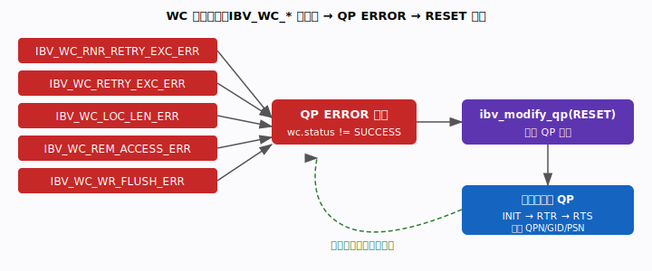
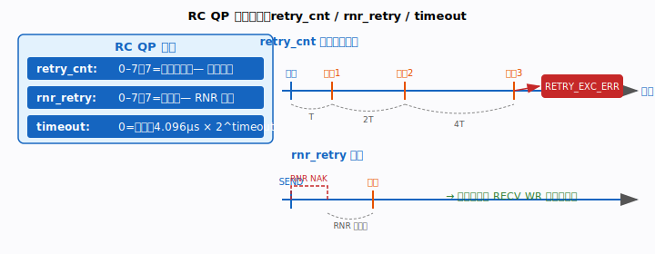
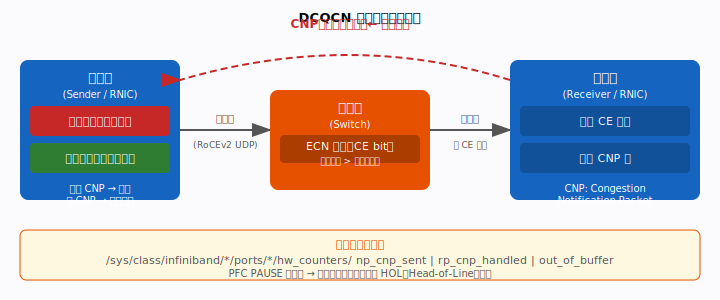
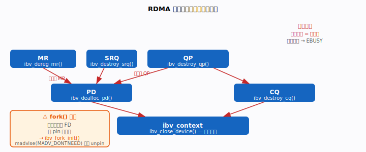

# 第 13 章 · 可靠性与生产化

> 到目前为止，我们的程序都假设"一切顺利"：连接建好、消息送达、操作成功。可一旦
> 把 RDMA 程序丢进真实数据中心，网络会拥塞、对端会来不及接收、链路会抖动、进程
> 会 fork、内存会被回收。本章要回答的问题是：**当事情出错时，RDMA 会怎么表现，
> 我们又该如何探知、恢复，并避免那些静默到让人抓狂的坑？**

---

## 本章你将遇到的术语（预览）

| 术语 | 一句话直觉 |
|------|-----------|
| **WC / CQE** | 工作完成 / 完成事件；它的 `wc.status` 是你判断成败的唯一依据 |
| **ACK** | RC 下接收方 NIC 自动回发的"收到了"确认包 |
| **RNR** | Receiver Not Ready，对端接收队列空时回的"我没准备好" |
| **PSN** | 包序列号，用来检测乱序、驱动重传 |
| **PFC** | 优先级流控，用 PAUSE 帧防丢包，副作用是队头阻塞 |
| **ECN** | 显式拥塞通知，交换机打标记代替丢包 |
| **CNP** | 拥塞通知包，接收方回送它来让发送方降速 |
| **DCQCN** | RoCEv2 的拥塞控制算法：ECN + CNP + 乘性降速/加性恢复 |
| **PD** | 保护域，销毁资源时必须遵守它牵出的依赖顺序 |

> 完整术语表见 [附录 A · 术语表与参考文献](appendix-a-glossary.md)。

---

## 引子：可靠 ≠ 不会出错

很多人初学时有个误解：RC 是"可靠连接"，那是不是就万事大吉了？并不是。RC 保证的
是"消息要么按序送达，要么明确告诉你失败了"——它**不会替你解决拥塞、不会替你准备
接收缓冲、更不会替你管理内存生命周期**。生产化的 RDMA 程序，恰恰是在这些"可靠"
覆盖不到的地方栽跟头。本章分四节：怎么读懂错误完成、怎么调重传参数、怎么治理
拥塞、怎么不让资源泄漏。

---

## 13.1 错误完成处理：读懂第一个真错误，忽略后续的冲刷



### 问题：操作"失败"了，但失败信息藏在哪？

RDMA 是异步的，你 post 出去就返回了，真正成败要从 CQ 里 poll 出来的那个完成事件
（WC）里读。关键纪律只有一条：**每次 poll 出 WC，都要检查 `wc.status`**。它等于
`IBV_WC_SUCCESS` 才算成功，否则就是出了问题——而具体是什么问题，全写在状态码里。

### 常见错误码速查

| 错误码 | 含义 | 常见原因 |
|--------|------|----------|
| `IBV_WC_RNR_RETRY_EXC_ERR` | RNR 重试次数耗尽 | 对端 RQ 空（未及时 post_recv） |
| `IBV_WC_RETRY_EXC_ERR` | 通用重试次数耗尽 | 链路故障、对端宕机、超时 |
| `IBV_WC_LOC_LEN_ERR` | 本地长度错误 | SGE 长度超过 MR 大小 |
| `IBV_WC_REM_ACCESS_ERR` | 远端访问权限错误 | rkey 无效或权限不足（无 REMOTE_WRITE/READ） |
| `IBV_WC_WR_FLUSH_ERR` | WR 被冲刷 | QP 已处于 ERROR 状态时投递的 WR |

### QP 进入 ERROR 状态：分清"真凶"和"陪葬"

这里有一个最容易让人误判的机制。任何一次操作只要完成时 `wc.status != IBV_WC_SUCCESS`，
对应的那个 QP 就会立刻跌入 **ERROR** 状态。此后，队列里所有还没完成的 WR 都会以
`WR_FLUSH_ERR` 完成——这是"冲刷"清场动作，**不是新的独立错误**。

打个比方：一条流水线上某个工件出了致命缺陷，整条线急停，后面排队的半成品全部被
当场报废。报废的那些不是"又出了 N 个故障"，它们只是被那一个真故障连累。所以排错
时务必认准：**真正的错误是第一个非 SUCCESS 的 CQE**，后面一串 FLUSH 只是陪葬，
统计即可，不要当成新问题去追。

```c
struct ibv_wc wc;
while (ibv_poll_cq(cq, 1, &wc) > 0) {
    if (wc.status != IBV_WC_SUCCESS) {
        if (wc.status == IBV_WC_WR_FLUSH_ERR) {
            /* QP 已出错，正在冲刷队列，忽略或统计 */
            continue;
        }
        fprintf(stderr, "WC error: %s (vendor_err=0x%x)\n",
                ibv_wc_status_str(wc.status), wc.vendor_err);
        /* 触发 QP 恢复流程 */
    }
}
```

### QP 恢复：跌倒了得从头爬

QP 一旦进 ERROR，就再也不能直接用了，必须走完整的状态机重置（与第 12 章手工建连
同一套台阶）才能复用：

```c
/* 1. 重置到 RESET */
struct ibv_qp_attr attr = { .qp_state = IBV_QPS_RESET };
ibv_modify_qp(qp, &attr, IBV_QP_STATE);

/* 2. RESET → INIT */
attr.qp_state   = IBV_QPS_INIT;
attr.pkey_index = 0;
attr.port_num   = port;
attr.qp_access_flags = IBV_ACCESS_REMOTE_WRITE | IBV_ACCESS_REMOTE_READ;
ibv_modify_qp(qp, &attr,
    IBV_QP_STATE | IBV_QP_PKEY_INDEX | IBV_QP_PORT | IBV_QP_ACCESS_FLAGS);

/* 3. INIT → RTR（需重新交换 QPN/GID 等信息） */
/* 4. RTR → RTS */
/* ... 与初始化时相同 ... */
```

> **生产建议**：把 QP 的生命周期封装成一个状态机；出错时**先把 CQ 排空**（poll
> 到再无 CQE 为止），再做 RESET，避免遗留的 CQE 污染下一轮操作。

---

## 13.2 重传与超时：在"快速失败"和"扛抖动"之间拨刻度



### 问题：丢一个包就放弃，还是死等？

RC QP 内置了重传机制——发出去的包等不到 ACK（接收方 NIC 自动回发的确认包）就重发。
但"重发几次""每次等多久"不是写死的，由三个参数控制。调这三个旋钮，本质是在两个
极端之间找平衡：调得太激进，偶尔的网络抖动就被当成故障上报；调得太宽容，对端真挂
了你还在傻等。

### retry_cnt —— 通用重传计数

```c
attr.retry_cnt = 7;   /* 0–7，7 = 无限重传 */
```

发送方等不到 ACK（超时）就重传，最多重 `retry_cnt` 次，超了就报 `RETRY_EXC_ERR`。
重传间隔由下面的 `timeout` 决定，且**每次翻倍**（指数退避）。

- **数据中心**：设 `retry_cnt=7`（实际意味着无限），依赖 PFC 把丢包从根上掐掉，
  正常情况下根本不会真触发重传。
- **WAN / 有损网络**：设小一点（3–5），好让故障尽早暴露、快速上报。

### rnr_retry —— RNR 重传计数

```c
attr.rnr_retry = 7;   /* 0–7，7 = 无限 */
```

**RNR（Receiver Not Ready）** 指对端的接收队列里没有预投递的 RECV WR。RC 协议
允许发送方收到 RNR NAK 后，等一段时间（这段时间由**对端**的 `min_rnr_timer` 决定）
再重试，最多重 `rnr_retry` 次，超了报 `RNR_RETRY_EXC_ERR`。

> 避免 RNR 的根本办法是：让接收队列里始终备着足够的 RECV WR。第 12 章讲的 SRQ
> （共享接收队列）能在多 QP 场景下显著减轻这份接收管理负担。

### timeout —— 本地 ACK 超时

```c
attr.timeout = 14;  /* 单位：4.096µs × 2^timeout */
                    /* timeout=14 ≈ 67ms */
```

公式是 `T = 4.096µs × 2^timeout`，这是个指数刻度，几档常用值如下：

| timeout 值 | 超时时间 |
|-----------|---------|
| 0 | 无限（禁用） |
| 8 | ~1ms |
| 14 | ~67ms |
| 17 | ~536ms |
| 21 | ~8.5s |

**数据中心推荐组合**：`timeout=14`，`retry_cnt=7`，`rnr_retry=7`。

---

## 13.3 拥塞控制：无损以太网的两层防御



### 问题：RoCEv2 跑在以太网上，可它最怕丢包

RDMA over Converged Ethernet（RoCEv2）把 RDMA 搬到了普通以太网上，但它的重传机制
对丢包很敏感——一旦拥塞导致丢包，性能会断崖式下跌。所以 RoCEv2 依赖**无损以太网**，
拥塞控制分两层来防御：底层用 PFC 兜底"绝不丢包"，上层用 ECN/DCQCN 主动"提前降速"。

### PFC（Priority Flow Control）—— 无损传输的地基

PFC 是 IEEE 802.1Qbb 标准。当交换机某个端口快被塞满时，它向上游发 **PAUSE 帧**，
让上游暂停发送特定优先级的流量，从而避免溢出丢包。这就像高速收费站快堵死时，直接
拉起栏杆让后面的车先别过来。

但它有个著名副作用——**HOL（Head-of-Line，队头）阻塞**：PFC 是按优先级（per-priority）
粒度暂停的，同一优先级里的不同流会相互连累。一条慢流就能把整个优先级队列卡住，殃及
本来毫不相干的其他流。

### ECN（Explicit Congestion Notification）—— 主动通知，不靠丢包

PFC 是粗暴的"急刹"，ECN 则温和得多。交换机发现队列深度超过阈值时，不丢包，而是在
数据包的 IP 头打上一个 **CE（Congestion Experienced，遭遇拥塞）** 标记。接收方看到
CE 标记，就回送一个 **CNP（Congestion Notification Packet，拥塞通知包）** 给发送方，
等于轻轻提醒一句"前面有点堵，您慢点"。

### DCQCN 算法

DCQCN（Data Center Quantized Congestion Notification）是 RoCEv2 的标准拥塞控制
算法，把上面的信号变成具体的速率调整动作：

1. **速率降低**：收到 CNP → 乘性减小发送速率（类似 TCP AIMD 里的 MD 部分，一脚收油）。
2. **慢启动恢复**：一段时间没再收到 CNP → 加性增大速率，慢慢试探还有多少带宽可用。
3. **快速恢复**：连续很久都没 CNP，超过阈值 → 切到快速恢复模式，更激进地把速率拉回来。

### 可观测计数器（排查时怎么看）

```bash
# 查看硬件拥塞计数器
ls /sys/class/infiniband/mlx5_0/ports/1/hw_counters/

# 关键指标
cat /sys/class/infiniband/mlx5_0/ports/1/hw_counters/np_cnp_sent      # 本机作为通知点(NP)发出的 CNP 数
cat /sys/class/infiniband/mlx5_0/ports/1/hw_counters/rp_cnp_handled   # 本机作为反应点(RP)收到并降速的 CNP 数
cat /sys/class/infiniband/mlx5_0/ports/1/hw_counters/out_of_buffer    # 接收端无可用 RQ/SRQ WR 的丢包数（RNR 类）

# PFC pause 计数（注意：与 out_of_buffer 无关）需看以太网侧计数器：
ethtool -S eth0 | grep -E 'rx_pause|tx_pause|prio.*pause'

# 使用 perfquery 查看端口计数器
perfquery -x <lid>
```

这里有个**极易踩的认知陷阱**，务必记牢：`out_of_buffer` 统计的是"接收端没有可用
接收 WR 而丢的包"，属于 **RNR 类**问题，**它和 PFC 触发次数毫无关系**。真正的 PFC
pause 计数要去**以太网侧**看，也就是上面 `ethtool -S` 里的 `rx_pause`/`tx_pause`/
`prio.*pause`。把 `out_of_buffer` 当成 PFC 指标，会让你的拥塞排查彻底跑偏。

> **调优建议**：在交换机侧启用 ECN + DCQCN 做主力，PFC 只作兜底，而且**只在 RDMA
> 所在的那个 priority 上开**。千万别开全局 PFC，否则 HOL 阻塞会蔓延到非 RDMA 流量上。

---

## 13.4 资源生命周期与泄漏排查



### 问题：RDMA 资源不是 free 一下就完事

RDMA 的对象之间有父子依赖：MR 依附于 PD，QP 依附于 CQ 和 PD……它们不像普通堆内存
那样随手释放就行。销毁顺序错了，你会撞上 `EBUSY`；该解绑的没解绑，物理内存可能被
内核悄悄回收，留下一个看起来"有效"实则失效的 MR——这类静默错误最折磨人。

### 正确的销毁顺序：从子到父

资源**必须按与创建相反的顺序销毁**（先拆子，再拆父）：

```
销毁顺序（从子到父）：
  MR       → 先于 PD 销毁
  QP       → 先于 CQ、PD 销毁
  SRQ      → 先于 PD 销毁
  CQ       → 先于 ibv_context 销毁
  PD       → 先于 ibv_context 销毁
  ibv_context → 最后关闭（ibv_close_device）
```

```c
/* 正确的清理顺序示例 */
if (ctx->mr)  { ibv_dereg_mr(ctx->mr);    ctx->mr  = NULL; }
if (ctx->qp)  { ibv_destroy_qp(ctx->qp);  ctx->qp  = NULL; }
if (ctx->srq) { ibv_destroy_srq(ctx->srq); ctx->srq = NULL; }
if (ctx->cq)  { ibv_destroy_cq(ctx->cq);  ctx->cq  = NULL; }
if (ctx->pd)  { ibv_dealloc_pd(ctx->pd);  ctx->pd  = NULL; }
if (ctx->ctx) { ibv_close_device(ctx->ctx); ctx->ctx = NULL; }
```

违反顺序会得到 `EBUSY`：子资源还活着时，父资源拒绝被销毁。

### fork() 陷阱：子进程会踩到失效的内存映射

```c
/* 必须在 ibv_open_device 之前调用 */
ibv_fork_init();

pid_t pid = fork();
if (pid == 0) {
    /* 子进程：FD 已继承，但 pin 住的物理页映射已失效！
     * 不调用 ibv_fork_init() 的后果：子进程访问已注册内存 → 段错误或数据损坏 */
}
```

`ibv_fork_init()` 会用 `mmap(MAP_ANONYMOUS|MAP_PRIVATE)` 把注册内存重映射一遍，
使 `fork()` 的写时复制（COW）机制对 RDMA 内存安全。也可以用环境变量等效开启：

```bash
export RDMAV_FORK_SAFE=1   # 等价于程序内调用 ibv_fork_init()
```

### madvise(MADV_DONTNEED)：静默 unpin 的暗雷

```c
/* 危险！静默解除内存 pin */
madvise(mr->addr, mr->length, MADV_DONTNEED);
/* 内核可能回收物理页，但 ibv_mr 仍然"有效"
 * 后续 RDMA 操作将导致 REM_ACCESS_ERR 或数据损坏 */
```

已注册 MR 的内存，**禁止**对其调用 `madvise(MADV_DONTNEED)` 或 `madvise(MADV_FREE)`。
内核会以为这块内存不要了而回收物理页，可 `ibv_mr` 句柄还在、看起来一切正常，等到
真正 DMA 时就炸成 `REM_ACCESS_ERR` 或数据损坏。要释放内存，必须先 `ibv_dereg_mr()`。

### 泄漏排查工具箱

```bash
# 1. valgrind（检测用户态内存泄漏）
valgrind --leak-check=full ./rdma_server 192.168.1.1 7471

# 2. 查看内核侧资源（每个进程）
ls /proc/<pid>/fd/ | wc -l          # FD 数量（rdma_cm 每个 endpoint 占 1 个）

# 3. rdma-core 调试环境变量
export IBV_SHOW_WARNINGS=1           # 打印 libibverbs 警告
export RDMAV_FORK_SAFE=1

# 4. 查看系统级 MR/QP 统计
cat /sys/class/infiniband/mlx5_0/ports/1/counters/port_rcv_errors
rdma res show mr                     # 列出系统所有 MR（需 iproute2-rdma）
rdma res show qp                     # 列出系统所有 QP
```

---

## 小结

> 五段式复习表，方便日后回顾本章。

| 维度 | 要点 |
|------|------|
| **原理** | RC 内置重传非万能；拥塞控制靠 PFC（兜底防丢包）+ ECN/DCQCN（主动降速）分层防御；RDMA 资源有严格依赖层次与销毁顺序 |
| **API** | `ibv_wc_status_str()` 解析错误；`ibv_modify_qp(RESET)` 后重建；`ibv_fork_init()`/`RDMAV_FORK_SAFE=1`；`/sys/.../hw_counters/` 观测 |
| **代码** | 每次 poll_cq 必检 `wc.status`；首个真实错误后批量忽略 `WR_FLUSH_ERR`；销毁顺序 QP→SRQ→MR→CQ→PD→context 写成辅助函数 |
| **性能** | PFC pause 引入尾延迟毛刺；DCQCN 降速后恢复慢，需按 `np_cnp_sent` 频率调 ECN 阈值；retry/timeout 调参平衡快速失败与抗抖动 |
| **陷阱** | `out_of_buffer` ≠ PFC 计数；fork 前必须 `ibv_fork_init`；已注册内存禁用 `madvise(MADV_DONTNEED)`；`timeout=0`+`retry_cnt=0` 会永久挂起 |

---

## 术语速查

| 术语 | 含义 |
|------|------|
| **WC / CQE** | 工作完成；`wc.status` 必须检查 |
| **ACK** | RC 下接收方 NIC 自动回发的确认包 |
| **RNR** | Receiver Not Ready，对端 RQ 空时返回的 NAK |
| **PSN** | 包序列号，用于乱序检测与重传 |
| **PFC** | 优先级流控，PAUSE 帧防丢包，副作用是 HOL 阻塞 |
| **ECN** | 显式拥塞通知，交换机打 CE 标记不丢包 |
| **CNP** | 拥塞通知包，接收方回送触发发送方降速 |
| **DCQCN** | RoCEv2 拥塞控制：ECN + CNP + 乘法降速/加法恢复 |
| **PD** | 保护域，资源销毁须遵守依赖顺序 |

> 完整术语表见 [附录 A · 术语表与参考文献](appendix-a-glossary.md)。
