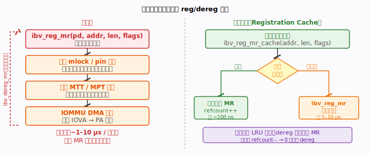
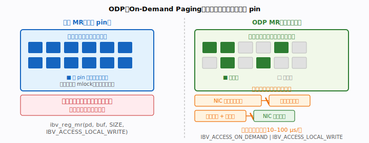
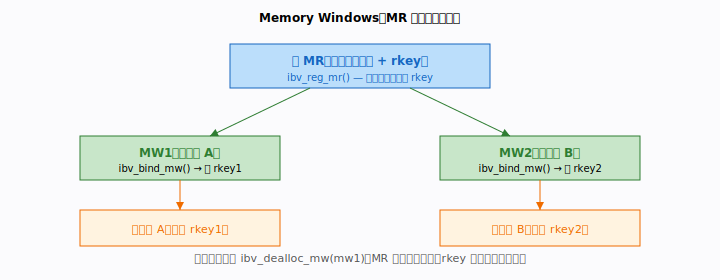
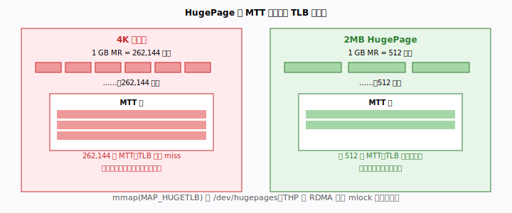

# 第 14 章 · 高级内存管理

> RDMA 的"零拷贝"神话建立在一个前提上：网卡能直接 DMA 访问你的内存。而要让网卡
> 能访问，内存必须先**注册**。我们前面把注册当成一句 `ibv_reg_mr` 一笔带过，可在
> 高性能场景里，注册本身就是一笔不小的开销，内存的组织方式还会直接影响网卡的命中
> 率。本章要回答的是：**注册到底贵在哪？能不能省？大块内存怎么摆才让网卡跑得快？**

本章深入四类高级内存管理技术：**注册缓存**（消除重复 reg/dereg 开销）、**ODP
（On-Demand Paging，按需分页）**（无需预先 pin）、**Memory Windows**（大 MR 的
细粒度子区域授权）、以及**大页与连续内存**（减少 MTT 条目、提升 NIC TLB 命中率）。
掌握这四项，能在保持正确性的前提下大幅降低内存子系统开销，是从"能跑"走向"高性能"
的必经之路。

---

## 本章你将遇到的术语（预览）

| 术语 | 一句话直觉 |
|------|-----------|
| **MR** | 已注册内存区域；它的注册代价来自 pin 页 + 建 MTT + IOMMU 映射 |
| **MTT / MPT** | 内存翻译表 / 保护表；大页能大幅压缩 MTT 条目数 |
| **lkey / rkey** | 本端 / 对端引用这块 MR 的密钥 |
| **ODP** | 按需分页，注册时不 pin，等网卡真访问时才缺页 pin |
| **MW** | 内存窗口，在大 MR 上开子区域，rkey 可动态授权、撤销 |
| **IOMMU** | DMA 地址翻译单元，会增加注册开销 |
| **PD** | 保护域，MR/MW/QP 的归属边界 |
| **NUMA** | 非一致内存访问，应尽量分配 NIC 本地的内存 |

> 完整术语表见 [`docs/glossary.md`](../glossary.md)。

---

## 14.1 注册开销与缓存：别让 reg/dereg 拖垮热路径



### 问题：`ibv_reg_mr` 远不止"记一个指针"

很多人以为注册内存就是告诉网卡"喏，这块地址归你访问"，一瞬间的事。实际上它在背后
干了三件重活：

1. **mlock / pin 页面**：通过 `get_user_pages_fast` 把缓冲区涉及的所有物理页锁住
   （不可换出、不可压缩），免得网卡 DMA 到一半页面被内核搬走。
2. **构建 MTT（Memory Translation Table，内存翻译表）条目**：网卡的地址翻译硬件
   需要一张"虚拟地址 → 物理地址"映射表，`ibv_reg_mr` 会逐页遍历，把表项写进网卡
   内部的 MTT/MPT（Memory Protection Table，内存保护表）。一个 1 GB、4K 页的 MR，
   要写入 262,144 项。
3. **IOMMU DMA 映射**：若系统启用了 IOMMU，还得在 IOVA 空间建映射，保证 DMA 地址
   的安全与隔离。

所以注册是有"体重"的：小 MR（< 1 MB）约 **1–5 µs**；大 MR（1 GB）能到**数十毫秒**，
因为建 MTT 的耗时和页数成正比。`ibv_dereg_mr` 同样昂贵——要刷网卡 TLB/缓存、拆
IOMMU 映射、解 pin。如果你在每个请求里都 reg 一次、dereg 一次，这笔开销会直接钉死
在热路径上。

### 解法：注册缓存

核心思路一句话：**把 `ibv_mr*` 缓存起来，相同地址/长度/权限的 MR 不重复注册。**
命中缓存约 100 ns，比真注册快上几个数量级。

```c
/* 注册缓存核心数据结构 */
typedef struct {
    void          *addr;
    size_t         len;
    int            access_flags;
} reg_cache_key_t;

typedef struct reg_cache_entry {
    reg_cache_key_t  key;
    struct ibv_mr   *mr;
    int              refcount;
    /* LRU 链表指针 */
    struct reg_cache_entry *lru_prev, *lru_next;
    /* 哈希桶链表 */
    struct reg_cache_entry *hash_next;
} reg_cache_entry_t;

#define CACHE_BUCKETS 256
typedef struct {
    reg_cache_entry_t *buckets[CACHE_BUCKETS];
    reg_cache_entry_t *lru_head, *lru_tail; /* 最近使用 → 最久未用 */
    int                count;
    int                max_entries;
    struct ibv_pd     *pd;
} reg_cache_t;

/* 查找或注册 MR */
struct ibv_mr *reg_cache_get(reg_cache_t *cache,
                             void *addr, size_t len, int flags)
{
    uint32_t h = hash(addr, len, flags) % CACHE_BUCKETS;
    reg_cache_entry_t *e = cache->buckets[h];
    while (e) {
        if (e->key.addr == addr && e->key.len == len &&
            e->key.access_flags == flags) {
            e->refcount++;
            lru_move_to_front(cache, e); /* 更新 LRU 顺序 */
            return e->mr;               /* 命中：~100 ns */
        }
        e = e->hash_next;
    }
    /* 未命中：真正注册 */
    if (cache->count >= cache->max_entries)
        reg_cache_evict_lru(cache);     /* LRU 淘汰最久未用的 MR */
    struct ibv_mr *mr = ibv_reg_mr(cache->pd, addr, len, flags);
    if (!mr) return NULL;
    reg_cache_insert(cache, addr, len, flags, mr); /* 存入缓存 */
    return mr;                          /* 未命中：1–10 µs */
}

/* 释放时只减引用计数 */
void reg_cache_put(reg_cache_t *cache, struct ibv_mr *mr)
{
    reg_cache_entry_t *e = reg_cache_find_by_mr(cache, mr);
    if (--e->refcount == 0 && cache->count > cache->max_entries / 2)
        reg_cache_remove_and_dereg(cache, e); /* 真正 dereg */
}
```

### 适用场景与陷阱

- **短生命周期分配**：请求处理完就 free、随后又 malloc 的场景，地址很可能被复用，
  缓存 key 的碰撞要格外小心（同地址但长度不同，或权限标志变了）。
- **配合内存池**：固定大小的内存池天生适合注册缓存——地址稳定、权限不变，命中率高。
- **主要陷阱**：`addr` 相同但 `len` 或 `access_flags` 不同时，**必须当成不同的 key**；
  缓存满时 LRU 淘汰会调 `ibv_dereg_mr`，要确保被淘汰的 MR 引用计数已归零。

---

## 14.2 ODP（按需分页）：注册时一个页都不 pin



### 问题：明明只访问一小块，却被迫 pin 整个大缓冲

设想你注册了一个稀疏的大缓冲区——名义上 1 GB，实际每次只碰其中几页。传统注册会把
1 GB 全部 pin 死，内存白白被锁住、注册还慢得要命。有没有办法"先注册个空壳，等真用
到哪页再 pin 哪页"？这就是 ODP。

### 机理：免预先 pin，由 NIC 触发缺页

ODP（On-Demand Paging，按需分页）只要在 `ibv_reg_mr` 时多传一个
`IBV_ACCESS_ON_DEMAND` 标志，就告诉内核驱动：**注册时一个页都别 pin**。哪一页被
网卡真正访问到，才在那一刻 pin 并建立映射。它的页面故障处理流程是这样的：

1. NIC 发起 DMA，目标物理地址在网卡页表里没有映射。
2. NIC 内部触发"页面故障"信号，通过 PCIe 中断通知内核 RDMA 驱动（Mellanox 驱动
   里是 `mlx5_ib_pfault`）。
3. 内核 `ibv_umem_odp` 子系统接管：通过 MMU notifier 找到对应 VMA，调
   `get_user_pages` 固定那一页，更新网卡页表（相当于
   `mmu_notifier_invalidate_range` 的逆操作）。
4. 内核通知 NIC 重试，NIC 重发 DMA，这时映射已就位，操作正常完成。

整套首次访问的代价约 **10–100 µs/页**。所以 ODP 适合**稀疏访问**的场景，**不适合
延迟敏感的热路径**——热路径上每次缺页都是几十微秒的尖刺。

### 代码：注册 + 预取

```c
/* ODP 注册：页面不会被立即 pin */
struct ibv_mr *mr = ibv_reg_mr(pd, buf, buf_len,
    IBV_ACCESS_ON_DEMAND  |
    IBV_ACCESS_LOCAL_WRITE |
    IBV_ACCESS_REMOTE_WRITE);
if (!mr) { perror("ibv_reg_mr ODP"); exit(1); }

/* 预取：提前告知驱动将要访问的范围，触发批量 pin，减少后续缺页 */
struct ibv_sge sg = {
    .addr   = (uint64_t)buf,
    .length = prefetch_len,
    .lkey   = mr->lkey,
};
/* ibv_advise_mr 相当于对 ODP MR 的 madvise(WILLNEED) */
ibv_advise_mr(pd, IBV_ADVISE_MR_ADVICE_PREFETCH_WRITE,
              IB_UVERBS_ADVISE_MR_FLAG_FLUSH, &sg, 1);
```

如果你预先知道接下来要访问哪片区域，可以用 `ibv_advise_mr` 提前预取——相当于对
ODP MR 做了一次 `madvise(WILLNEED)`，批量把那段页 pin 好，把缺页尖刺挪到你能接受
的时刻。

### 传统 MR vs ODP MR

| 维度 | 传统 MR（全量 pin） | ODP MR（按需分页） |
|------|--------------------|--------------------|
| 注册耗时 | 1–10 µs（小）到数十 ms（大） | 极低（无 pin） |
| 首次访问延迟 | 正常 DMA 延迟 | +10–100 µs/页（缺页中断） |
| 内存用量 | 全部页面预先锁定 | 仅访问页面被锁定 |
| 稀疏大缓冲区 | 浪费（无论访问与否全部 pin） | 理想（只 pin 实际访问页） |
| 硬件要求 | 所有 RNIC | 需 ConnectX-4 及以上，且驱动支持 |

---

## 14.3 Memory Windows（内存窗口）：在大 MR 上开细粒度的"门禁"



### 问题：一块大 MR，想分别授权给不同客户端

服务端常有一块大 MR，想把它的不同子区域分给不同客户端访问。最省事的做法是把整块
MR 的 `rkey` 发给所有人——但这样有两个硬伤：

1. **权限过宽**：任一客户端拿到 rkey 就能读写整块 MR，越界访问无从拦截。
2. **无法撤销**：想收回某客户端的访问权，只能销毁并重建 MR，而我们刚学过，
   reg/dereg 代价极大。

Memory Window（内存窗口）就是为此而生：在大 MR 之上开一个个轻量级子区域窗口，每个
窗口有独立的 `rkey`，能按需绑定、按需撤销，像给大房间里的每个隔间单独配一把门禁卡。

### Type 1 vs Type 2

**Type 1 MW**（`IBV_MW_TYPE_1`）：通过 `ibv_bind_mw` 在指定 QP 上显式绑定。

```c
/* 1. 分配 MW */
struct ibv_mw *mw = ibv_alloc_mw(pd, IBV_MW_TYPE_1);
if (!mw) { perror("ibv_alloc_mw"); exit(1); }

/* 2. 绑定到子区域 */
struct ibv_mw_bind bind_info = {
    .bind_info = {
        .mr           = mr,                    /* 底层 MR */
        .addr         = (uint64_t)sub_region_addr,
        .length       = sub_region_len,
        .mw_access_flags = IBV_ACCESS_REMOTE_WRITE,
    },
    .wr_id    = 42,
    .send_flags = IBV_SEND_SIGNALED,
};
int ret = ibv_bind_mw(qp, mw, &bind_info);
/* 绑定完成后 mw->rkey 更新为新 rkey，可传给客户端 */

/* 3. 使用完毕后撤销（无需销毁 MR） */
struct ibv_send_wr inv_wr = {
    .opcode     = IBV_WR_LOCAL_INV,
    .wr_id      = 43,
    .ex.invalidate_rkey = mw->rkey,
    .send_flags = IBV_SEND_SIGNALED,
};
struct ibv_send_wr *bad_wr;
ibv_post_send(qp, &inv_wr, &bad_wr);
```

**Type 2 MW**（`IBV_MW_TYPE_2`）：绑定动作作为一条 RDMA WRITE WR 的一部分原子执行，
省掉额外的往返。绑定和写入在网卡侧原子完成，适合对延迟极敏感的场景。

### rkey 轮换：一项安全技术

每次授权后，撤销旧 MW、重新 `ibv_bind_mw`，客户端拿到的是一个全新的 rkey，旧 rkey
即刻失效。这能防住**重放攻击（rkey replay attack）**：哪怕攻击者截获了之前的 rkey，
也无法再拿它来访问内存。

---

## 14.4 大页、大 MR 与连续内存：让网卡 TLB 命中得更多



### 问题：4K 页太碎，网卡 TLB 装不下

网卡做地址翻译的单位是物理页。页越小、页数越多，MTT 条目就越多，而网卡内部那块小
小的 TLB（典型 512 项）能缓存的映射就那么几条。一旦访问落到 TLB 没缓存的页上，就要
去查 MTT，徒增延迟、占用 PCIe 带宽。解法很直接：**用大页，把页数砍下来。**

### MTT 条目的数学账

同样是一块 1 GB MR，换不同页大小，差距是 512 倍：

| 页大小 | 页数 | MTT 条目数 | NIC TLB 覆盖（512 项）|
|--------|------|------------|----------------------|
| 4 KB   | 262,144 | 262,144 | 512 × 4 KB = 2 MB    |
| 2 MB   | 512     | 512     | 512 × 2 MB = 1 GB    |
| 1 GB   | 1       | 1       | 全部                 |

4K 页模式下，网卡 TLB 满打满算只能覆盖 2 MB——访问超出这个范围就触发 TLB miss。
换成 2 MB 大页，同样 512 项 TLB 直接覆盖整个 1 GB MR，几乎不再 miss。

### 分配方式：显式大页（推荐）

```c
#include <sys/mman.h>
#include <numaif.h>
#include <numa.h>

/* 分配 2MB 大页，MAP_HUGETLB 要求系统预先配置大页池 */
size_t buf_size = 1UL << 30; /* 1 GB */
void *buf = mmap(NULL, buf_size,
                 PROT_READ | PROT_WRITE,
                 MAP_PRIVATE | MAP_ANONYMOUS | MAP_HUGETLB,
                 -1, 0);
if (buf == MAP_FAILED) {
    perror("mmap hugepage"); exit(1);
}

/* mlock 防止 2MB 大页被拆分（compaction） */
if (mlock(buf, buf_size) != 0) {
    perror("mlock"); /* 非致命，但建议处理 */
}

/* NUMA 亲和：将内存绑定到 NIC 所在 socket，降低跨 NUMA 访问延迟 */
/* 查询 NIC NUMA node: cat /sys/class/infiniband/<dev>/device/numa_node */
int nic_numa_node = 0; /* 示例：NIC 在 node 0 */
unsigned long nodemask = 1UL << nic_numa_node;
if (mbind(buf, buf_size, MPOL_BIND, &nodemask,
          sizeof(nodemask) * 8, MPOL_MF_MOVE) != 0) {
    perror("mbind");
}

/* 注册 MR */
struct ibv_mr *mr = ibv_reg_mr(pd, buf, buf_size,
    IBV_ACCESS_LOCAL_WRITE |
    IBV_ACCESS_REMOTE_WRITE |
    IBV_ACCESS_REMOTE_READ);
```

**配置系统大页池**（运行前需 root 操作）：

```bash
# 配置 2MB 大页（持久化写入 /etc/sysctl.conf 则永久生效）
echo 512 > /proc/sys/vm/nr_hugepages

# 验证
cat /proc/meminfo | grep Huge
# HugePages_Total:     512
# HugePages_Free:      512
# Hugepagesize:       2048 kB
```

### THP 警告：透明大页与 RDMA 到底冲不冲突？

这一节专门澄清一个流传很广的误解。

**澄清**：对于**普通注册的 MR**（非 ODP），`ibv_reg_mr` 内部已经通过
`get_user_pages` 把页 **pin 住**了，内核的 THP 合并/拆分、compaction、迁移**都不会
去动这些已 pin 的页**——这种情况下 DMA 是安全的。换句话说，"普通 pin 的 MR 不受 THP
迁移影响"，别再担心。

THP 的真正风险只出现在两类场景：

- **ODP MR**：页没有 pin，khugepaged 迁移页面会触发 MR 失效与重新缺页，带来延迟
  抖动甚至正确性边界问题。
- **fork() + COW**：子进程写时复制可能让父进程注册的页被换到新物理页（用
  `ibv_fork_init()` / `RDMAV_FORK_SAFE=1` 规避，见第 13 章 13.4）。

所以结论不是"THP 与 RDMA 不兼容"，而是：**只有 ODP 或 fork 场景下才需谨慎**；而当你
追求确定性的大页性能时，优先用显式 `MAP_HUGETLB`，别去依赖 THP 的自动合并。

正确做法：

```bash
# 关闭 THP（或至少关闭 compaction）
echo never > /sys/kernel/mm/transparent_hugepage/enabled
# 或仅关闭 compaction
echo never > /sys/kernel/mm/transparent_hugepage/defrag
```

### NUMA 分配（libnuma 方式）

```c
#include <numa.h>

/* 使用 libnuma 接口，更清晰 */
void *buf = numa_alloc_onnode(buf_size, nic_numa_node);
if (!buf) { fprintf(stderr, "numa_alloc_onnode failed\n"); exit(1); }
/* 注意：numa_alloc_onnode 使用 mmap + mbind，页仍为 4K，
   若需大页须额外组合 MAP_HUGETLB 才能获得 2MB 页面 */
```

---

## 小结

> 五段式复习表，方便日后回顾本章。

| 特性 | 原理 | 关键 API | 性能收益 | 主要陷阱 |
|------|------|----------|----------|----------|
| 注册缓存 | 复用已 pin 内存，避免重复系统调用 | `ibv_reg_mr` / `ibv_dereg_mr` | 热路径省去 1–10 µs | 地址重用时 key 碰撞；释放顺序错误 |
| ODP | 按需 pin 页，NIC 触发缺页中断 | `IBV_ACCESS_ON_DEMAND`，`ibv_advise_mr` | 零预注册开销，适合稀疏大缓冲 | 首次访问延迟 10–100 µs/页 |
| Memory Windows | 大 MR 划分子窗口，独立 rkey | `ibv_alloc_mw`，`ibv_bind_mw`，`IBV_WR_LOCAL_INV` | 动态授权/撤销无需销毁 MR | 需 QP 支持；Type 2 需驱动版本匹配 |
| 大页 | 减少 MTT 项，提升 NIC TLB 命中率 | `MAP_HUGETLB`，`mlock`，`mbind` | 512× 更少 MTT 项，TLB 覆盖提升 512× | 普通 pin MR 安全；ODP/fork 下慎用 THP；优先显式 `MAP_HUGETLB` |

---

## 术语速查

| 术语 | 含义 |
|------|------|
| **MR** | 已注册内存区域，reg_mr 代价来自 pin + MTT + IOMMU |
| **MTT / MPT** | 内存翻译表 / 保护表；大页大幅减少 MTT 条目数 |
| **lkey / rkey** | 本端 / 对端引用 MR 的密钥 |
| **ODP** | 按需分页，`IBV_ACCESS_ON_DEMAND`，访问时缺页 pin |
| **MW** | 内存窗口，MR 子区域动态授权，可撤销 rkey |
| **IOMMU** | DMA 地址翻译单元，影响注册开销 |
| **PD** | 保护域，MR/MW/QP 的归属边界 |
| **NUMA** | 非一致内存访问，应分配 NUMA-local 内存 |

> 完整术语表见 [`docs/glossary.md`](../glossary.md)。
