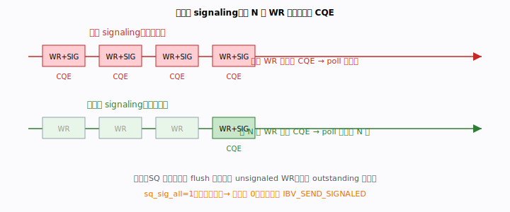
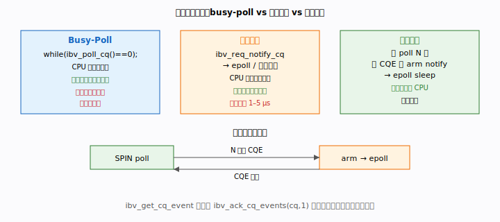
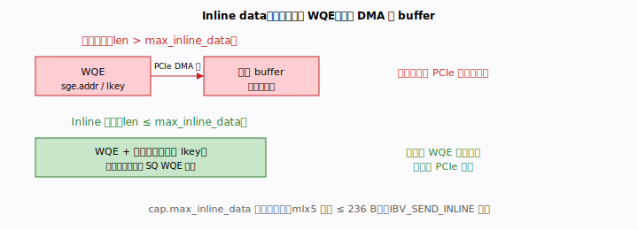
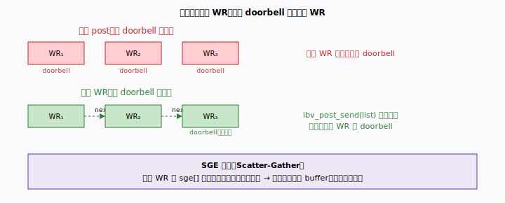
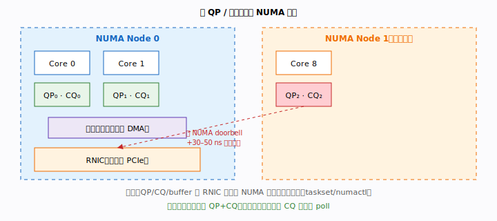
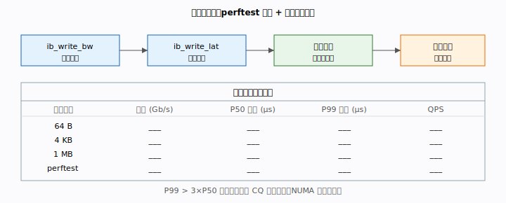

# 阶段三 · 性能工程

> 对应 `TODO.md` 阶段三 3.1–3.6。前置阅读：`docs/stage1-hardware-model.md`（硬件
> 模型）与 `examples/02-send-recv/`（延迟基线）。
> 目标：把延迟做到 μs 级、带宽打满线速，并解释每项优化背后的硬件机理。

---

## 目录

1. [选择性 signaling 与 SQ 回收](#1-选择性-signaling-与-sq-回收)
2. [轮询 vs 事件：busy-poll / 事件驱动 / 混合策略](#2-轮询-vs-事件)
3. [Inline data 与小消息优化](#3-inline-data-与小消息优化)
4. [批处理、链式 WR 与 SGE 聚合](#4-批处理链式-wr-与-sge-聚合)
5. [多 QP / 多核扩展与 NUMA 亲和](#5-多-qp--多核扩展与-numa-亲和)
6. [基准方法学：perftest 校准 + 指标模板](#6-基准方法学)

---

## 本阶段术语速查

> 完整术语表见 [`docs/glossary.md`](glossary.md)。

| 术语 | 含义 |
|------|------|
| **SQ / RQ** | 发送队列 / 接收队列，组成一个 QP |
| **CQ / CQE** | 完成队列 / 完成队列条目，poll_cq 取出结果 |
| **WR / WQE** | 工作请求 / 其在硬件队列中的存储形式 |
| **SGE** | Scatter/Gather 元素 `{addr, length, lkey}`，一个 WR 可含多个 |
| **Doorbell** | MMIO 通知 NIC 新 WQE；批处理可合并多次 doorbell |
| **IMM** | 立即数，随 SEND/WRITE_WITH_IMM 携带的 32 位通知 |
| **Credit** | 流控信用，确保对端 RQ 有足够预投递 WR |
| **NUMA** | 非一致内存访问，QP/MR/线程应绑定同一 NUMA 节点 |


---
## 1. 选择性 signaling 与 SQ 回收

> 🛠 可运行示例：[`examples/06-selective-signaling/`](../examples/06-selective-signaling/)
> ——同样 N 次 WRITE，对比"全 signaled"与"每 K 个 signaled"的吞吐加速比。

### 原理

每个 `IBV_SEND_SIGNALED` 的 WR 完成后，网卡都要通过 PCIe DMA 写一条 CQE。
高吞吐场景下，如果每个 WR 都打 SIGNALED，CQ 的 DMA 写和 CPU 的 `ibv_poll_cq`
本身就会占用大量 PCIe 带宽和 CPU 周期。

**选择性 signaling**：每 N 个 WR 只让最后一个带 `IBV_SEND_SIGNALED`，其余为
unsignaled。一次 `poll_cq` 就能确认前 N 个 WR 全部完成——因为 RC 的 SQ 是
严格有序的。



### 代码模式

```c
#define SIGNAL_INTERVAL 16          /* 每 16 个 WR signaled 一次 */
static int outstanding = 0;         /* 未 poll 的 unsignaled WR 数 */

static void post_write_selective(struct rdma_cm_id *id, /* ... */)
{
    int flags = (++outstanding % SIGNAL_INTERVAL == 0)
                ? IBV_SEND_SIGNALED : 0;

    /* ibv_post_send ... flags ... */

    if (flags & IBV_SEND_SIGNALED) {
        wait_send_comp(id, "selective signal");
        outstanding = 0;
    }
}

/* 退出前 flush 剩余 unsignaled WR */
static void flush_outstanding(struct rdma_cm_id *id, int remain)
{
    if (remain > 0) {
        /* post 一个 no-op / 0 字节 WRITE 带 SIGNALED，然后 poll */
        /* 或直接 post 最后一个真实 WR 带 SIGNALED */
        wait_send_comp(id, "flush");
    }
}
```

### 关键约束

- 教学默认 `sq_sig_all = 1`（`common/rdma_common.h:fill_qp_attr`）—— 生产环境
  改为 `0`，手动控制 `IBV_SEND_SIGNALED`。
- SQ 深度（`max_send_wr`）必须 ≥ `SIGNAL_INTERVAL`，否则 SQ 满在 poll 之前。
- unsignaled WR 出错时**不会**产生错误 CQE；需靠 signaled WR 的 `wc.status`
  间接发现（此时 QP 已进入 ERROR 态，所有后续 WR 以 flush error 完成）。

---

## 2. 轮询 vs 事件

### 三种模式对比



#### Busy-Poll（最低延迟）

```c
struct ibv_wc wc;
while (ibv_poll_cq(cq, 1, &wc) == 0)
    ;   /* 空转 */
```

- **优点**：消除事件通知延迟，P50 可达亚微秒级。
- **缺点**：独占一个 CPU 核，功耗高，不适合 QPS 低的场景。

#### 事件驱动（省 CPU）

```c
/* 注册 completion channel */
struct ibv_comp_channel *cc = ibv_create_comp_channel(ctx);
ibv_req_notify_cq(cq, 0);          /* arm：下一个 CQE 触发事件 */

/* 线程阻塞等待 */
struct ibv_cq *ev_cq; void *ev_ctx;
ibv_get_cq_event(cc, &ev_cq, &ev_ctx);
ibv_ack_cq_events(ev_cq, 1);       /* 必须 ack，否则引用计数泄漏 */
ibv_req_notify_cq(ev_cq, 0);       /* 重新 arm */
ibv_poll_cq(ev_cq, batch, wcs);    /* 取出所有 CQE */
```

- **优点**：线程可睡眠，适合高连接数 / 低 QPS。
- **缺点**：事件路径多一次内核交互，延迟增加 1–5 μs。

#### 混合策略（生产首选）

```c
/* 先 busy-poll N 次，无 CQE 则切换为事件模式 */
int spin = 0;
while (ibv_poll_cq(cq, 1, &wc) == 0) {
    if (++spin > SPIN_THRESHOLD) {
        ibv_req_notify_cq(cq, 0);
        /* 再 poll 一次防 race */
        if (ibv_poll_cq(cq, 1, &wc) == 0) {
            ibv_get_cq_event(cc, &ev_cq, &ev_ctx);
            ibv_ack_cq_events(ev_cq, 1);
        }
        spin = 0;
    }
}
```

**arm 后必须再 poll 一次**防止以下竞态：CQE 在 `req_notify` 之后、
`get_cq_event` 之前到达，导致事件不触发、线程永久睡眠。

---

## 3. Inline data 与小消息优化

### 原理

普通 `ibv_post_send` 在 WQE 中存储 `(addr, lkey, length)`，网卡执行时再发起
PCIe DMA 去读数据 buffer。对于小消息，这次额外的 DMA 往返成本显著。

`IBV_SEND_INLINE` 把数据直接**内嵌进 WQE**，网卡读 WQE 即得数据，**省去一次
PCIe 往返**，通常可降低延迟 20–50 ns。



### 使用方法

```c
/* 创建 QP 时声明最大 inline 容量（受硬件限制） */
qp_attr.cap.max_inline_data = 236;   /* mlx5 典型上限 */

/* post_send 时加 IBV_SEND_INLINE 标志（不需要 lkey） */
struct ibv_send_wr wr = { ... };
wr.send_flags = IBV_SEND_SIGNALED | IBV_SEND_INLINE;
```

`rdma_post_send` 没有直接 inline 参数，需用 `ibv_post_send` 手工构造。

### 调优建议

```bash
# 查询设备支持的最大 inline 大小
ibv_devinfo -v | grep max_inline
```

- 超过 `max_inline_data` 的 WR 设置 `IBV_SEND_INLINE` 会返回 `EINVAL`。
- 控制面消息（64–128 B，本仓库 `control_message` = 80 B）是 inline 的理想候选。
- 大数据面传输（>1 KB）收益极小，不必 inline。

---

## 4. 批处理、链式 WR 与 SGE 聚合

### 批处理与链式 WR

每次 `ibv_post_send` 都会触发一次 doorbell MMIO 写（WC flush），代价约 50–100 ns。
将多个 `ibv_send_wr` 通过 `wr.next` 链成链表，**一次 `ibv_post_send` 调用**
即可投递整个链，只需一次 doorbell。



```c
struct ibv_send_wr wr[BATCH], *bad;
for (int i = 0; i < BATCH - 1; i++) {
    build_wr(&wr[i], ...);
    wr[i].send_flags = 0;           /* unsignaled */
    wr[i].next = &wr[i + 1];
}
build_wr(&wr[BATCH-1], ...);
wr[BATCH-1].send_flags = IBV_SEND_SIGNALED;
wr[BATCH-1].next = NULL;

ibv_post_send(qp, &wr[0], &bad);   /* 一次调用，一次 doorbell */
wait_send_comp(...);
```

### SGE 聚合（Scatter-Gather）

单个 WR 可携带 `sge[]` 数组，指向多段**不连续内存**，网卡在 DMA 时自动拼接。
`max_send_sge` 决定每个 WR 最多几个 SGE（通常 ≥ 16）。

```c
struct ibv_sge sge[2] = {
    { .addr = (uint64_t)hdr,  .length = hdr_len,  .lkey = hdr_mr->lkey  },
    { .addr = (uint64_t)body, .length = body_len, .lkey = body_mr->lkey },
};
wr.sg_list = sge;
wr.num_sge = 2;
```

避免了为拼包而做的内存拷贝，是 zero-copy RPC 框架的常用技巧。

---

## 5. 多 QP / 多核扩展与 NUMA 亲和

### 单 QP 的瓶颈

单 QP 本质上是串行的——前序 WR 完成才能继续。高吞吐需要多 QP 并行，
每个工作线程独享一组 QP + CQ，彻底消除锁竞争。



### NUMA 亲和三原则

1. **RNIC 所在 NUMA 节点**：`cat /sys/bus/pci/devices/<BDF>/numa_node`
2. **数据 buffer 在同节点内存分配**：`numa_alloc_onnode()` 或
   `numactl --membind=<node>`
3. **工作线程绑定到同节点 CPU**：`taskset -c <core>` 或 `pthread_setaffinity_np`

跨 NUMA 的 doorbell 写（CPU 与 RNIC 不在同节点）额外增加 30–50 ns，
是 P99 抖动的常见根源。

### 多 QP 设计模式

```
模式 A：每线程独享 QP + CQ
    线程 0 → QP₀ + CQ₀   (无锁，最快)
    线程 1 → QP₁ + CQ₁

模式 B：共享 CQ + 各自 QP
    线程 0/1 → QP₀/QP₁ → 共享 CQ
    poll_cq 需加锁（或用原子 CAS）

模式 C（阶段四）：SRQ + 共享 CQ
    大量连接共享一个 RQ，节省内存
```

生产推荐模式 A；连接数 > CPU 核数时考虑模式 B/C。

---

## 6. 基准方法学

### perftest 校准流程

```bash
# 安装
dnf install -y perftest

# RDMA WRITE 带宽基线（双机）
ib_write_bw -d mlx5_0 -i 1              # server
ib_write_bw -d mlx5_0 -i 1 <server-ip> # client

# RDMA WRITE 延迟基线
ib_write_lat -d mlx5_0 -i 1
ib_write_lat -d mlx5_0 -i 1 <server-ip>

# SEND 延迟
ib_send_lat ...

# 关键参数
ib_write_bw ... -s 65536 -n 10000      # 消息大小 64 KB，10000 次迭代
ib_write_lat ... --output=percentiles   # 输出百分位数
```



### 自研程序对比 checklist

将 `examples/02-send-recv` 的 RTT 数字与 `ib_send_lat` 对比，差距大时逐项检查：

| 检查项 | 命令 / 方法 |
|--------|------------|
| 是否跨 NUMA | `numactl --hardware` + `lstopo` |
| SQ 深度是否够 | `ibv_devinfo \| grep max_qp_wr` |
| 中断亲和性 | `/proc/irq/*/smp_affinity` |
| CPU 调速器 | `cpupower frequency-info` → 改 performance |
| 重传计数器 | `/sys/class/infiniband/mlx5_0/ports/1/counters/port_rcv_errors` |
| PCIe 带宽饱和 | `pcm-pcie` 或 `nvidia-smi dmon` |

### 延迟解读

```
P50  ≈ 理想路径延迟（无抖动）
P99  ≈ 抖动上限
P99 > 3 × P50  → 存在明显抖动，检查：
    - CQ 轮询不及时（缺 busy-poll 或批量 poll 不够大）
    - 重传（rnr_retry 触发、congestion）
    - NUMA 跨节点访问
    - OS jitter（NMI、timer、kthread）
```

---

## 小结：五段式

| 节 | 原理 | 核心 API / 参数 | 代码示例 | 性能收益 | 常见陷阱 |
|----|------|----------------|---------|---------|---------|
| 3.1 | 减少 CQE DMA 写次数 | `IBV_SEND_SIGNALED` · `sq_sig_all=0` | `fill_qp_attr` | QPS 提升 N 倍 | flush 剩余 unsignaled WR |
| 3.2 | CPU 占用 vs 延迟折中 | `ibv_req_notify_cq` · `ibv_get_cq_event` | — | 延迟 vs 省电 | arm 后忘记再 poll 一次 |
| 3.3 | 省去小消息 DMA 读 | `IBV_SEND_INLINE` · `max_inline_data` | — | −20–50 ns | 超 limit 返回 EINVAL |
| 3.4 | 减少 doorbell 次数 | `wr.next` 链式 · `ibv_post_send(list)` | — | doorbell 开销 ÷ batch | 链尾 `next=NULL` 且 SIGNALED |
| 3.5 | 消除锁 + NUMA 延迟 | `taskset` · `numa_alloc_onnode` | — | P99 抖动减少 30–50 ns | buffer 跨 NUMA 分配 |
| 3.6 | 建立可重复的度量基线 | `ib_write_bw/lat` · `--output=percentiles` | `02-send-recv` | — | 单次测量 vs 统计百分位 |

---
