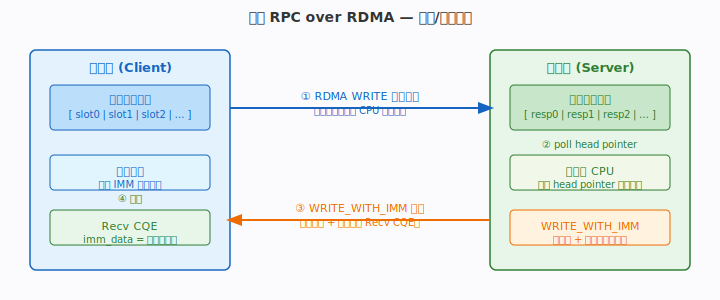
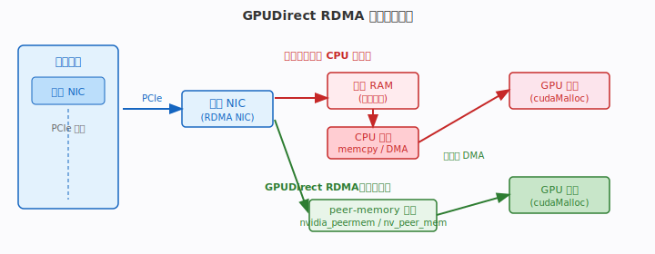
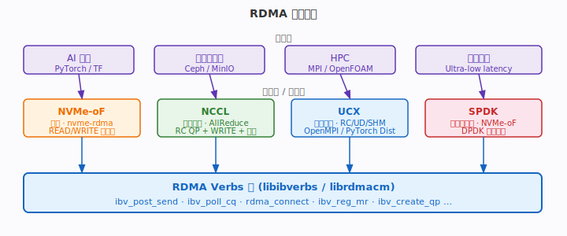
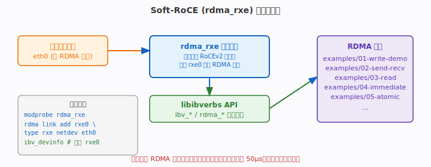

# 阶段七：与上层系统集成

> 目标：把 RDMA 原语嵌入真实系统——极简 RPC、GPU 直传、存储与通信生态、无硬件实验环境。

---

## 本阶段术语速查

> 完整术语表见 [`docs/glossary.md`](glossary.md)。

| 术语 | 含义 |
|------|------|
| **IMM** | 立即数，WRITE_WITH_IMM 实现 RPC 响应+通知合一 |
| **SGE** | Scatter/Gather 元素，构造请求/响应缓冲 |
| **RC / UD** | 传输类型，RPC 用 RC，广播控制可用 UD |
| **RoCE** | RDMA over Converged Ethernet，RoCEv2 用 UDP 4791 |
| **GID** | 全局标识符，跨节点寻址 |
| **NUMA** | GPUDirect 要求 NIC 与 GPU 同 PCIe 拓扑/NUMA |
| **MR / rkey** | GPU 显存也可 `ibv_reg_mr` 注册（需 peer-memory）|


---
## 7.1 极简 RPC over RDMA

> 🛠 可运行示例：[`examples/08-rpc/`](../examples/08-rpc/)
> ——SEND/RECV 请求/响应 RPC + 平均延迟基准（本节进一步讲单边 WRITE+IMM 环形缓冲优化）。

传统 TCP RPC 每次往返需要两次系统调用 + 内核协议栈，RTT 约 10–50 µs。
基于 RDMA 的 RPC 把控制面（通知）与数据面（载荷）分离：

- **数据**：RDMA WRITE（单边，对端 CPU 不参与）直接写入对端环形缓冲。
- **通知**：`WRITE_WITH_IMM` 在写数据的同时让对端产生一个 recv CQE，
  imm_data 携带槽位索引，无需额外 SEND 往返。



**环形缓冲设计**：

```c
#define SLOT_SIZE  4096
#define RING_SLOTS 256

struct rpc_ring {
    char     slots[RING_SLOTS][SLOT_SIZE];
    uint32_t head;   // 消费者读指针（本端维护，不通过 RDMA 暴露）
};

// 客户端发送请求：写数据 + IMM 通知槽位号
void send_request(struct ibv_qp *qp, struct ibv_mr *local_mr,
                  uint64_t remote_addr, uint32_t remote_rkey,
                  int slot, void *req, size_t len) {
    struct ibv_send_wr wr = {
        .opcode       = IBV_WR_RDMA_WRITE_WITH_IMM,
        .imm_data     = htonl(slot),
        .send_flags   = IBV_SEND_SIGNALED,
        .sg_list      = &(struct ibv_sge){
            .addr   = (uint64_t)req,
            .length = len,
            .lkey   = local_mr->lkey,
        },
        .num_sge      = 1,
        .wr.rdma.remote_addr = remote_addr + slot * SLOT_SIZE,
        .wr.rdma.rkey        = remote_rkey,
    };
    struct ibv_send_wr *bad;
    ibv_post_send(qp, &wr, &bad);
}

// 服务端事件循环：poll recv CQE 得到槽位号，处理请求
void server_loop(struct ibv_cq *cq, struct rpc_ring *ring) {
    struct ibv_wc wc;
    while (ibv_poll_cq(cq, 1, &wc) > 0) {
        if (wc.opcode == IBV_WC_RECV_RDMA_WITH_IMM) {
            int slot = ntohl(wc.imm_data);
            handle_request(ring->slots[slot]);
            // 重新投递 recv WR
            repost_recv(cq, slot);
        }
    }
}
```

**性能对比**：

| 方案 | 典型 RTT | CPU 开销 |
|------|---------|---------|
| TCP RPC（内核） | 10–50 µs | 高（系统调用 + 中断） |
| RDMA RPC（busy-poll） | 1–3 µs | 中（轮询 CQ） |
| RDMA RPC（event 模式） | 3–10 µs | 低（睡眠等待） |

---

## 7.2 GPUDirect RDMA

GPUDirect RDMA 允许远端网卡通过 PCIe P2P 直接 DMA 读写 GPU 显存，**完全绕过系统内存和 CPU 拷贝**。



**传统路径**（有 CPU 参与）：
```
远端 NIC → PCIe → 本端 NIC → 系统 RAM → CPU memcpy → GPU 显存
```

**GPUDirect 路径**（零拷贝）：
```
远端 NIC → PCIe → 本端 NIC → PCIe P2P → GPU 显存
```

**使用方式（伪代码）**：

```c
// 1. 分配 GPU 内存
void *gpu_buf;
cudaMalloc(&gpu_buf, buf_size);

// 2. 注册为 RDMA MR（需 nvidia_peermem 或 nv_peer_mem 内核模块）
struct ibv_mr *gpu_mr = ibv_reg_mr(pd, gpu_buf, buf_size,
    IBV_ACCESS_LOCAL_WRITE | IBV_ACCESS_REMOTE_WRITE);

// 3. 将 gpu_mr->rkey + gpu_buf 地址发给对端
// 4. 对端直接 RDMA WRITE 到 GPU 显存
rdma_post_write(id, NULL, src_buf, len, src_mr, IBV_SEND_SIGNALED,
                (uint64_t)gpu_buf, gpu_mr->rkey);
```

**前提条件**：
- 加载 `nvidia_peermem`（新驱动）或 `nv_peer_mem`（旧驱动）。
- NIC 与 GPU 需在同一 PCIe root complex 下，或通过支持 P2P 的 PCIe switch 连接。
- 在 `nvidia-smi topo -m` 中确认 GPU 与 NIC 的拓扑关系（NV# 表示支持）。
- 并非所有 NIC/GPU 组合支持；A100/H100 + ConnectX-6/7 是典型支持配置。

---

## 7.3 生态总览

RDMA Verbs 是各类高性能系统的底层基座：



### NVMe-oF（NVMe over Fabrics）

块存储协议，通过 RDMA 传输 NVMe 命令与数据：

```bash
# 加载内核模块（Target 端）
modprobe nvmet && modprobe nvmet-rdma
# 配置 namespace 并监听（通过 configfs）
# Initiator 端
modprobe nvme-rdma
nvme connect -t rdma -a <target_ip> -s 4420 -n nqn.xxx
```

- 延迟接近本地 NVMe（~10 µs vs ~100 µs TCP/IP NVMe-oF）。
- 内核态实现；用户态方案见 SPDK。

### NCCL（NVIDIA Collective Communication Library）

AI 训练中的集合通信库，AllReduce / AllGather 底层使用 RDMA：

- IB 传输主要用 RC QP + RDMA WRITE / WRITE_WITH_IMM 搬运数据（不依赖 RDMA
  原子）；ring/tree 算法的同步靠 flag/计数轮询而非硬件原子操作。
- `NCCL_IB_HCA` 环境变量指定使用哪张 RDMA 网卡。
- 与 GPUDirect RDMA 结合实现 GPU-to-GPU 零拷贝通信。

### UCX（Unified Communication X）

传输无关的通信框架，被 OpenMPI、PyTorch Distributed、Apache Spark 采用：

```bash
ucx_info -d        # 查看可用传输（rc_verbs, ud_verbs, shared_mem 等）
ucx_perftest -t ucp_put_bw -m rdma  # 带宽测试
```

UCX 自动选择最优传输：同节点用共享内存，跨节点用 RC/UD，降级到 TCP。

### SPDK（Storage Performance Dev Kit）

用户态 NVMe-oF Target，结合 DPDK 风格的轮询和 RDMA：

- 绕过内核，延迟 < 10 µs。
- `spdk_tgt` 配合 `bdev_nvme` + `nvmf_rdma` transport 使用。
- 适合超低延迟存储场景（AI 训练 Checkpoint、数据库）。

---

## 7.4 Soft-RoCE 完整实验环境

无物理 RDMA 网卡时，`rdma_rxe` 内核模块在普通以太网卡上模拟 RoCEv2：



**完整搭建步骤**：

```bash
# 1. 加载模块（内核 ≥ 5.8 内置，无需额外编译）
sudo modprobe rdma_rxe

# 2. 绑定到以太网口（eth0 替换为实际网卡名）
sudo rdma link add rxe0 type rxe netdev eth0

# 3. 验证设备出现
ibv_devinfo          # 应看到 rxe0，port_state: ACTIVE
rdma link show       # 确认 rxe0 link layer: Ethernet

# 4. 运行本仓库示例（loopback 测试）
cd examples/02-send-recv
./server 127.0.0.1 7471 &
./client 127.0.0.1 7471
```

**Docker/容器环境**：

```bash
# 需要特权模式 + host 网络
docker run --privileged --network host \
  -v /dev/infiniband:/dev/infiniband \
  your_rdma_image bash
```

**性能预期与限制**：

| 指标 | Soft-RoCE | 物理 RoCEv2 NIC |
|------|-----------|----------------|
| RTT | ~50 µs | ~1–2 µs |
| 带宽 | 受限于 CPU 和以太网卡 | 线速（25/100 Gbps） |
| 硬件卸载 | 无（全软件） | 完整卸载 |
| 适用场景 | 开发/功能测试 | 生产环境 |

Soft-RoCE 支持本教程所有示例（SEND/RECV、WRITE、READ、ATOMIC、SRQ 等），
是验证代码逻辑正确性的理想环境。

---

## 小结：原理 → API → 代码 → 性能 → 陷阱

| 维度 | 要点 |
|------|------|
| **原理** | RDMA RPC = WRITE（数据）+ IMM（通知）合一；GPUDirect 靠 PCIe P2P 绕开 CPU；各上层框架各有侧重（存储/通信/计算） |
| **API** | `IBV_WR_RDMA_WRITE_WITH_IMM`；`ibv_reg_mr(gpu_buf)`（需 peer-mem 模块）；`rdma link add rxe0 type rxe netdev eth0` |
| **代码** | RPC 环形缓冲槽位用 imm_data 传递；GPUDirect 仅伪代码参考；Soft-RoCE 搭建脚本即可跑全部示例 |
| **性能** | RDMA RPC 比 TCP 快 5–10×；GPUDirect 消除 GPU←→CPU 拷贝（带宽 × 2）；Soft-RoCE 延迟高但功能完整 |
| **陷阱** | GPUDirect 需确认 PCIe 拓扑（nvidia-smi topo）；NCCL 调参需匹配 QP 数与 GPU 数；Soft-RoCE 不能用于性能基准 |

---
