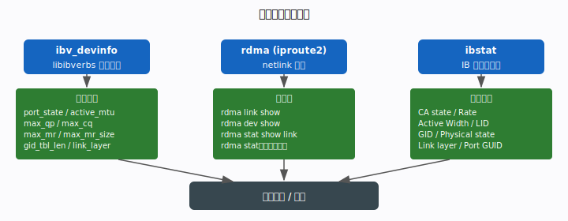
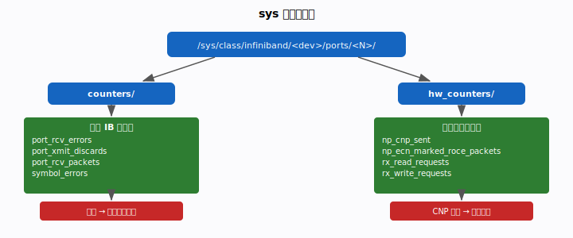
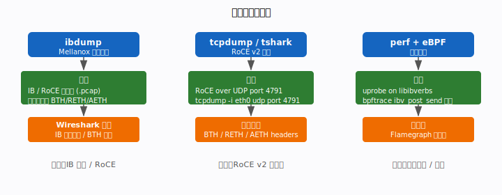
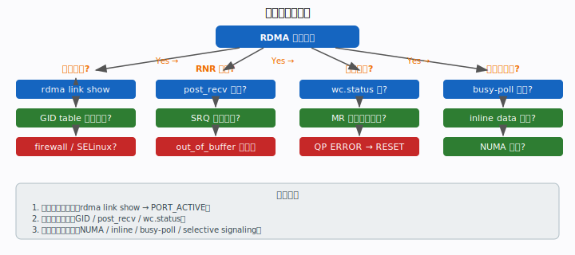

# 阶段八：调试与可观测性

> 目标：建立完整的 RDMA 可观测工具箱，能独立排查建链失败、完成错误与性能瓶颈。

---

## 8.1 设备能力查询



### ibv_devinfo

最常用的设备信息查询命令，输出包含：

```
$ ibv_devinfo
hca_id: mlx5_0
  transport:            InfiniBand (0)
  fw_ver:               20.35.1012
  node_guid:            b8:ce:f6:ff:fe:12:34:56
  sys_image_guid:       ...
  vendor_id:            0x02c9
  vendor_part_id:       4119          # ConnectX-6
  max_mr_size:          0xffffffffffffffff
  max_qp:               131072
  max_qp_wr:            32768
  max_cq:               16777216
  max_cq_wr:            4194303
  max_mr:               16777216
  port:   1
    state:              PORT_ACTIVE (4)    # ← 必须是 ACTIVE
    max_mtu:            4096 (5)
    active_mtu:         4096 (5)
    link_layer:         Ethernet           # RoCEv2
    gid_tbl_len:        255
```

**关键字段**：`state` 必须为 `PORT_ACTIVE`；`link_layer: Ethernet` 表示 RoCEv2；
`active_mtu` 影响单包最大载荷。

### rdma 命令（iproute2）

```bash
rdma link show          # 所有 RDMA 链路状态一览
rdma dev show           # 设备列表（含 node_type）
rdma stat               # 实时流量统计（packets/bytes per port）
rdma res show qp        # 查看当前所有 QP（调试 QP 泄漏）
show gids               # 列出所有 GID（排查 RoCE GID 配置问题）
```

### ibstat（InfiniBand 专用）

```bash
$ ibstat mlx5_0
CA 'mlx5_0'
  CA type: MT4119
  Port 1:
    State: Active
    Physical state: Polling
    Rate: 100
    Base lid: 0          # RoCE 下 LID=0
    LMC: 0
    SM lid: 0
    Link layer: Ethernet
    Active width: 4X
```

**Rate: 100** = 100 Gbps；**Physical state: Polling** 表示物理层在寻找链路对端。

---

## 8.2 计数器与监控



### 标准 IB 计数器

```bash
ls /sys/class/infiniband/mlx5_0/ports/1/counters/
# port_rcv_errors       ← 接收错误（链路质量问题）
# port_xmit_discards    ← 发送丢弃（拥塞 / 缓冲区满）
# port_rcv_packets      ← 接收包数（流量监控）
# port_xmit_packets
# symbol_errors         ← 物理层符号错误（线缆/光模块问题）
# link_error_recovery   ← 链路错误恢复次数

cat /sys/class/infiniband/mlx5_0/ports/1/counters/port_rcv_errors
```

### 硬件扩展计数器（NIC 私有）

```bash
ls /sys/class/infiniband/mlx5_0/ports/1/hw_counters/
# np_cnp_sent                  ← 发出的 CNP 数（本机检测到拥塞次数）
# np_ecn_marked_roce_packets   ← 收到 ECN 标记包数（被交换机标记为拥塞）
# rx_read_requests             ← 收到的 RDMA READ 请求数
# rx_write_requests            ← 收到的 RDMA WRITE 请求数
# roce_slow_restart            ← RoCE 慢启动次数（DCQCN 触发）
```

### perfquery（逐计数器查询）

```bash
perfquery -x mlx5_0 1   # 查询扩展计数器
perfquery -r mlx5_0 1   # 查询后重置（用于增量统计）
```

### 监控告警建议

| 计数器 | 告警阈值 | 含义 |
|--------|---------|------|
| `port_rcv_errors` | > 0 | 链路质量问题，检查线缆/光模块 |
| `symbol_errors` | > 0 | 物理层误码，更换线缆 |
| `port_xmit_discards` | 持续增长 | 拥塞丢包，检查 PFC/ECN 配置 |
| `np_cnp_sent` | 高频增长 | 本机触发 DCQCN 降速，排查瓶颈 |
| `np_ecn_marked_roce_packets` | 高频增长 | 交换机 ECN 标记过多，调整 ECN 阈值 |

---

## 8.3 抓包与追踪



### ibdump（Mellanox 专用）

```bash
# 抓取 RoCE 流量到 pcap（需 Mellanox NIC + special firmware）
ibdump -d mlx5_0 -i 1 -w rdma_capture.pcap
# 用 Wireshark 打开（InfiniBand / RoCEv2 dissector 自动识别）
wireshark rdma_capture.pcap
```

### tcpdump / tshark（RoCEv2 = UDP 4791）

```bash
# RoCEv2 封装在 UDP port 4791
tcpdump -i eth0 udp port 4791 -w rdma.pcap

# 用 tshark 解码 RDMA 头部
tshark -r rdma.pcap -T fields \
  -e frame.number -e ip.src -e ip.dst \
  -e infiniband.bth.opcode   # BTH opcode: SEND/WRITE/READ/ACK

# 常见 BTH opcode
# 0x04 = SEND Only
# 0x0a = RDMA WRITE Only
# 0x0c = RDMA WRITE WITH Immediate
# 0x06 = RDMA READ Request
# 0x10 = ACK
```

### perf 与 eBPF

```bash
# 用 perf 追踪 RDMA tracepoints（需内核配置 CONFIG_INFINIBAND_USER_ACCESS）
perf list | grep rdma
perf stat -e "rdma:*" ./my_rdma_app

# 用 bpftrace 测量 ibv_post_send 延迟
bpftrace -e '
uprobe:/usr/lib/libibverbs.so:ibv_post_send { @start[tid] = nsecs; }
uretprobe:/usr/lib/libibverbs.so:ibv_post_send {
  @latency = hist(nsecs - @start[tid]); delete(@start[tid]);
}'

# flamegraph 分析 CPU 热点
perf record -F 99 -g ./my_rdma_app
perf script | stackcollapse-perf.pl | flamegraph.pl > flame.svg
```

### rdma-core 调试日志

```bash
# 开启 libibverbs 调试输出
IBVERBS_DEBUG=1 ./my_rdma_app

# mlx5 provider 详细日志
MLX5_DEBUG_MASK=0xffffffff ./my_rdma_app

# fork 安全模式（同时保证 RDMA + fork 正确）
RDMAV_FORK_SAFE=1 ./my_rdma_app
```

---

## 8.4 常见故障决策树



### 建链失败

```
症状：rdma_connect / ibv_modify_qp(RTR) 返回错误，或超时无响应

排查步骤：
1. ibv_devinfo → port state = PORT_ACTIVE？（不是则检查线缆/交换机）
2. rdma link show → link 显示为 UP？
3. show gids → GID[0] 有效？（RoCE 需要 IP 层 GID，确认 IP 地址配置）
4. ping <对端 RDMA 网卡 IP>（基础网络连通性）
5. iptables / firewalld 是否放行 UDP 4791？（RoCEv2 端口）
6. SELinux：setenforce 0 测试（临时）
7. Soft-RoCE：确认 modprobe rdma_rxe 已执行，rdma link add 已绑定
```

### RNR 错误（IBV_WC_RNR_RETRY_EXC_ERR）

```
症状：wc.status == IBV_WC_RNR_RETRY_EXC_ERR

原因：对端 RQ 无可用 WR（Receiver Not Ready）
排查：
1. 确认对端 post_recv 在 post_send 之前执行
2. 若使用 SRQ：检查 SRQ 未耗尽（ibv_post_srq_recv 足够多）
3. 增大 rnr_retry 到 7（无限重试）买时间排查
4. 检查 CQ 是否溢出导致对端卡住无法继续 post_recv
```

### 完成错误（wc.status != IBV_WC_SUCCESS）

```c
// 调试代码：打印详细错误信息
if (wc.status != IBV_WC_SUCCESS) {
    fprintf(stderr, "WC error: %s\n", ibv_wc_status_str(wc.status));
    fprintf(stderr, "  opcode=%d, vendor_err=0x%x, qp_num=%u\n",
            wc.opcode, wc.vendor_err, wc.qp_num);
}
```

| 错误码 | 首选排查方向 |
|--------|------------|
| `RETRY_EXC_ERR` | 对端宕机？链路故障？增大 retry_cnt |
| `RNR_RETRY_EXC_ERR` | 对端 RQ 空，见上 |
| `LOC_LEN_ERR` | SGE length > MR 范围，检查 WR 构造 |
| `REM_ACCESS_ERR` | rkey 无效或权限不足（少了 REMOTE_WRITE/READ 标志） |
| `WR_FLUSH_ERR` | QP 已在 ERROR 态，批量忽略，找根因那条 |

### 性能不达标

```bash
# 1. NUMA 亲和（跨 NUMA 访问带宽减半）
numactl --hardware
numactl --cpunodebind=0 --membind=0 ./my_app   # 绑定 NUMA node 0

# 2. PCIe 带宽（瓶颈排查）
lspci -vv | grep -A5 "Mellanox"   # 确认 PCIe x16 Gen4
cat /sys/bus/pci/devices/<bdf>/current_link_speed

# 3. 确认 busy-poll（非 event 模式）
# 去掉 ibv_get_cq_event / ibv_ack_cq_events，改用纯 ibv_poll_cq 循环

# 4. 检查 inline data 配置
ibv_devinfo | grep max_inline   # 确认 NIC 支持 inline

# 5. 选择性 signaling（每 N 个才 signaled 一次）
# 见 docs/stage3-performance.md 3.1 节

# 6. 对比 perftest 基准
ib_send_lat -d mlx5_0            # 标准延迟基准
ib_send_bw -d mlx5_0             # 标准带宽基准
```

---

## 小结：原理 → API → 代码 → 性能 → 陷阱

| 维度 | 要点 |
|------|------|
| **原理** | 可观测性分三层：设备能力（ibv_devinfo）、运行计数器（/sys）、实时抓包（tcpdump/ibdump）|
| **API** | `ibv_wc_status_str()`；`perfquery`；`rdma res show qp`；`bpftrace uprobe` |
| **代码** | 每个 wc 必须打印 status_str + vendor_err；调试时开 IBVERBS_DEBUG=1；建链失败先查 port_state |
| **性能** | hw_counters 中 np_cnp_sent 是拥塞的第一信号；perf flamegraph 定位 CPU 热点；NUMA 亲和是性能翻倍的低垂果实 |
| **陷阱** | WR_FLUSH_ERR 批量出现不是真正错误；symbol_errors > 0 必须换线缆；ibdump 需要特殊 firmware，RoCE 场景优先用 tcpdump |

---

## 本阶段术语速查

> 完整术语表见 [`docs/glossary.md`](glossary.md)。

| 术语 | 含义 |
|------|------|
| **GID** | 全局标识符，`show gids` 排查 RoCE 配置 |
| **LID** | 本地标识符，RoCE 下为 0 |
| **QPN** | QP 编号，`rdma res show qp` 排查 QP 泄漏 |
| **PSN** | 包序列号，抓包分析乱序/重传 |
| **WC** | 工作完成，`ibv_wc_status_str` + `vendor_err` 定位错误 |
| **RNR** | 接收未就绪错误，对端 RQ 空 |
| **PFC / ECN / CNP** | 拥塞相关，对应 hw_counters 指标 |
| **DCQCN** | 拥塞控制，`np_cnp_sent` 是降速第一信号 |
| **RoCE** | RoCEv2 = UDP 4791，tcpdump 抓包过滤 |
