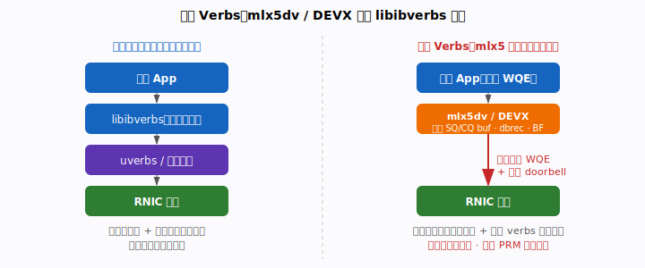
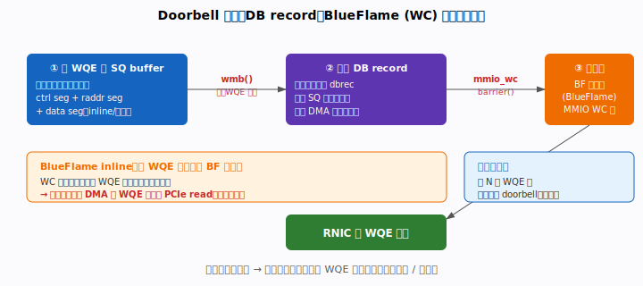
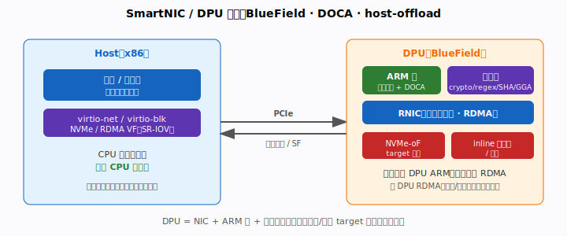
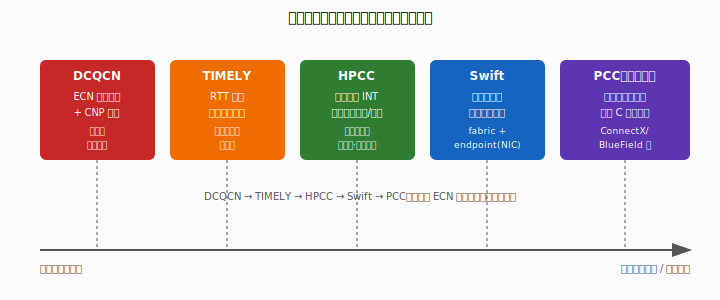

# 阶段九 · 专家深水区

> 前置阅读：`docs/stage1-hardware-model.md`（MMIO/DMA/WQE/MPT-MTT）、
> `docs/stage3-performance.md`（inline / doorbell / 批处理）、
> `docs/stage5-reliability.md`（DCQCN）、`docs/stage8-debugging.md`（计数器）。
> 目标：跨过 librdmacm / libibverbs 的舒适区，进入直接 verbs、硬件门铃、DPU
> 卸载与现代拥塞控制——这一层是把 RDMA 系统从「能用」做到「极致」的分水岭。
>
> ⚠️ 与本仓库前八个阶段不同：本阶段大量代码是 **mlx5 厂商专属**（`mlx5dv` /
> DEVX），不可移植，且依赖 PRM（Programmer's Reference Manual）结构布局。教学示例
> 以**伪代码 + 关键结构**呈现，生产落地务必对照对应固件版本的 PRM。

---

## 目录

1. [直接 Verbs：mlx5dv / DEVX 绕过 libibverbs 抽象](#91-直接-verbsmlx5dv--devx-绕过-libibverbs-抽象)
2. [Doorbell 机制深入：DB record、BlueFlame 与门铃批处理](#92-doorbell-机制深入db-recordblueflame-与门铃批处理)
3. [SmartNIC / DPU 卸载：BlueField、DOCA 与 host-offload 架构](#93-smartnic--dpu-卸载bluefielddoca-与-host-offload-架构)
4. [现代拥塞控制：超越 DCQCN（HPCC / TIMELY / Swift / 可编程 CC）](#94-现代拥塞控制超越-dcqcnhpcc--timely--swift--可编程-cc)

---

## 本阶段术语速查

> 完整术语表见 [`docs/glossary.md`](glossary.md)。

| 术语 | 含义 |
|------|------|
| **mlx5dv** | mlx5 Direct Verbs，取出标准 verbs 对象的裸硬件指针（SQ/CQ/dbrec/BF） |
| **DEVX** | `mlx5dv_devx_*`，用 PRM 命令直接创建/操作硬件对象（DC、steering 等） |
| **PRM** | Programmer's Reference Manual，mlx5 硬件结构布局规范 |
| **WQE ctrl segment** | WQE 控制头：opcode、qp_num、`ds`（长度）、signal/fence 位、SQ 索引 |
| **DB record (dbrec)** | 主机内存中的 SQ 生产者索引，网卡 DMA 读取以同步队列，真相来源 |
| **BlueFlame (BF)** | WC 内存映射的门铃寄存器，小 WQE 可整条 inline 进去省一次 PCIe read |
| **DPU** | Data Processing Unit，NIC + ARM 核 + 加速器，可下沉整条控制面 |
| **DOCA** | BlueField DPU 的上层 SDK（Flow/DMA/crypto/storage/doca_rdma 等库） |
| **SF** | Scalable Function，比 SR-IOV VF 更轻量、可大规模实例化的虚拟功能 |
| **GGA** | Generic Global Accelerator，DPU 上 regex/SHA/压缩等通用加速器 |
| **DCQCN** | RoCEv2 标准 CC，基于 ECN 二元信号 + CNP，收敛慢、参数难调 |
| **TIMELY** | 基于 RTT 梯度的 CC，用网卡硬件时戳，纯端侧 |
| **HPCC** | High Precision CC，用在网遥测 INT 精确算速率，收敛最快、近零排队 |
| **Swift** | Google 的时延型 CC，目标时延拆分为 fabric + endpoint，纯端侧 |
| **INT** | In-Network Telemetry，交换机把队列深度/链路利用率戳进包头 |
| **PCC** | 可编程拥塞控制，用受限 C 写算法跑在 ConnectX/BlueField 网卡上 |


---
## 9.1 直接 Verbs：mlx5dv / DEVX 绕过 libibverbs 抽象



### 为什么要绕过 libibverbs

libibverbs 是**可移植**的——同一份代码跑在 mlx5、irdma、bnxt_re 等不同 provider
上。代价是每个数据面调用（`ibv_post_send` / `ibv_poll_cq`）都要经过
**provider 函数表的间接分发**，再由 provider 把 WR 翻译成硬件 WQE。对追求亚微秒
延迟、或要用标准 verbs 没有暴露的硬件特性（DC 传输、UMR、高级流量分类）的系统，
这层抽象就成了障碍。

**两条直接通道：**

| 通道 | 用途 | 抽象层级 |
|------|------|---------|
| **mlx5dv（Direct Verbs）** | 取出标准 verbs 对象的**裸硬件指针**（SQ/CQ 缓冲、dbrec、BF 寄存器），在用户态手工拼 WQE | 仍复用 libibverbs 创建对象，只「下探」数据面 |
| **DEVX（`mlx5dv_devx_*`）** | 直接用 **PRM 命令**创建/操作硬件对象（QP、CQ、DC、流表项），完全不经标准 verbs | 最底层，几乎等同写驱动 |

### mlx5dv：取出裸缓冲指针

标准 verbs 创建 QP/CQ 后，`mlx5dv_init_obj` 把内部结构「掀开」，交出硬件级字段：

```c
#include <infiniband/mlx5dv.h>

struct mlx5dv_qp dvqp = {0};
struct mlx5dv_cq dvcq = {0};
struct mlx5dv_obj obj = {
    .qp = { .in = qp, .out = &dvqp },   /* qp 由 ibv_create_qp 创建 */
    .cq = { .in = cq, .out = &dvcq },
};

if (mlx5dv_init_obj(&obj, MLX5DV_OBJ_QP | MLX5DV_OBJ_CQ))
    die_rdma("mlx5dv_init_obj");

/* 现在拿到了硬件级指针： */
void     *sq_buf   = dvqp.sq.buf;      /* SQ 环形缓冲基址（直接写 WQE） */
uint32_t  sq_wqe_cnt = dvqp.sq.wqe_cnt;
uint32_t  sq_stride  = dvqp.sq.stride; /* 每个 WQE 槽位字节数（通常 64） */
__be32   *dbrec    = dvqp.dbrec;       /* DB record：SQ 生产者索引（主机内存） */
void     *bf_reg   = dvqp.bf.reg;      /* BlueFlame 门铃寄存器（MMIO WC） */
uint32_t  bf_size  = dvqp.bf.size;

void     *cq_buf   = dvcq.buf;         /* CQ 缓冲，可手工解析 CQE，跳过 ibv_poll_cq */
uint32_t  cqe_cnt  = dvcq.cqe_cnt;
uint32_t  cqe_size = dvcq.cqe_size;    /* 64 或 128 */
```

拿到 `sq.buf` + `dbrec` + `bf.reg` 三件套后，发一个 WQE 就**完全不调用
libibverbs**：自己往 `sq_buf` 里按 PRM 布局写 ctrl/data segment，更新 `dbrec`，
再敲 `bf_reg`（细节见 9.2）。`ibv_poll_cq` 同理可被「手工解析 `cq_buf` 里的 CQE
owner bit」取代。

### DEVX：用 PRM 命令直接造硬件对象

mlx5dv 仍借标准 verbs 创建对象；**DEVX 连创建都自己来**——把一段按 PRM 编码的
命令直接下发给固件：

```c
/* 以 PRM 命令创建一个硬件对象（如 DC target、流表 steering rule、计数器） */
uint32_t in[MLX5_ST_SZ_DW(create_qp_in)]   = {0};
uint32_t out[MLX5_ST_SZ_DW(create_qp_out)] = {0};

DEVX_SET(create_qp_in, in, opcode, MLX5_CMD_OP_CREATE_QP);
DEVX_SET(create_qp_in, in, qpc.st, MLX5_QPC_ST_DCI);   /* DC initiator */
DEVX_SET(create_qp_in, in, qpc.pd, pdn);
/* ... 逐字段按 PRM 填 qpc（QP context）... */

struct mlx5dv_devx_obj *qp_obj =
    mlx5dv_devx_obj_create(ctx, in, sizeof(in), out, sizeof(out));
if (!qp_obj) die_rdma("devx create_qp");

uint32_t qpn = DEVX_GET(create_qp_out, out, qpn);

/* 后续用 mlx5dv_devx_obj_modify() 推 QP 状态机 RST→INIT→RTR→RTS */
```

DEVX 是解锁高级能力的钥匙：**DC（Dynamically Connected）传输**（一个 DCI 连任意
DCT，省下 N² 个 QP，见阶段四）、**高级 steering**（按五元组/VXLAN 把流量导向特定
QP/RQ）、**UMR**（用户态内存重注册，零拷贝重组 MR）等，标准 verbs 大多不暴露。

### 权衡：能力 vs 锁定

| 维度 | libibverbs | mlx5dv / DEVX |
|------|-----------|---------------|
| 可移植性 | 跨厂商 | **仅 mlx5（厂商锁定）** |
| 延迟 | 多一层分发 | 最短路径，省间接调用 |
| 能力 | 标准子集 | DC / UMR / 高级 steering 等 |
| 维护成本 | 低 | **须跟 PRM 结构布局**，固件升级可能变更 |
| 出错代价 | verbs 会校验 | 写错 WQE 字节 → 静默数据损坏 / NIC 卡死 |

经验法则：**控制面**（建链、MR 注册）继续用 libibverbs / librdmacm；只把**最热的
数据面**（post + poll）下沉到 mlx5dv，必要时才动 DEVX。

---

## 9.2 Doorbell 机制深入：DB record、BlueFlame 与门铃批处理



阶段三把 doorbell 当成「一次 MMIO 写」一笔带过。在 mlx5 上，发一个 WQE 其实是
**三步 + 两道内存屏障**的精密舞蹈，错一步就是数据损坏或死锁。

### 三步门铃序列

```
① 写 WQE 到 SQ buffer（主机内存环形队列）
        │   wmb()         ← 保证 WQE 字节先于索引可见
② 更新 DB record（dbrec，主机内存中的生产者索引）
        │   mmio_wc barrier()   ← 保证 dbrec 先于 BF 写，且 WC 缓冲不乱序
③ 敲 BlueFlame（BF）寄存器（MMIO，写合并 WC 内存）
```

- **DB record（dbrec）**：一小块**主机内存**，存 SQ 的生产者索引。网卡通过 DMA
  读它来知道「队列里新增了多少 WQE」。它是**真相来源**——即使 BF 写丢了，网卡轮询
  dbrec 仍能发现新 WQE（BF 只是「催一下」的快路径）。
- **BlueFlame（BF）寄存器**：映射为 **write-combining（WC）** 的 MMIO 区域。普通
  doorbell 只写一个索引；BF 的特殊之处见下。

### BlueFlame inline：把 WQE 直接「喷」进寄存器

普通流程里，网卡收到门铃后要**反向 DMA 读 SQ buffer** 把 WQE 取回——这是一次
PCIe 读往返（数百 ns）。BlueFlame 的杀手锏：**小 WQE 可以整条 inline 写进 BF
寄存器**。借助 WC 内存的写合并，整个 WQE 随门铃一次性推到网卡：

```
普通：  CPU 写 WQE 到内存 → 敲门铃 → 网卡 DMA 读 WQE 回来（PCIe read 往返）
BF inline：CPU 把 WQE 直接写进 BF 寄存器 → 网卡当场拿到 WQE
                                        ↑ 省去网卡反向 DMA 读 WQE 的一次 PCIe read
```

这与阶段三的 `IBV_SEND_INLINE` 是**两个不同层次**的 inline：前者把**用户数据**塞进
WQE 省一次数据 DMA；BlueFlame 把**整条 WQE**塞进门铃省一次 WQE DMA。两者叠加，小
消息延迟可压到极限。

### 手工 post：屏障不能省

```c
/* 续 9.1：sq_buf / dbrec / bf_reg 已由 mlx5dv_init_obj 取得 */

static unsigned sq_pi;   /* SQ 生产者索引（以 WQE 为单位） */

void post_write_raw(void *sq_buf, uint32_t stride, __be32 *dbrec,
                    void *bf_reg, /* ... WQE 内容 ... */)
{
    /* ① 在 sq_buf 的当前槽位按 PRM 拼 WQE（ctrl + raddr + data segment） */
    void *seg = (char *)sq_buf + (sq_pi % wqe_cnt) * stride;
    build_ctrl_seg(seg, MLX5_OPCODE_RDMA_WRITE, sq_pi, /*ds=*/3, /*signal=*/1);
    build_raddr_seg((char *)seg + 16, remote_addr, rkey);
    build_data_seg ((char *)seg + 32, local_addr, lkey, len);

    sq_pi++;

    /* ②③ 之间的屏障：WQE 必须先于 dbrec 落地 */
    udma_to_device_barrier();           /* == wmb() */
    dbrec[MLX5_SND_DBR] = htobe32(sq_pi & 0xffff);   /* 更新 DB record */

    mmio_wc_start();                    /* WC 屏障，保证 dbrec 先于 BF 写 */
    /* ③ 敲门铃：64 字节 WQE 可整条 inline 进 BF（此处简化为写 ctrl seg） */
    mmio_write64_be(bf_reg, *(uint64_t *)seg);
    mmio_flush_writes();                /* 强制 WC 缓冲刷出，门铃真正到达 NIC */
}
```

> 屏障语义（rdma-core 提供 `udma_to_device_barrier` / `mmio_wc_start` 等可移植
> 封装）：
> - **wmb（WQE → dbrec）**：若网卡先看到新索引却读到半成品 WQE → 执行垃圾。
> - **mmio_wc（dbrec → BF）**：WC 内存默认可乱序合并；不加屏障，BF 写可能在 dbrec
>   之前到达，网卡按旧索引取 WQE。
> - **结尾 flush**：WC 缓冲若不刷出，门铃滞留在 CPU 写合并缓冲，表现为「post 了但
>   网卡毫无反应」的诡异卡死。

### WQE 二进制布局

一条 RDMA WRITE WQE 至少由三段 16 字节对齐的 segment 组成：

| segment | 内容 | 关键字段 |
|---------|------|---------|
| **ctrl segment** | 控制头 | opcode、qp_num、`ds`（data segment 数，决定 WQE 长度）、`fm_ce_se`（含 signal/fence 位）、`opmod_idx_opcode`（含 SQ 索引） |
| **raddr segment** | 远端寻址（仅单边操作） | `raddr`（对端虚拟地址）、`rkey` |
| **data segment** | 数据指针或 inline 数据 | `byte_count`、`lkey`、`addr`（或 inline 标志 + 内嵌字节） |

`ds` 字段尤其要小心：它以 16 字节为单位描述整条 WQE 的长度，**算错一格**网卡就会
把下一条 WQE 的字节误读成本条的 data segment。

### 门铃批处理

把 N 条 WQE 连续写进 SQ buffer，**只在最后更新一次 dbrec、敲一次门铃**：dbrec 一次
跳 N 格，网卡批量取走 N 条 WQE。这是阶段三「链式 WR 一次 doorbell」在硬件层的真身。
注意此时**不能**用 BlueFlame inline（BF inline 只适合单条小 WQE），批处理走普通
doorbell 路径。

---

## 9.3 SmartNIC / DPU 卸载：BlueField、DOCA 与 host-offload 架构



### 从 NIC 到 DPU

普通 RNIC 卸载的是**传输层**（RDMA 引擎）。**DPU（Data Processing Unit，如 NVIDIA
BlueField）= RNIC + 一组 ARM 核 + 专用加速器**，它能跑一个**完整的 Linux**，因此
可以把整条**控制面**乃至**存储/网络服务**从主机搬到网卡侧：

```
传统：  Host CPU 跑 控制面 + 数据面协议栈 + 存储 target
DPU：   Host 只看到虚拟设备；控制面 / target 跑在 DPU 的 ARM 上
        Host CPU 100% 还给业务
```

### DOCA 编程模型与设备表示

- **DOCA SDK**：BlueField 的上层框架，封装 Flow（硬件流表）、DMA、加解密、压缩、
  存储（NVMe-oF）、`doca_rdma` 等领域库。开发者在 ARM 侧写应用，调 DOCA API 驱动
  下面的加速器与 RNIC。
- **设备表示（device representation）**：
  - **SR-IOV VF**：传统虚拟化，每个 VF 是一个轻量 PCIe 功能，直通给虚拟机。
  - **SF（Scalable Function）**：比 VF 更轻量、可大规模实例化的虚拟功能，DPU 用它
    给成百上千租户提供隔离的虚拟设备。
  - 主机侧看到的 virtio-net / virtio-blk / NVMe 设备，背后由 DPU **模拟**——主机
    驱动以为在和真硬件说话，实际请求被 DPU ARM 截获处理。

### 典型卸载场景

| 场景 | 卸载了什么 | 收益 |
|------|-----------|------|
| **NVMe-oF target 卸载** | 存储 target 跑在 DPU，主机磁盘 I/O 走 DPU | 存储节点主机 CPU 几乎零占用 |
| **inline 加解密 / 压缩** | 数据过网卡时硬件加速器在线处理 | 线速加密，主机无感 |
| **virtio-net/blk 模拟** | 网络/块设备由 DPU 模拟 + 后端卸载 | 裸金属也能软件定义 I/O |
| **零信任隔离** | 控制面/安全策略在 DPU，租户碰不到物理设备 | 主机被攻破也无法越权访问网络/存储 |

### RDMA 专属玩法

- **跨 DPU RDMA**：两端 DPU 间直接用 RDMA 搬数据，主机完全不参与——存储复制、
  GPU 训练梯度交换的常见拓扑。
- **GGA（Generic Global Accelerator）+ RDMA 合一**：数据 RDMA 落到 DPU 内存后，
  顺手过 regex / SHA / 压缩加速器，再写出——「搬运 + 计算」一次过，省去回主机绕一圈。
- **架构铁律**：**控制面在 DPU ARM，数据面走 RDMA 线速通道，主机只见虚拟设备**。
  控制面的灵活性（软件）与数据面的极致性能（硬件）由此解耦。

### 与本仓库的关系

本仓库示例都是**主机侧 RDMA**。迁到 DPU 时，`server.c` / `client.c` 这类
target/控制逻辑会编译进 DPU ARM 的 Linux 运行，数据面 verbs 调用直接驱动 DPU 上的
RNIC——代码几乎不变，**改变的是它运行的位置**。这正是 DPU 卸载「对应用透明」的精髓。

---

## 9.4 现代拥塞控制：超越 DCQCN（HPCC / TIMELY / Swift / 可编程 CC）



### DCQCN 的天花板

阶段五讲的 DCQCN 是 RoCEv2 的事实标准，但它有结构性短板：

- **ECN 是二元信号**：交换机只能说「拥塞 / 不拥塞」，给不出「拥塞多严重」。发送端
  只能盲目按固定步长降速、再缓慢探测加速。
- **收敛慢**：基于概率标记 + 速率慢启动，从拥塞恢复要多个 RTT。
- **参数地狱**：`Kmin/Kmax/Pmax`、`g`、`Rai/Rhai`、timer——一组参数对一种流量谱
  系最优，换业务就要重调，跨数据中心几乎无法统一。

后续算法的共同方向：**用更精细的信号**（精确时延、精确链路利用率）替代二元 ECN。

### TIMELY：RTT 梯度

用**网卡硬件时戳**精确测量 RTT，关键洞察是**用 RTT 的梯度（变化率）而非绝对值**
做决策：RTT 在上升说明队列在堆积，提前降速；RTT 下降则加速。比 ECN 提前感知拥塞，
且不依赖交换机配合。

### HPCC：在网遥测（INT），最精确

HPCC（High Precision Congestion Control）跳出端到端猜测，让**网络自己上报状态**：

```
数据包穿过每一跳交换机时，交换机把【出口队列深度 / 已发字节 / 链路带宽 / 时戳】
用 INT（In-Network Telemetry）戳进包头；
        │
ACK 把这串遥测带回发送端；
        │
发送端按每条链路的【精确利用率】算出恰好填满而不排队的速率（inflight 字节目标）。
```

效果：**收敛极快、近零排队、几乎无需调参**——因为它拿到的是链路利用率的真值，而非
二元信号。代价：需要**交换机支持 INT**（P4 可编程交换机或厂商 ASIC 特性），部署门槛高。

### Swift（Google）：时延拆分

Swift 以**端到端时延为唯一信号**，但把目标时延拆成两部分分别控制：

- **fabric 时延**：网络中转产生（队列/链路），反映网络拥塞。
- **endpoint 时延**：网卡/主机内部产生（NIC 处理、PCIe、incast 时的目标端排队），
  反映端侧拥塞（尤其 incast）。

分别设目标、分别调速，使 Swift 在大规模 incast 下仍稳定。优点：**纯端侧、不需要
交换机改造**，工程上比 HPCC 易部署。

### 可编程 CC（PCC）：把算法写进网卡

NVIDIA ConnectX/BlueField 支持**用户可编程拥塞控制**：用**受限 C** 写一段 CC 算法，
编译后**运行在网卡固件的 CC 引擎里**。算法可消费硬件时戳、CNP、RTT 等事件，输出
速率决策——既享受硬件级反应速度，又能按业务自定义策略（甚至直接实现 Swift/HPCC 风格
逻辑）。这是「算法灵活性」与「硬件性能」的合流点，呼应 9.3 的可编程网卡趋势。

### 横向对比

| 算法 | 信号类型 | 信号粒度 | 收敛速度 | 硬件要求 | 部署门槛 |
|------|---------|---------|---------|---------|---------|
| **DCQCN** | ECN（二元）+ CNP | 粗 | 慢 | 交换机 ECN + NIC | 低（RoCEv2 标配） |
| **TIMELY** | RTT 梯度 | 中 | 中 | NIC 硬件时戳 | 中（纯端侧） |
| **HPCC** | 在网遥测 INT | **最精确** | **最快** | **交换机 INT** + NIC | 高（需 P4/特殊 ASIC） |
| **Swift** | 端到端时延（拆分） | 细 | 快 | NIC 硬件时戳 | 中（纯端侧） |
| **PCC** | 可编程（任意信号） | 取决于算法 | 取决于算法 | 可编程 CC 的 NIC | 中（需 ConnectX/BlueField） |

> 观测落地：阶段八的 `hw_counters`（`np_cnp_sent` / `np_ecn_marked_roce_packets`
> / `roce_slow_restart`）是 DCQCN 的「仪表盘」。换到 HPCC/Swift/PCC 时，监控重点
> 转向**实测 RTT 分布**与**队列深度**，而非 CNP 计数。

---

## 小结：原理 → API → 代码 → 性能 → 陷阱

| 节 | 原理 | 核心 API / 机制 | 代码示例 | 性能收益 | 常见陷阱 |
|----|------|----------------|---------|---------|---------|
| 9.1 | 绕过 provider 函数表分发，直取硬件对象 | `mlx5dv_init_obj` · `mlx5dv_devx_obj_create` · `DEVX_SET/GET` | 取 `sq.buf/dbrec/bf` + DEVX 建 DC | 省间接调用 + 解锁 DC/UMR/steering | 厂商锁定；PRM 字段写错 → 静默损坏 |
| 9.2 | 三步门铃 + 两道屏障；BF 把 WQE inline 进寄存器 | `dbrec` 写 · `mmio_wc_start` · BlueFlame BF 寄存器 | `post_write_raw` 手工 WQE | 省网卡反向 DMA 读 WQE 一次 PCIe read | 漏 wmb/mmio_wc → 损坏或卡死；`ds` 算错 |
| 9.3 | DPU=NIC+ARM+加速器，控制面下沉网卡 | DOCA SDK · SF/VF · 设备模拟 · `doca_rdma` | NVMe-oF/crypto 卸载 · 跨 DPU RDMA | 主机 CPU 几乎清零 | 误把数据面也搬上 ARM（ARM 算力有限） |
| 9.4 | 用精确信号（时延/INT）替代二元 ECN | TIMELY/HPCC/Swift 算法 · PCC 可编程引擎 | INT 遥测回算速率 · 受限 C 写 CC | 近零排队、收敛快、少调参 | HPCC 需交换机 INT；DCQCN 参数地狱 |

---
