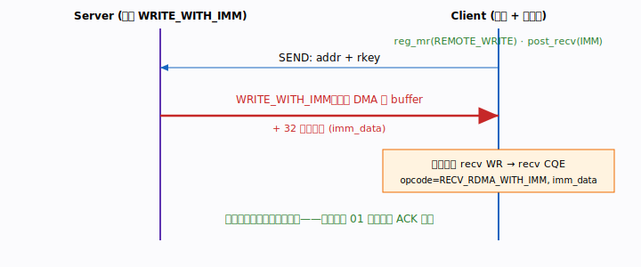

# 示例 04 · WRITE_WITH_IMM（带立即数的单边写）

在示例 01 里，服务端 WRITE 完还要再补一发 SEND 当 ACK，客户端才知道数据就绪。
本示例用 **`IBV_WR_RDMA_WRITE_WITH_IMM`** 把"写数据"和"通知对端"合并为一次操作：

- 写入的数据照常 DMA 进客户端目标 buffer（单边，对端 CPU 不搬数据）；
- **但额外消费对端一个 recv WR，产生 recv CQE**，`wc.opcode ==
  IBV_WC_RECV_RDMA_WITH_IMM`，`wc.imm_data` 携带 32 位立即数。

于是客户端**无需额外 ACK 报文**即可被通知，少一个往返。



## 要点与陷阱

- librdmacm 的 `rdma_post_write` **不支持立即数**；必须用 `ibv_post_send` 手工
  构造 `ibv_send_wr`，`opcode = IBV_WR_RDMA_WRITE_WITH_IMM`。
- 接收方仍须**预投递 recv WR**（哪怕 0/1 字节占位），否则 RNR；该 WR 不承载数据。
- `imm_data` 走线为网络字节序：发端 `htonl`，收端 `ntohl`。
- 读 `imm_data` 需要拿到 `ibv_wc`，故客户端直接用 `rdma_get_recv_comp(&wc)` 而非
  丢弃 wc 的封装。

## 构建与运行

```bash
make
./bin/server <RDMA网卡IP> 7471   # 终端1
./bin/client <RDMA网卡IP> 7471   # 终端2
```

预期：客户端打印 `imm=0xCAFEF00D` 与被覆盖后的 buffer 内容。

## 关联章节

`CLAUDE.md` 第 6（WRITE/READ）、7（post/poll）节；`TODO.md` 阶段二 2.4。
